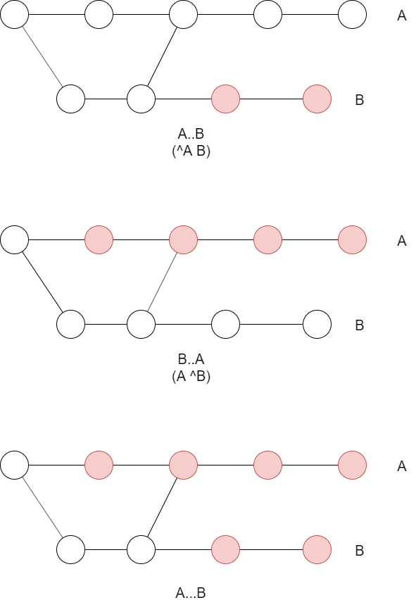

---
title: Version Control with Git ch6 Commits
tags:
- Git
- 勉強メモ
date: 2019-10-28T22:36:47+09:00
URL: https://wand-ta.hatenablog.com/entry/2019/10/28/223647
EditURL: https://blog.hatena.ne.jp/wand_ta/wand-ta.hatenablog.com/atom/entry/26006613457164467
bibliography: http://shop.oreilly.com/product/0636920022862.do
-------------------------------------

# Commits

- リポジトリへの変更の記録
- コミットが発生すると、Gitはインデックスのスナップショットを作成しオブジェクトストアに永続化する
    - 【補】インデックスがトップレベルのtreeになる
    - 【補】べつに`git commit`しなくても`git write-tree`でtreeを書き出せる
- このスナップショットは、全ファイル全ディレクトリのコピーではない
    - それでは非効率すぎる
    - 前回のスナップショットと比較し、変更のあったblobとtreeのみ新規作成
    - 変更のないものは再利用
    - 比較はSHA1で行われるので高速
        - treeが一致したらsubtree以下のtreeやblobも一致するので、枝切りになる
- コミットはリポジトリの変更と一対一対応
    - コミットはリポジトリに変更を加える唯一の方法
    - リポジトリへの変更はコミットによって行われなければならない
- コミットの多くは開発者によって行われるが、Git自身が行うものも
    - マージコミット等
- いつコミットするかはお好み
    - 切りの良いところで
        - テストがパスしたときなど
    - 帰り際に
    - ほか何かしらの理由で
- 遠慮せずどんどんコミットせよ
    - Gitは頻繁なコミットに適したつくりになっている
    - コミット操作コマンドも充実している
        - 【補】歴史の改竄とか
    - 小さくてwell-definedな変更のススメ
        - よく組織化される
        - パッチ操作を行いやすい
        - 【所感】大きすぎるコミットを分割するよりは細かすぎるコミットをsquashするほうが楽な気はする


# Atomic Changesets

- semantic gap
    - コードの変更の過渡的な状態では、意味的に一貫性を欠くことがある
    - 例:関数の移動
        1. Aファイルの関数fを消す
        1. Bファイルに関数fを追加する
    - 1.より前、または2.より後のコードは正しく動作する
        - 意味的に一貫性のある状態
    - 1.以降かつ2.以前のコードは、関数fがないので正しく動かない
        - 意味的に一貫性のない状態
    - Gitは変更理由については関知しない
        - Gitはファイルの意味を知らない
        - semantic gapのある状態になってもお構いなし
- 原子性
    - あるコミットスナップショットから次のスナップショットの間で、過渡的な状態がないことを保証する
    - 上記の例では、1, 2両コミットをまとめることで、semantic gapを無くせる


# Identifying Commits

- コミットの参照方法は2つ
    - explicit reference
        - SHA1値など
    - implied reference
        - HEADなど

## Absolute Commit Names

- SHA1値
    - 最も厳格な指定方法
    - ちょうど1つのコミットだけを参照できる
        - 指定のコミットがリポジトリの歴史上のどこにあろうがかまわない
    - globally unique
        - あるリポジトリのみならず全リポジトリで一意
            - 同じSHA1値のコミットが別のリポジトリでも見つかったら、それは同一内容の同一コミット
            - そのコミットに至るでの歴史も完全に一致
    - 短縮可能
        - 40文字の16進数列は長ったらしく間違いの元なので
        - リポジトリ内オブジェクトストアで前方一致でオブジェクトを特定できればよし
            - 【補】`git rev-parse`でフルのSHA1値に解決できる
- タグ
    - globally uniqueではないが、絶対名である
        - コミットを特定し、明示的に付け替えない限り経時変化しない
            - cf. HEADなどはコミットを重ねていくと変化する


## refs and symrefs

- _ref_
    - Gitのオブジェクトストア中でオブジェクトを参照するSHA1ハッシュ値
    - オブジェクトの中でも、ふつうコミットを指すもののことを言う
- _symref_ :symbolic reference
    - Gitオブジェクトを間接的に参照する名前
    - これもrefであることに変わりはない
    - 例
        - ローカルトピックブランチ名
        - リモート追跡ブランチ名
        - タグ名
- symrefは`refs/`から始まるフルネームを持つ
    - devブランチのフルネームはrefs/heads/dev
    - リモート追跡ブランチorigin/masterのフルネームはrefs/oremotes/origin/master
    - タグv2.6.23はrefs/tags/v2.6.23
- フルネームでも省略形でも指定可能
    - 【補】`git show refs/remotes/origin/master`とか
- 曖昧な場合は下記の優先度で解決される(優先度降順)
    - .git/_ref_
    - .git/refs/_ref_
    - .git/refs/tags/_ref_
    - .git/refs/heads/_ref_
    - .git/refs/remotes/_ref_
    - .git/refs/remotes/_ref_/HEAD
- .git/_ref_
    - `HEAD`
        - 現在のブランチ先頭コミットを常に指す
    - `ORIG_HEAD`
        - mergeやresetの取り消し用に、直前のHEADを記録
    - `FETCH_HEAD`
        - git fetch直後に全ブランチのheadが集められる
    - `CHERRY_PICK_HEAD`
    - `MERGE_HEAD`
        - これからHEADにマージされるコミット
- 実は`.git/`ディレクトリ名は変えられる
    - `$GIT_DIR`環境変数
- refの意味を変える特殊な文字が多数存在する
    - `^`と`~`は特によく使う


## Relative Commit Names

- `C^`
    - コミットCの親を参照
    - `C^1`と同義
- `C^n`
    - コミットCの親のうちn番めを参照
    - 【疑問】親の兄弟関係はどのようにして決まるのか
- `C~`
    - コミットCの親を参照
    - `C~1`と同義
- `C~n`
    - コミットCのn番目の親
    - n = 2なら親の親
- 組み合わせ可能
    - `master~3^2^2^`とか


# Commit History

## Viewing Old Commits

- `git log`コマンド
    - かの名高い`ls`コマンドよりもオプション多い
    - が、すぐに全部学ぶ必要はない
- master~11とmaster~10を表示
    - 短く
    - SHA1値短縮形

```sh
git log --pretty=short --abbrev-commit master~12..master~10
```

- 出力結果省略
    - master~12は含まれない
- master先頭コミットのパッチを出力

```sh
git log -1 -p master
```

- yasnippetを追加したようだ

```
commit 793ab6b6f965d5e9d5c66d23cbc05cce52b85b64 (HEAD -> master, origin/master, origin/HEAD)
Author: Daiki Horiyama <xxxxxxxxx@yyyy.co.jp>
date:   Mon Oct 28 13:39:42 2019 +0900

    型つきgetterスニペット

diff --git a/snippets/php-mode/get b/snippets/php-mode/get
new file mode 100644
index 0000000..f56454f
--- /dev/null
+++ b/snippets/php-mode/get
@@ -0,0 +1,15 @@
+# -*- mode: snippet -*-
+# contributor: DAIKI Horiyama <xxxxxxxxx@yyyy.co.jp>
+# name: get
+# key: get
+# group: definitions
+# --
+/**
+ * ${3:description}
+ * @return ${2:$(yas-text)}
+ */
+public function get${1:$(upcase-initials yas-text)}(): ${2:type}
+{
+    
+    return \$this->$1;
+}
\ No newline at end of file
```

- 変更量表示

```sh
git log -1 --stat master
```

```
commit 793ab6b6f965d5e9d5c66d23cbc05cce52b85b64 (HEAD -> master, origin/master, origin/HEAD)
Author: Daiki Horiyama <xxxxxxxxx@yyyy.co.jp>
date:   Mon Oct 28 13:39:42 2019 +0900

    型つきgetterスニペット

 snippets/php-mode/get | 15 +++++++++++++++
 1 file changed, 15 insertions(+)
```

- `git diff --stat`との違い
    - `git log --stat`: 指定したコミット範囲において、個々のコミットの変更差分を数える
    - `git diff --stat` : 指定した2つのコミットの全差分を数える


## Commit Graphs

- コミットグラフは DAG: Directed Acyclic Graph
    - 【補】treeはtree


### Using gitk to view Commit Graph

- 略
- 【補】GUIツールはSourceTreeとかいろいろある

## Commit Ranges



- `start..end`の真の意味
    - Q: なんでstartは含まないの？
    - A: そういう定義だから
- `^start end`と同義
    - 「コミットendに到達可能な全コミット、ただしコミットstartに到達可能なコミットは含めない」の意
- 排他的論理和的な意味の`start...end`なんてのもある


### Reachability in Graphs

- グラフ理論の話。略


# Finding Commits

- リポジトリを「考古学」する

## Using git bisect

- いつの間にかバグが混入していた場合などに使用する
- 2分探索でコミットを特定
- 開始

```sh
git bisect start
git status
```

- bisectingになる

```
On branch master
Your branch is up to date with 'origin/master'.

You are currently bisecting, started from branch 'master'.
  (use "git bisect reset" to get back to the original branch)

nothing to commit, working tree clean
```

- たいていはHEADでたまたま不具合混入に気づくもの
- HEADにbadの印をつける

```sh
git bisect bad
# git bisect bad HEAD
```

- すくなくともHEAD~10までは元気に動いていた
- goodの印をつける

```sh
git bisect good HEAD~10
```

- 半分の5コミットに絞られた

```
Bisecting: 5 revisions left to test after this (roughly 3 steps)
[f687070b79a19307ad1b1263a88e7a29b4a34eeb] デフォルトフォント変更、テーマ読み込み位置変更
```

- 探索範囲の2端点を指定した時点で、HEADはdetachedになる

```sh
git status
```

```
HEAD detached at f687070
You are currently bisecting, started from branch 'master'.
  (use "git bisect reset" to get back to the original branch)

nothing to commit, working tree clean
```

- あとはgit bisect good/badで絞っていく
- `git bisect log`で絞り込みの履歴を閲覧できる
- 完了したら`git bisect reset`でdetachedから復帰する

```sh
git branch
```

```
* (no branch, bisect started on master)
  master
```

```sh
git bisect reset
```

```
Previous HEAD position was 1ec0774 ほげほげ
Switched to branch 'master'
Your branch is up to date with 'origin/master'.
```

```sh
git branch
```

```
* master
```


## Using git blame

- 指定のファイルの指定の行を、誰が最後に変更したか調べる

## Using pickaxe

- 力づくで考古学する
    - pickaxe: つるはし
- init.elファイルの`require`という単語の増減があったコミットのログのみ表示

```sh
git log -Srequire -5 --pretty=oneline --abbrev-commit init.el
```

- (コミットメッセージがテキトーすぎる)

```
f3fc092 いらないもの消したり
262338a web-mode
f3d2f6c init.elのリファクタリング
06b99a1 use-package使用にリファクタリング(WIP)
993f34e 天気見れるようにした
```

- Emacsのパッケージの増減があったコミットのみ抽出できているようだ


----------------------------------------

# 英語

- cut a swath
    - 派手にやる
        - 木構造を地道に比較することを指していると思われる
- quiescent
    - 休止している、活動していない
        - 開発の切りの良いところ、くらいの意味かな
- rest assured
    - 安心する、...は確実と安堵する
- inductive
    - 帰納的な
- a whole raft of
    - たくさんの
- penultimate
    - 後ろから2番目の
- doodads
    - 何とかいうもの、あれ
        - 名前がわからないやつ
        - 例示の最後で「いろいろ」的な意味で
- fabled
    - 名高い
- tally
    - 勘定する
- intervening
    - 途中にある
- fine points
    - 委細
- elide
    - 省く
- delineate
    - 輪郭を描く
- pickaxe
    - つるはし
        - Gitリポジトリを力ずくで掘り進んで考古学することから
