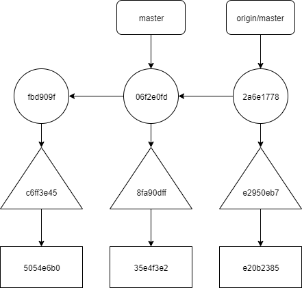
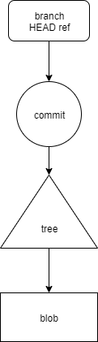
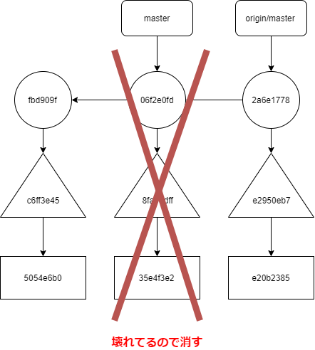
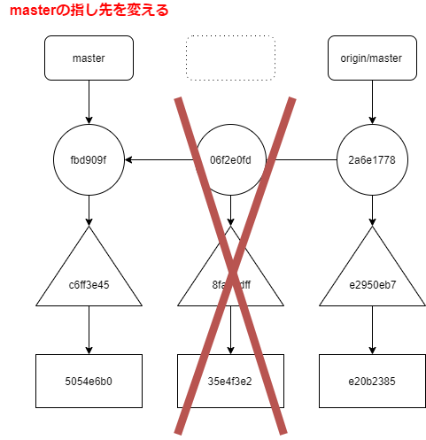
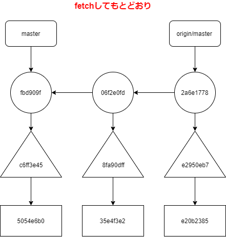
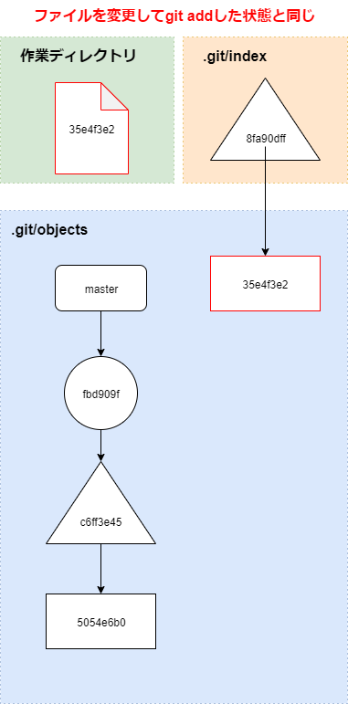

---
title: gitリポジトリが壊れたので.git/ディレクトリの中身を完全理解して修復した話
tags:
- Git
- 勉強メモ
date: 2019-10-29T21:02:56+09:00
URL: https://wand-ta.hatenablog.com/entry/2019/10/29/210256
EditURL: https://blog.hatena.ne.jp/wand_ta/wand-ta.hatenablog.com/atom/entry/26006613457665590
-------------------------------------


# gitリポジトリが壊れた


- statusを確認したところエラーが

```sh
git status
```

```
error: object file .git/objects/06/f2e0fd1f94d73e7a59fdd0ab765957e339b8d2 is empty
error: object file .git/objects/06/f2e0fd1f94d73e7a59fdd0ab765957e339b8d2 is empty
fatal: loose object 06f2e0fd1f94d73e7a59fdd0ab765957e339b8d2 (stored in .git/objects/06/f2e0fd1f94d73e7a59fdd0ab765957e339b8d2) is corrupt
```

- オブジェクト`06f2e0fd...`が壊れているそう

```sh
ls -la .git/objects/06/
```

- 0バイト。確かに壊れている

```
total 8
drwxrwxr-x   2 wand           wand     4096 2019-10-29 03:21 .
drwxrwxr-x 110 wand           wand     4096 2019-10-29 03:21 ..
-r--r--r--   1 wand           wand        0 2019-10-29 03:21 f2e0fd1f94d73e7a59fdd0ab765957e339b8d2
```


# Gitのオブジェクト

- オブジェクトには4種類ある
    - commit
        - コミットグラフ(マルと線で書くあの絵)のノード
        - 格納するデータ
            - authorやコミット時刻
            - (あれば)親コミットへの参照
            - ルートディレクトリのtreeへの参照
    - tree
        - ディレクトリに対応するもの
        - 格納するデータ
            - ファイルのメタデータ(ファイル名、rwxとか)
            - ファイルの中身のblobへの参照
            - サブディレクトリのtreeへの参照
    - blob
        - ファイル内容
    - tag
        - タグ
- 今回壊れた`06f2e0fd...`はcommitオブジェクトだった
- リモートリポジトリには壊れていない`06f2e0fd...`が残っていたので、さらに調査したところ、次のことが判明した
    - commit `06f2e0fd...`が指すべきtreeは `8fa90dff...`
    - tree `8fa90dff...`が指すべきblob `35e4f3e2...`も壊れている

## 壊れていない場合

- commitをcat-fileすると、指しているtreeと親commitがわかる

```sh
git cat-file -p 06f2e0fd1f94d73e7a59fdd0ab765957e339b8d2
```

```
tree 8fa90dff176a7ae2db41af1b0c9559cef6f3eaa1
parent fbd909faec7448c99777eb676dc634763f730b1a
author Daiki Horiyama <xxxxxxxxx@gmail.com> 1572286886 +0900
committer Daiki Horiyama <xxxxxxxxx@gmail.com> 1572286886 +0900
```

- treeをcat-fileすると、指しているblobがわかる

```sh
git cat-file -p 8fa90dff176a7ae2db41af1b0c9559cef6f3eaa1
```

```
100644 blob 35e4f3e2fd941be71194abf19e2069c81cb3bd53	main.org
```

- blobをcat-fileすると、当該ファイルのファイル内容を閲覧できる

```sh
git cat-file -p 35e4f3e2fd941be71194abf19e2069c81cb3bd53
```

```
(ひみつ)
```

- 全体像



- 凡例



## 壊れている場合

- 読めない

```sh
git cat-file -p 8fa90dff176a7ae2db41af1b0c9559cef6f3eaa1
```

```
error: object file .git/objects/8f/a90dff176a7ae2db41af1b0c9559cef6f3eaa1 is empty
fatal: Not a valid object name 8fa90dff176a7ae2db41af1b0c9559cef6f3eaa1
```


# 直す


- まず壊れているオブジェクトを削除



```sh
# commit
rm .git/objects/06/f2e0fd1f94d73e7a59fdd0ab765957e339b8d2
# tree
rm .git/objects/8f/a90dff176a7ae2db41af1b0c9559cef6f3eaa1
# blob
rm .git/objects/35/e4f3e2fd941be71194abf19e2069c81cb3bd53
```

- masterのrefをすげ替える



.git/refs/heads/master

```diff
- 06f2e0fd1f94d73e7a59fdd0ab765957e339b8d2
+ fbd909faec7448c99777eb676dc634763f730b1a
```

- 生きているリモートからfetch

```sh
git fetch
```

- なんかめっちゃエラー出るけど取ってこれた

```
error: refs/remotes/origin/HEAD does not point to a valid object!
error: refs/remotes/origin/master does not point to a valid object!
error: refs/remotes/origin/HEAD does not point to a valid object!
error: refs/remotes/origin/master does not point to a valid object!
error: refs/remotes/origin/HEAD does not point to a valid object!
error: refs/remotes/origin/master does not point to a valid object!
error: refs/remotes/origin/HEAD does not point to a valid object!
error: refs/remotes/origin/master does not point to a valid object!
remote: Enumerating objects: 8, done.        
remote: Counting objects: 100% (8/8), done.        
remote: Compressing objects: 100% (2/2), done.        
remote: Total 6 (delta 2), reused 6 (delta 2), pack-reused 0        
Unpacking objects: 100% (6/6), done.
From github.com:wand2016/org
 * [new branch]      master     -> origin/master
```



- 今どうなっているのか

```sh
git status
```

- 変更がステージングされている？

```
On branch master
Your branch is behind 'origin/master' by 2 commits, and can be fast-forwarded.
  (use "git pull" to update your local branch)

Changes to be committed:
  (use "git reset HEAD <file>..." to unstage)

	modified:   main.org
```


- すでに昨日commit・push済の変更が再度ステージングされている


```sh
git diff --cached
```

```
diff --git a/main.org b/main.org
index 5054e6b..35e4f3e 100644
--- a/main.org
+++ b/main.org
@@ -2609,12 +2609,13 @@
    - Note taken on [2019-10-21 Mon 00:56] \\
      14P
    CREATED: [2019-10-21 Mon 00:56]
-** TASK Git ch6 Commits                            :Version_Control_with_Git:
-   SCHEDULED: <2019-10-27 Sun 20:00>
+** DONE Git ch6 Commits                            :Version_Control_with_Git:
+   CLOSED: [2019-10-29 Tue 03:15] SCHEDULED: <2019-10-27 Sun 20:00>
    :PROPERTIES:
    :Effort:   3:30
    :END:
    :LOGBOOK:
+   CLOCK: [2019-10-29 Tue 00:40]--[2019-10-29 Tue 03:15] =>  2:35
    CLOCK: [2019-10-27 Sun 23:25]--[2019-10-28 Mon 01:18] =>  1:53
    :END:
    CREATED: [2019-10-21 Mon 00:56]
```

- 作業ディレクトリとindexの状態が一致しており、masterブランチのHEADだけ1つ巻き戻したので、相対的に「変更をgit add」した状態と同じになっているのである



- あとはいい感じにresetなりpullなりなんなりすればOK
