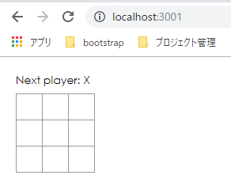
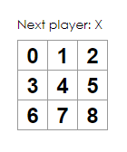

# ReactJS触る

- [公式チュートリアル](https://ja.reactjs.org/tutorial/tutorial.html)
- [リポジトリ](https://github.com/wand2016/ReactJSTutorial)

# 準備


- まずバージョンチェック

```sh
node --version
npm --version
```

- 古杉

```
v8.10.0
3.5.2
```

- npxも入っていなかったのでNodeのバージョン上げる

```sh
sudo npm i -g n
sudo n stable
```

```
  installing : node-v12.13.0
       mkdir : /usr/local/n/versions/node/12.13.0
       fetch : https://nodejs.org/dist/v12.13.0/node-v12.13.0-linux-x64.tar.gz
######################################################################## 100.0%
   installed : v12.13.0 (with npm 6.12.0)
```

- '19/10/31時点最新stableに

```
v12.13.0
6.12.0
```

- 空のプロジェクト作成

```sh
npx create-react-app my-app
```

- サーバ起動
    - 他のとポートがぶつかるので.envで設定
    

```
PORT=3001
```

```sh
npm start
```



- ソースコード配置する

# データをProps経由で渡す

- [差分](https://github.com/wand2016/ReactJSTutorial/commit/f80c73aa5de7ab8f32af193c3cc8e0a5a718313a)




