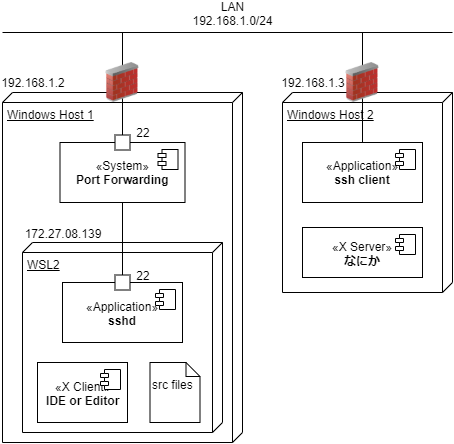
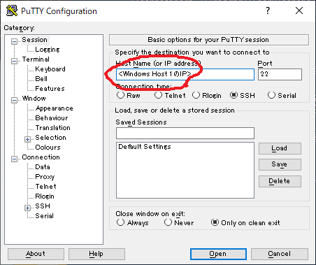
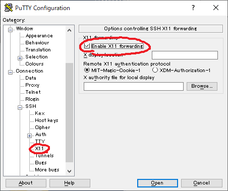

# モチベーション

- 2019年11月時点で、WindowsでWeb開発するときはWSL2環境に閉じこもっている
    - localhostへのX11Forwarding常用
- リモートワークで職場からWindows PCを持ち帰った
- 普段遣いのPCから作業したい
- 他ホストからのWSL2へのssh接続・X11Forwardingを試してみよう

# ネットワーク


# Windows Host1の設定

## Windows-> WSL2のポートフォワーディング

[参考](https://qiita.com/yabeenico/items/15532c703974dc40a7f5)

- WSLのIPアドレス取得

```sh
# WSL2 bash
ifconfig eth0 | grep 'inet ' | awk '{print $2}'
```

- 起動するたびに変わる

```
172.27.108.139
```

- ポートフォワーディングの設定

```
# Windows PS(管理者権限)
netsh interface portproxy add v4tov4 listenport=22 connectaddr=172.27.108.139 connectport=22
netsh interface portproxy show v4tov4
```

- 任意のホストからWindowsの22ポートへのアクセスを、WSLの22ポートにフォワーディング

```
ipv4 をリッスンする:         ipv4 に接続する:

Address         Port        Address         Port
--------------- ----------  --------------- ----------
*               22          172.27.108.139  22
```

## sshの設定

[参考](https://qiita.com/katsukii/items/c3df0653ac07d41fe03f)

- sshdの設定

WSL2の/etc/ssh/sshd_config

```diff
- PubkeyAuthentication no
+ # PubkeyAuthentication no
+ PubkeyAuthentication yes
```

- 設定反映

```sh
sudo service ssh restart
# systemctlは使えない
```

- WindowsからWSL2へ鍵搬送する
    - `ssh-copy-id`コマンド等

## ファイアウォールの設定

- 受信22を開ける
    - Windows Host2からWindows Host1への疎通で必要

# Windows Host2からSSH接続・X11Forwarding

- Puttyなどで





