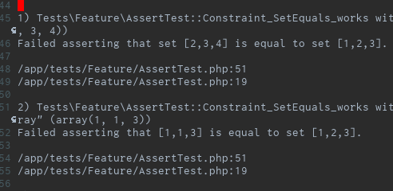

# モチベーション

- アサートのロジックをDRYにしたい
- テストの出力結果をprettyにしたい
- 雑にtraitとかに切り出すのではなく、プロジェクト横断的に使いまわしたい

# 作ったもの

[https://github.com/wand2016/phpunit_constraints:embed:cite]

参考: [公式ドキュメント](https://phpunit.readthedocs.io/ja/latest/extending-phpunit.html#extending-phpunit-custom-assertions)

- 集合の一致のアサーションを作ってみた
    - 正確には、作ったのは「Constraint」
    - 述語関数みたいな感じ

## 使い方

[https://github.com/wand2016/phpunit_constraints/blob/master/tests/Feature/AssertTest.php#L10:title]

- 生のConstraintは使いづらいので、PHPUnit\Framework\TestCaseを継承したテストケースクラスにassertメソッドを生やす
    - Laravelならtests/TestCase.php

```php
<?php
...
    protected function assertSetEquals(
        array $expectedSet,
        $set
    ): void {
        $this->assertThat(
            $set,
            new SetEquals($expectedSet)
        );
    }
```

- 利用側はこんなかんじ

```php
<?php
...
    /**
     * @test
     * @dataProvider dataProvider
     */
    public function Constraint_SetEquals_works($given): void
    {
        $this->assertSetEquals(
            [1, 2, 3],
            $given
        );
    }
```

```php
<?php
...
    public function dataProvider(): array
    {
        return [
            'same' => [  // pass
                [1, 2, 3]
            ],
            'not the same order' => [  // pass
                [2, 3, 1]
            ],
            'different' => [  // fail
                [2, 3, 4]
            ],
            'not a set but an array' => [  // fail
                [1, 1, 3]
            ],
            'not a set nor an array' => [  // fail
                1,
            ]
        ];
    }
```
