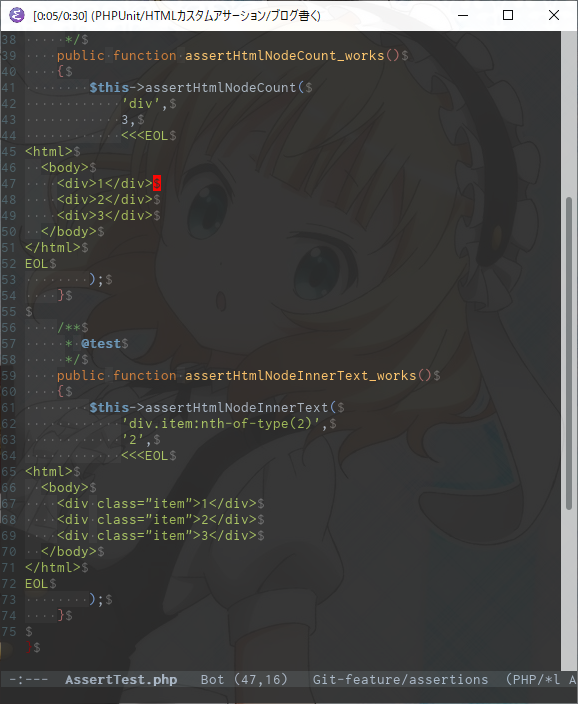

# モチベーション

- '19/11/16時点で、フロントエンドで高度なことをせず、サーバが返したHTMLをそのまま返すような古き良きアプリケーションの開発に携わっている
    - AjaxでJSONに色を付けたりしない
- 下記のような表示系テストを、わざわざブラウザで行いたくない
    - データは所定の件数表示される
    - データ表示内容が所定の値である
    - 情報aは権限Aを持つユーザにのみ表示される
- アプリケーションサーバがPHPなのでPHPUnitでテストしたい
- Constraintとしてプロジェクト横断的に再利用できるようにしたい

# 作ったもの

- 下記Constraint
    - CSSセレクタで特定されるHTML要素の個数のアサート
    - CSSセレクタで特定される最初のHTML要素の、innerTextの内容一致アサート
- ConstrantのラッパAssertion
    - traitにまとめた

## 依存

- SymfonyにHTML解析ライブラリがあったんですね

[https://qiita.com/miya0001/items/178f31035f63bba63f67:embed:cite]

# つかいかた

```php
<?php

    /**
     * @test
     */
    public function assertHtmlNodeCount_works()
    {
        $this->assertHtmlNodeCount(
            'div',
            3,
            <<<EOL
<html>
  <body>
    <div class="item">1</div>
    <div class="item">2</div>
    <div class="item">3</div>
  </body>
</html>
EOL
        );
    }

    /**
     * @test
     */
    public function assertHtmlNodeInnerText_works()
    {
        $this->assertHtmlNodeInnerText(
            'div.item:nth-of-type(2)',
            '2',
            <<<EOL
<html>
  <body>
    <div class="item">1</div>
    <div class="item">2</div>
    <div class="item">3</div>
  </body>
</html>
EOL
        );
    }
```

- CSSセレクタでHTML要素を狙い撃ち
- HTML文字列を渡してアサーションを記述する

# future work

- Constraint/Assertionを増やす
    - 属性
    - innerHTML
- 「内容一致」の判定の汎用化
    - 部分一致
    - regex
    - 述語関数を渡せるようにする
- Symfonyコンポーネントに直接依存しているのをやめる
    - nodejsでパースできたほうがなんとなく安心じゃないですか
