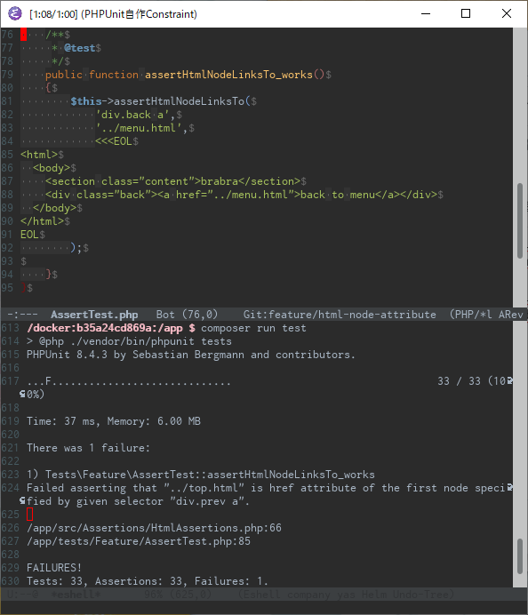

Constraint

[https://github.com/wand2016/phpunit_constraints/blob/master/src/Constraints/Html/HtmlNodeAttribute.php:title]

Assertion

[https://github.com/wand2016/phpunit_constraints/blob/master/src/Assertions/HtmlAssertions.php#L52:title]

# モチベーション

- HTML要素のアトリビュートのアサートを書きたい
    - requiredとか
    - hrefとか

