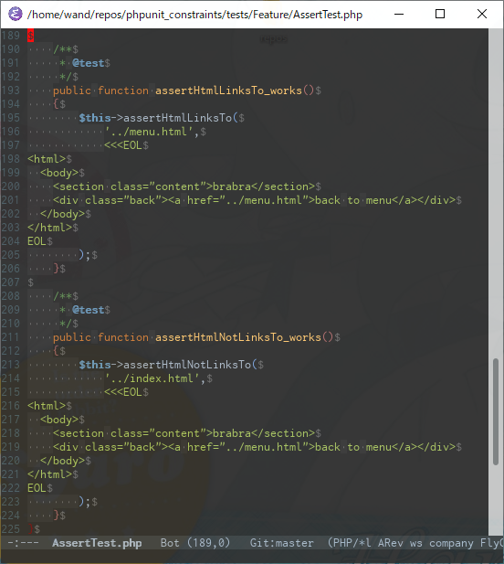

- 動線の存在のアサート

[https://github.com/wand2016/phpunit_constraints/blob/master/src/Assertions/HtmlAssertions.php#L229:title]

- 否定形のアサート

[https://github.com/wand2016/phpunit_constraints/blob/master/src/Assertions/HtmlAssertions.php#L38:title]


# モチベーション

- 画面遷移仕様のテストを書きたい
    - 「○○画面への動線がある」
    - 「権限aがない場合はA画面への動線がない」

# 学び

- 「存在」のアサートを生やすと、「存在しない」のアサートも生やしたくなるのが人情というもの
- PHPUnitでは、Constraintの否定・合成を行うことができる
    - [Composite Specification Pattern](https://martinfowler.com/apsupp/spec.pdf)


```php
<?php
...
    /**
     * Asserts that two variables are not equal.
     *
     * @param mixed  $expected
     * @param mixed  $actual
     * @param string $message
     * @param float  $delta
     * @param int    $maxDepth
     * @param bool   $canonicalize
     * @param bool   $ignoreCase
     */
    public static function assertNotEquals($expected, $actual, $message = '', $delta = 0.0, $maxDepth = 10, $canonicalize = false, $ignoreCase = false)
    {
        $constraint = new LogicalNot(
            new IsEqual(
                $expected,
                $delta,
                $maxDepth,
                $canonicalize,
                $ignoreCase
            )
        );

        static::assertThat($actual, $constraint, $message);
    }
```


```php
<?php
...
    public static function lessThan($value): LessThan
    {
        return new LessThan($value);
    }

    public static function lessThanOrEqual($value): LogicalOr
    {
        return static::logicalOr(
            new IsEqual($value),
            new LessThan($value)
        );
    }
```
