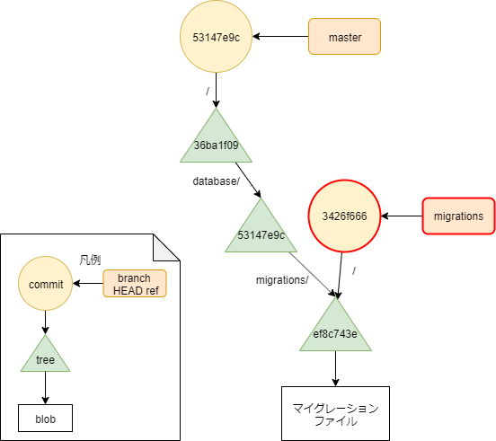

# モチベーション

- Laravelアプリケーションで、docker実行環境とmigrationを別repositoryに切り出したい
- docker実行環境 ... git submodule
    - 他アプリケーションでも使いまわすため
    - アプリケーションと疎結合にしたいのでread onlyなsubmodule
- migration ... git subtree
    - 別アプリケーションとDBを共有するため
    - アプリケーションとmigrationとは密結合であり、同じコミット・同じ歴史を刻みたいので、submoduleにはしない

# 予習


[https://wand-ta.hatenablog.com/entry/2019/10/25/013713:embed:cite]


- Gitの内部のデータ構造を理解していないと、以下読んでもたぶん理解できません


# 最初の状態


[https://github.com/wand2016/sub_practice/tree/b07cb2343acd8211aa5762510ffa59beda4bd49e:embed:cite]


- sub_practiceプロジェクトにすべてが含まれている状態
    - docker/
        - docker実行環境
    - database/migrations/
        - migration
- これらを切り出す


# 最終的な状態


[https://github.com/wand2016/sub_practice:title]

[https://github.com/wand2016/sub_practice_submodule:title]

[https://github.com/wand2016/sub_practice_subtree:title]


# git submodule

- 外部のgitリポジトリをread onlyで取り込む機能

## submodule切り出し

[https://qiita.com/horiem/items/e740a69bd3fec5908ce4:embed:cite]


- ↑参考
- submodule切り出し用に、sub_practiceリポジトリをもう1つcloneしてくる

```sh
ls
```

```
app        composer.json  database           package.json  readme.md  server.php  webpack.mix.js
artisan    composer.lock  docker             phpunit.xml   resources  storage     
bootstrap  config         package-lock.json  public        routes     tests       
```

- dockerディレクトリを切り出す
    - `docker/`ディレクトリをリポジトリのルートのtreeとし、masterブランチを作り直す

```sh
git filter-branch --prune-empty --subdirectory-filter docker master
```

```
Rewrite 0ff481efad1b40ee5296baca9a7df30767e147ea (1/1) (0 seconds passed, remaining 0 predicted)    
Ref 'refs/heads/master' was rewritten
```

- dockerディレクトリがリポジトリルートになったことを確認

```sh
ls -la
```

```
total 13
drwxrwxr-x   3 wand           wand     4096 2019-11-27 02:48 .
drwxrwxr-x   6 wand           wand     4096 2019-11-27 02:47 ..
-rw-rw-r--   1 wand           wand       25 2019-11-27 02:48 .env.example
drwxrwxr-x   8 wand           wand     4096 2019-11-27 02:48 .git
-rw-rw-r--   1 wand           wand      617 2019-11-27 02:48 docker-compose.yml
~/repos/laravel/clone $ 
```

- リモートにpush

```sh
git remote add docker git@github.com:wand2016/sub_practice_submodule.git
git push docker master
```

## submodule取り込み

- 取り込み先のsub_practiceリポジトリのルートに移動
- これからsubmoduleを取り込むpathを削除

```sh
git rm docker/
git commit
```

- submoduleを取り込む

```sh
git submodule add --name docker -- git@github.com:wand2016/sub_practice_submodule.git docker
git submodule absorbgitdirs docker
```

- 「gitリポジトリをsubmoduleとして取り込む」とは、「treeがsubmoduleの特定のcommitを指す」ということ


```sh
git cat-file -p HEAD
```

- master HEADのコミットは、tree `36ba1f09`を指している

```
tree 36ba1f09e6b773704df18c44bdce4a0f9c81d20f
parent 8676f3d2219794ef298c2bd895ffb3a9c9274dbe
author Daiki Horiyama <xxxxxxxxx@gmail.com> 1574791000 +0900
committer Daiki Horiyama <xxxxxxxxx@gmail.com> 1574791000 +0900

docker開発環境をsubmoduleとして取り込み
```

- tree `36ba1f09`の中身は？

```sh
git cat-file -p 36ba1f09
```

- プロジェクトルート直下のファイル(blob)、ディレクトリ(tree)に加え、**commit b07bf2c40 docker**を指していることがわかる

```diff
...
  100644 blob 6537ca4677ee97ddcb112f22d086b92721fd578c	.editorconfig
  100644 blob 604b401fee832040c89063374140131681b82154	.env.example
  100644 blob 967315dd3d16d50942fa7abd383dfb95ec685491	.gitattributes
  100644 blob 0f7df0fbef7c3ea7cf8299cd2601b54e9de6eb9e	.gitignore
  100644 blob 76f1c17f72a3e6a765cd1b9d6d8ac5b8afd25496	.gitmodules
  100644 blob 5e3689bd3afa58839202c4cfeabc288d5c8c7663	.styleci.yml
  040000 tree 43afe5d05e3b96381b6c9779241e6441177d93d4	app
  100644 blob 5c23e2e24fc5d9e8224d7357dbb583c83884582b	artisan
  040000 tree fa579600b150dfe96277f923c509bc473517b32a	bootstrap
  100644 blob bfa54bdd0f98ed5ef805f6c0ff41b00d62781b72	composer.json
  100644 blob 3b1a3cb7bbd6071465a99dcab222363298b089b3	composer.lock
  040000 tree acd5d8b944c8ecd50e2cbf580f4305a7e2e3be15	config
  040000 tree 53147e9ccaa3c48013a9454dd96a1095bb365d38	database
+ 160000 commit b07bf2c403fb4374166df24740eb8a0e33ac9250	docker
  100644 blob 73e61299df910b9ce0098ac2df22d37c15b38261	package-lock.json
  100644 blob 89cacb5a39cee36608096ea958f61555300ae4c9	package.json
  100644 blob c1a4100a36f738f5c6bde15a8a6ecb4aebcd34b0	phpunit.xml
  040000 tree c633051a714a6eb929f1302ec14652438ad3c85e	public
  100644 blob 1a80716afbb271e33d268522cfce7022070d222e	readme.md
  040000 tree 41538951c05cbd27862f5fe5bebafb5b461e7b14	resources
  040000 tree 37519220967f289b5fbb39f0696a7bd496e7560f	routes
  100644 blob 5fb6379e71f275a1784e6638adc96420aaa5c5b2	server.php
  040000 tree fc752eb01f1bb3c4c469a72c8f5a4de1ed2ad2ed	storage
  040000 tree cda839a93a5c691a2c7cdc49eaa2af0960fd67f2	tests
  100644 blob 19a48fa1314868e3836bcd59721e3b6e50386dac	webpack.mix.js
...
```


# git subtree

- これ自体はあくまで「commitがsubtree = 部分木 = プロジェクトルート以外のtreeを指す」という機能
- そのcommitを別個のリモートリポジトリにpushすることで、リポジトリ横断的に使い回せるようになる



- `database/migrations/`ディレクトリに対応するtree (`ef8c743e`) を指すcommitを作成し、これを指すmigrationsブランチを作成する


```sh
git subtree split --prefix=database/migrations/ -b migrations
```

```
Created branch 'migrations'
3426f6665e36cc1be5fa42752a3a6bbd0f02d3be
```

- tree `ef8c743e`を指しているなんの変哲もないcommit

```sh
git cat-file -p 3426f666
```

```
tree ef8c743e1e51f12c720dd1537d0d6ed7f4e24718
author Daiki Horiyama <xxxxxxxxx@gmail.com> 1574789294 +0900
committer Daiki Horiyama <xxxxxxxxx@gmail.com> 1574789294 +0900

first commit
```

- checkoutしてみる

```sh
git checkout 3426f666
ls
```

(Untrackedなファイルがあるけど) ちゃんと`database/migrations`がルートになっている

```
2014_10_12_000000_create_users_table.php            bootstrap     storage
2014_10_12_100000_create_password_resets_table.php  docker        vendor
2019_08_19_000000_create_failed_jobs_table.php      node_modules  
```

当該ブランチを独立したリモートリポジトリにpushしてやれば、他のアプリケーションのリポジトリでも共用できるようになる

```sh
git checkout master

git remote add -f migrations git@github.com:wand2016/sub_practice_subtree.git
git subtree push --prefix=database/migrations/ migrations feature/soft-delete-users
# 多分
# git checkout migrations
# git push migrations migrations
# と同じ
```
