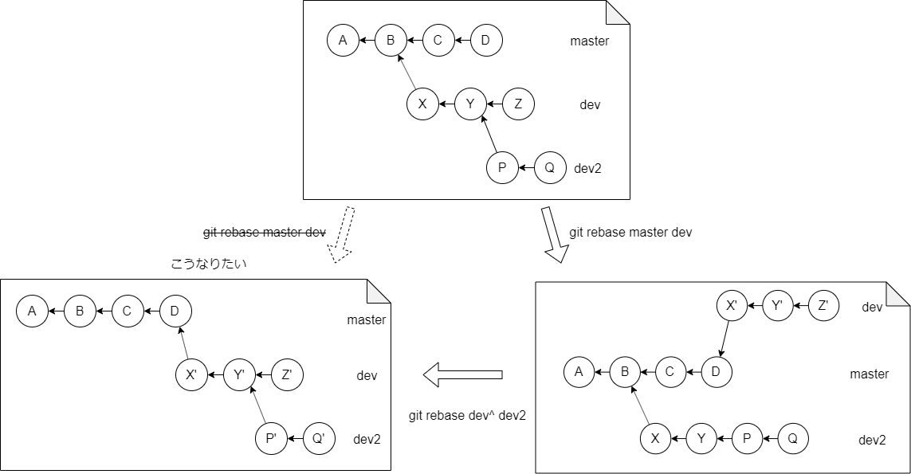

---
title: Version Control with Git ch10 Altering Commits
tags:
- Git
- 勉強メモ
date: 2019-11-21T09:39:10+09:00
URL: https://wand-ta.hatenablog.com/entry/2019/11/21/093910
EditURL: https://blog.hatena.ne.jp/wand_ta/wand-ta.hatenablog.com/atom/entry/26006613468928779
bibliography: http://shop.oreilly.com/product/0636920022862.do
-------------------------------------

# Altering Commits

- Gitはコミットの歴史を改変・改善するツールを提供している
- 歴史改変のモチベーション
    - 問題を修正し、はじめから問題がなかったことにする
        - typoの修正とか
    - 巨大なコミットの分割/細かなコミットの合体
    - レビューFBや提案の反映
    - 論理的な順番にコミットを積み直す
    - 誤ってコミットしてしまったデバッグコードを消す
- コミットを公開する前に済ませようね
- コミットを改変することで歴史が綺麗・理解しやすくなるなら大いにやるべき
    - 自分にも他の人にもわかりやすくなる
- とはいえほどほどに


## Philosophy of Altering History

- 現実の歴史のまま、決して改変しないよ派
    - ことあるごとにcommitする派
    - きりのよいところでcommitする派
- 理想的な歴史を目指して改変する派
- 良し悪し
    - 改変しない利点
        - 情報が失われない
            - 試行錯誤のすえに何か良いアイデアをひらめいたのかも
    - 改変する理由
        - 歴史が論理的で、読んでいて楽しい
        - 遠回りや後で直された次善の策を読まずに済む
- ブランチを使って両方取っておくのもアリ


# Caution About Altering History

- そのコミット履歴をコピー済の開発者が誰もいない限り、大いに歴史改変してどうぞ
- 他のリポジトリにコピーされている歴史を改変することなかれ


# Using git reset

- リポジトリと作業ディレクトリに変更を加える
- HEADを指定のコミットに移す
    - `git reset --soft HEAD^`とすると、HEADだったcommitがコミットされていないことになる


| Option  | HEAD | index | 作業ディレクトリ |
|---------|------|-------|------------------|
| --soft  | yes  | no    | no               |
| --mixed | yes  | yes   | no               |
| --hard  | yes  | yes   | yes              |

- デフォルトは`--mixed`
- reset前のHEADのrefの値はORIG_HEADに格納される
    - reset前のコミットメッセージを流用したい場合
    - しくじって戻したい場合


# Using git cherry-pick

- あるブランチのcommitをつまみ食いして別のブランチに持っていったりする
- 既存の歴史の改変は行わない。新しいコミットを積むだけ
- 指定のcommit単体でつまみ食いする
    - それよりも新しいcommitはつままない
- 新しいバージョンのgitではコミット範囲を指定できる

```sh
git cherry-pick X..Z
```


# Using git revert

- cherry-pickに似ている
- 指定のcommitの逆差分を当てる
- 既存の歴史の改変は行わない。新しいコミットを積むだけ

# reset, revert, and checkout

- checkoutとresetの混同
    - ブランチ
        - checkoutはブランチを切り替える
        - resetはブランチを切り替えない
    - mergeの中間状態の解消
        - reset --hardで行える
        - checkoutでは行えない
- checkoutの2つの機能の混同
    - 【補】新しいGitでswitchとrestoreに分化した的な話


# Changing the Top Commit

- HEADのcommitを改変したい場合はresetとかせずに`git commit --amend`使え
    - typoの即修正とか
- コミットのメタ情報も書き換え可能
    - `--author`とか

# Rebasing Commits

- どこから枝分かれしたかを改変する
- origin/masterにforward portingするのがよくある
    - 共同開発で、メンテナから「master先頭にrebaseして」と要求されることしばしば


## Using git rebase -i

- いろいろできるすごいやつ
    - commit並べ替え
    - commit編集
    - commit削除
    - 複数commitをまとめる
    - commit分割
- 【所感】毎日のように使ってるので略
    - magitの `r i` さまさま

## rebase Versus merge

- rebaseに関しては、上述の歴史改変の哲学論争よりもさらに細かな分派がある
- mergeとrebaseどっち使えばいいの
    - 複数開発者、複数リポジトリ、複数ブランチが絡むとき特に重要な問い
- 誰かがすでにコピーして利用しているブランチをrebaseするのはトラブルのもと
    - 「誰か」には自分自身も含まれる



- トラブる例
    - rebaseするブランチから別のブランチが生えている場合、そいつは追従しない
        - 明示的に順次rebaseしてやる必要がある
    - merge commitも維持したい場合は `--preserve-merges`オプション必要
        - さもないと、コミットグラフは直線状になってしまう
- rebaseの留意すべき点
    - rebaseはcommitを新しいcommitとして書き換える
    - DAG上で到達不可能な古いcommitは消える
    - rebase前の古いcommitを利用している人は立ち往生してしまう
        - それも順次rebaseしてあげる必要がある
    - rebase前のcommitが他リポジトリにコピーされている場合、そちらも追従する必要がある
    

----------------------------------------


# 英語

- sacrosanct
    - 神聖にして侵すべからざる
- posterity
    - 後世
- didactic
    - (過度に)教育的な
- explicate
    - 詳細に説明する
- meticuous
    - 細かいことに気を配る、凝り性の
- vagary
    - とっぴな行い、酔狂
- pedantic
    - 知識をひけらかす
- chronicle
    - 年代記
- construe
    - ...を解釈する、と受け取る
- reinstate
    - 復帰させる
- peculiar
    - 妙な
- rabification
    - 分派
- strand
    - 立ち往生する
