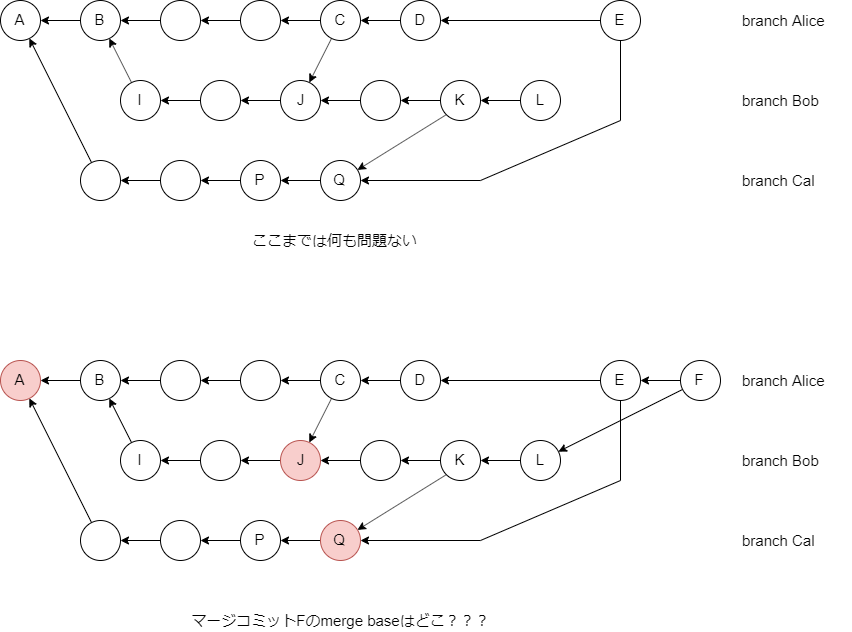
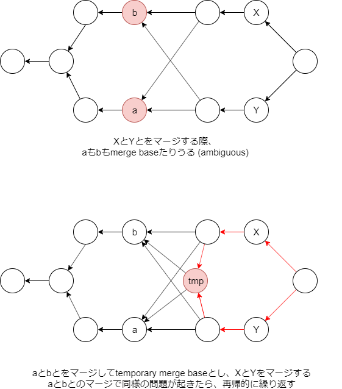

---
title: Version Control with Git ch9 Merges (2/3)
tags:
- Git
- 勉強メモ
date: 2019-11-26T01:48:28+09:00
URL: https://wand-ta.hatenablog.com/entry/2019/11/26/014828
EditURL: https://blog.hatena.ne.jp/wand_ta/wand-ta.hatenablog.com/atom/entry/26006613471394147
bibliography: http://shop.oreilly.com/product/0636920022862.do
-------------------------------------

# Merges(続き)

# Merge Strategies #

- criss-cross mergeで必要となる概念
    - merge-baseをうまく決められない
    - どこをmerge-baseにとっても、変更が重複してコンフリクトしてしまう

<figure class="figure-image figure-image-fotolife" title="Criss-Cross Mergeでmerge-baseが一意に定まらない例"><figcaption>Criss-Cross Mergeでmerge-baseが一意に定まらない例</figcaption></figure>

## Degenerate Merges ##

- 同じコミットをdegenerate(縮退)させる
    - already up-to-date
        - targetにother_branchのコミットがすでに全てある
    - fast-forward
        - targetがまるまるother_branchに含まれている
        - リモート追跡ブランチをmergeするときによくある
- いずれも、実コミットを積まないのが重要
    - さもないと永久にstableな状態にならない

## Normal Merges ##

- 実コミットを積む

### Resolve ###

- 2ブランチのコミットで行う直感的なやつ

### Recursive merges ###

<figure class="figure-image figure-image-fotolife" title="Recursive Merge Strategy"><figcaption>Recursive Merge Strategy</figcaption></figure>

- merge baseが一意に定まらない場合に

### Octopus merges ###

- 同時に3つ以上のブランチをマージするやつ
- コンフリクト解消はできない
- 一般化・設計上の美しさに由来
    - 親なし (initial commit)
    - 親1つ  (normal commit)
    - 親複数 (merge commit)
        - 2つに制限する道理はない
- コミットグラフが美しい

## Specialty Merges ##

### Ours ###

- other_branchsをマージしたという歴史のみ刻む
- ファイルはHEADのまま

### Subtree ###

- 【補】subtreeの雑理解
    - submoduleのcommit/push可能できるやつ的な
    - 別repoをサブディレクトリにマッピングできる
- subtreeのマージ戦略

----------------------------------------

# 英語

- eponymous
    - 名祖の
- tack on
    - 上乗せする
