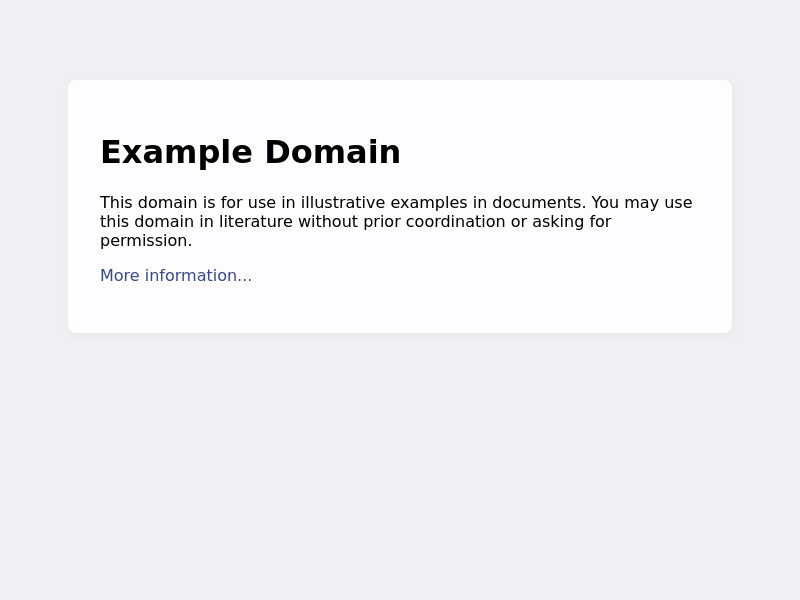
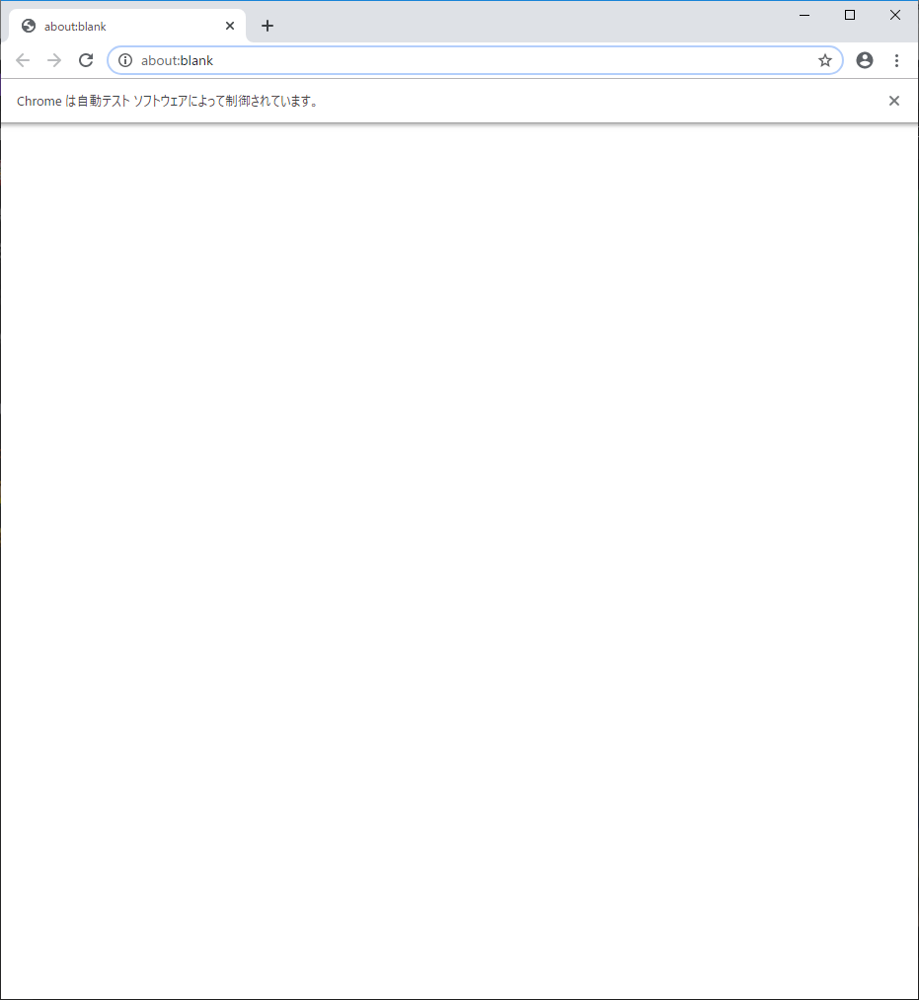
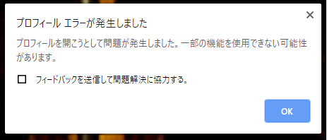

chromiumじゃくてchromeを使う

たんなる備忘


# chromeインストール

- 入れる

```sh
curl https://dl.google.com/linux/linux_signing_key.pub | sudo apt-key add -
echo 'deb [arch=amd64] http://dl.google.com/linux/chrome/deb/ stable main' | sudo tee /etc/apt/sources.list.d/google-chrome.list
sudo apt update
sudo apt install google-chrome-stable
```

- インストール確認

```sh
google-chrome-stable --version
which google-chrome-stable
```

```
Google Chrome 79.0.3945.79
/usr/bin/google-chrome-stable
```

- 適宜symlinkとか張ればいいんでしょうね

# puppteer動かす

- 適当にプロジェクト作る

```sh
mkdir sandbox
cd sandbox

npm init -y
npm install --save-dev puppeteer
```

example.js

```javascript
const puppeteer = require('puppeteer');

(async () => {
    const browser = await puppeteer.launch({
        'headless': false,
        executablePath: 'google-chrome-stable',
        args: [
            '--no-sandbox', // 必要
        ]
    });

    const context = await browser.createIncognitoBrowserContext(); // シークレットモードでブラウザ起動

    const page = await context.newPage();
    await page.goto('https://example.com');
    await page.screenshot({path: 'example.png'});

    await browser.close();
})();
```

```sh
node example.js
```



- chromeを自動操作しスクショを撮れた

# 【ダメだった】WSL2上のpuppeteerからwindowsのchrome.exeを自動操作

example_win.js

```javascript
const puppeteer = require('puppeteer');

(async () => {
    try {
        const browser = await puppeteer.launch({
            'headless': false,
            executablePath: '/mnt/c/Program Files (x86)/Google/Chrome/Application/chrome.exe',
            args: [
                '--no-sandbox',
            ]
        });

        const context = await browser.createIncognitoBrowserContext();

        const page = await context.newPage();
        await page.goto('https://example.com');
        await page.screenshot({path: 'example.png'});

        await browser.close();
    } catch (e) {
        console.log(e);
        throw e;
    }
})();
```

- 実行ファイルを`/mnt/c/Program Files (x86)/Google/Chrome/Application/chrome.exe`にした

```sh
node exaple_win.js
```

- うまくいかない。



- プロフィール読み込みエラーとのこと



- stderr。`ECONNREFUSED`とのこと

```
ErrorEvent {
  target: 
   WebSocket {
     domain: null,
     _events: { open: [Object], error: [Object] },
     _eventsCount: 2,
     _maxListeners: undefined,
     readyState: 3,
     protocol: '',
     _binaryType: 'nodebuffer',
     _closeFrameReceived: false,
     _closeFrameSent: false,
     _closeMessage: '',
     _closeTimer: null,
     _closeCode: 1006,
     _extensions: {},
     _receiver: null,
     _sender: null,
     _socket: null,
     _isServer: false,
     _redirects: 0,
     url: 'ws://127.0.0.1:53736/devtools/browser/4d67b21d-b0bf-4538-a46a-696b9e97afd1',
     _req: null },
  type: 'error',
  message: 'connect ECONNREFUSED 127.0.0.1:53736',
  error: 
   { Error: connect ECONNREFUSED 127.0.0.1:53736
    at Object._errnoException (util.js:1022:11)
    at _exceptionWithHostPort (util.js:1044:20)
    at TCPConnectWrap.afterConnect [as oncomplete] (net.js:1198:14)
     code: 'ECONNREFUSED',
     errno: 'ECONNREFUSED',
     syscall: 'connect',
     address: '127.0.0.1',
     port: 53736 } }
(node:24086) UnhandledPromiseRejectionWarning: #<ErrorEvent>
(node:24086) UnhandledPromiseRejectionWarning: Unhandled promise rejection. This error originated either by throwing inside of an async function without a catch block, or by rejecting a promise which was not handled with .catch(). (rejection id: 1)
(node:24086) [DEP0018] DeprecationWarning: Unhandled promise rejections are deprecated. In the future, promise rejections that are not handled will terminate the Node.js process with a non-zero exit code.
```

- chrome.exeのエラーログ

/mnt/c/Program Files (x86)/Google/Chrome/Application/debug.log

```
[1214/143637.466:ERROR:file_io_win.cc(193)] LockFileEx: ファンクションが間違っています。 (0x1)
[1214/143637.468:ERROR:file_io_win.cc(193)] LockFileEx: ファンクションが間違っています。 (0x1)
[1214/143637.471:ERROR:registration_protocol_win.cc(84)] TransactNamedPipe: パイプは終了しました。 (0x6D)
[1214/143637.476:ERROR:file_io_win.cc(193)] LockFileEx: ファンクションが間違っています。 (0x1)
[1214/143637.477:ERROR:file_io_win.cc(193)] LockFileEx: ファンクションが間違っています。 (0x1)
[1214/143637.494:ERROR:registration_protocol_win.cc(56)] CreateFile: 指定されたファイルが見つかりません。 (0x2)
[1214/143637.566:ERROR:registration_protocol_win.cc(56)] CreateFile: 指定されたファイルが見つかりません。 (0x2)
[1214/143637.632:ERROR:registration_protocol_win.cc(56)] CreateFile: 指定されたファイルが見つかりません。 (0x2)
[1214/143637.632:ERROR:registration_protocol_win.cc(56)] CreateFile: 指定されたファイルが見つかりません。 (0x2)
```

- ファイル読み書きの権限がない系な気がする
- ubuntu上でchromeが動く以上、chrome.exeを動かせても別に嬉しくないことに気づき、調査打ち切り。
    - 本当にchrome.exeを動かしたかったらwindows上でpuppetter動かせばいいし…
