**あ…ありのまま 今　起こった事を話すぜ！**

**「おれは　masterからトピックを切っていたと思ったら　いつのまにかトピックから切っていた」**

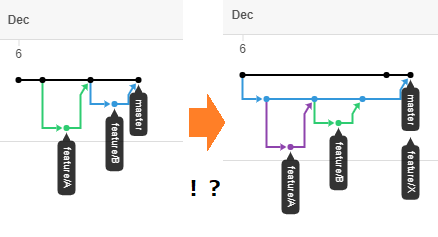

- ※ masterは適宜develop等に読み替えてください  
- ※ developはありましたが無くなりました  
    - (未リリースだしまあ妥当)

# TL;DR

- PR(MR)作れ
- 次点で`git merge <branch> --no-ff`しろ
- タイトルは半分釣り
    - トピックをトピックから切ったように見えるだけ


# ぜんてい

gitを用いた開発では、「ブランチ」が開発の単位となります。

いろいろな流儀がありますが、

1. 幹から枝を生やして (トピックブランチ作成)
1. 枝の上で作業をし (トピックブランチにコミット)
1. 枝の作業を幹に戻す (トピックブランチを統合ブランチにマージ)

という大まかな流れは同じかと思います。

こうして形成されるのがコミットグラフです。

ローカルの**git**コマンドやGUIツールで確認できますし、  
**GitHub**や**GitLab**といったGitホスティングサービスを利用している場合、Webブラウザ上でも確認できます。

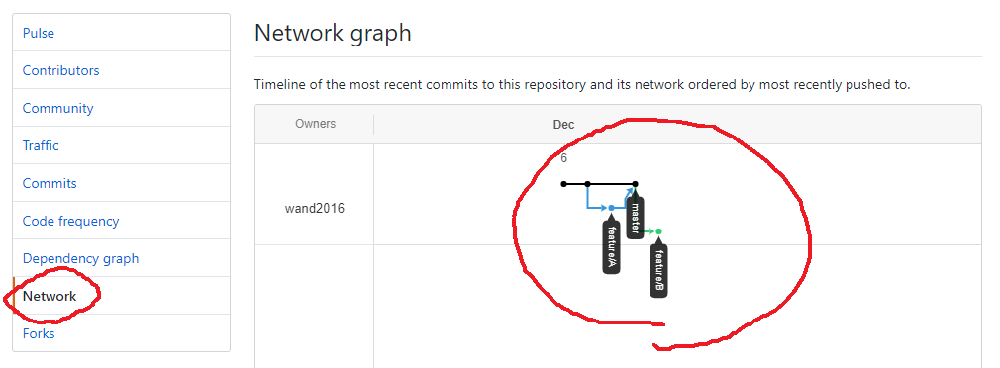

さてGitホスティングサービスを利用する場合、

> 「3. トピックブランチを統合ブランチにマージ」

はホスティングサービス上で行うのが普通です。

トピックブランチをリモート(ホスティングサービス)にpushしたのち、

- GitHubならPull Request
- GitLabならMerge Request

を発行し、マージを実行します。


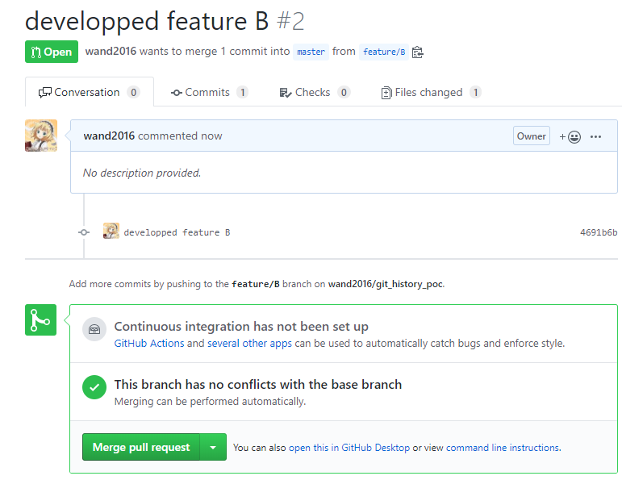

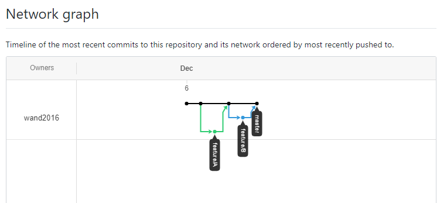


# リモートの更新をローカルのトピックブランチに取り込む

> さてGitホスティングサービスを利用する場合、
>
> 「3. トピックブランチを統合ブランチにマージ」
>
> はホスティングサービス上で行うのが普通です。

逆はこの限りではありません。ローカルでマージするのが普通だと思います。(要出典)

いま、リモートのコミットグラフはこんな形:

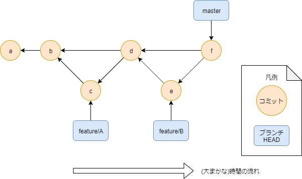

ここで、コミットaからブランチ`feature/X`を切って作業している人がいたとします

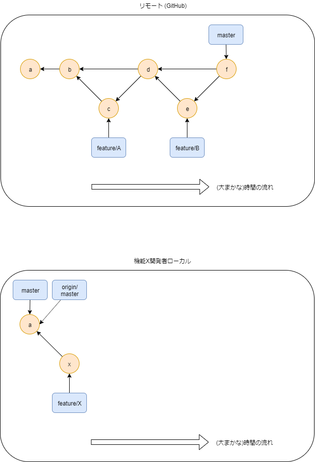


その人はリモートの最新の`master`を取り込みたいので、`git fetch`します:


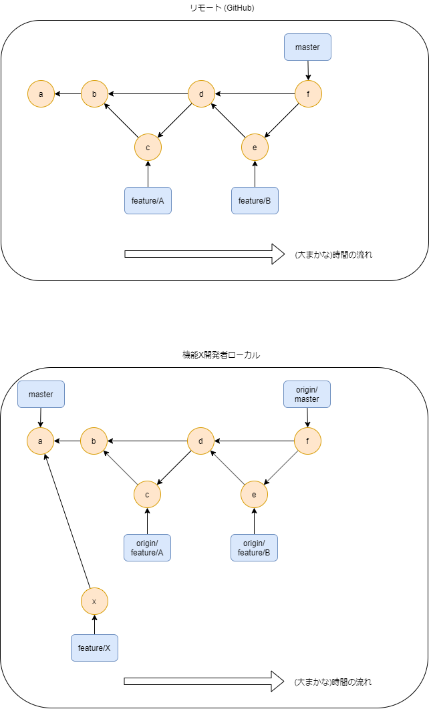


ローカルの**リモート追跡ブランチ`origin/master`**に**リモートのmaster**が降ってきました。

「さあ`feature/X`に`origin/master`をマージするぞ！」

と、ここまではまあ普通です。  
(merge/rebase宗教論争については触れません)


```sh
git checkout feature/X
git merge origin/master
```

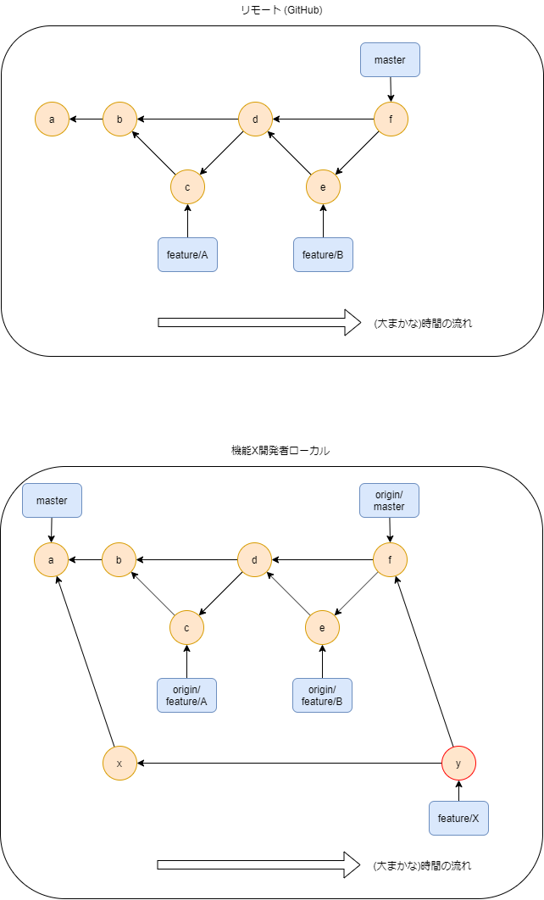


# NG: ローカルでmasterを更新してリモートにpushする

```sh
git checkout master
git merge feature/X
```

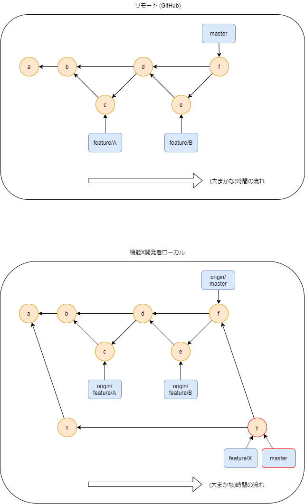

```sh
git push origin master
```


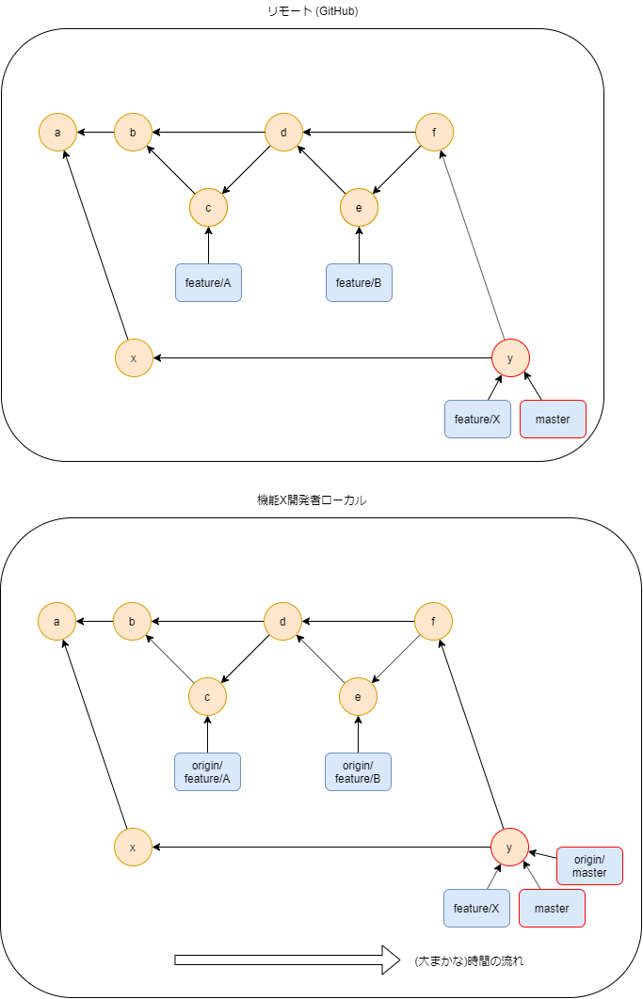


**これはいけない。**

masterがなるべく真っ直ぐになるようにコミットグラフが歪められて、こうなる


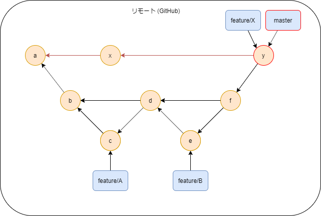

`feature/A`, `feature/B`が**「トピックブランチからトピックブランチを切った」ような珍妙な形**になるわけです

<figure class="figure-image figure-image-fotolife" title="あーあ">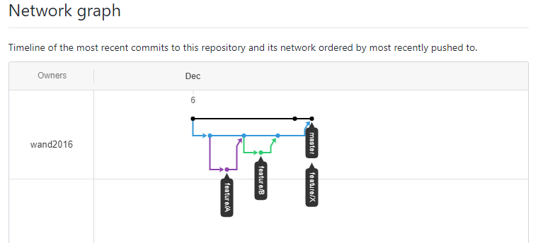<figcaption>あーあ</figcaption></figure>


# 模範解答: Pull Request (Merge Request) を発行する

これに尽きる

# 次点: git merge 時、`--no-ff`オプションを付ける

開発者全員がPR(MR)を発行してくれるのは理想郷です。

偉い人が

**「俺がmasterだ！！」**

とばかりに`git push origin master`してしまうこともあると思います。  
そんなケースでもコミットグラフの治安を守るには、  
**`git merge`コマンドの`--no-ff`オプション**が有用です:


```sh
git checkout master
git merge feature/X --no-ff
```

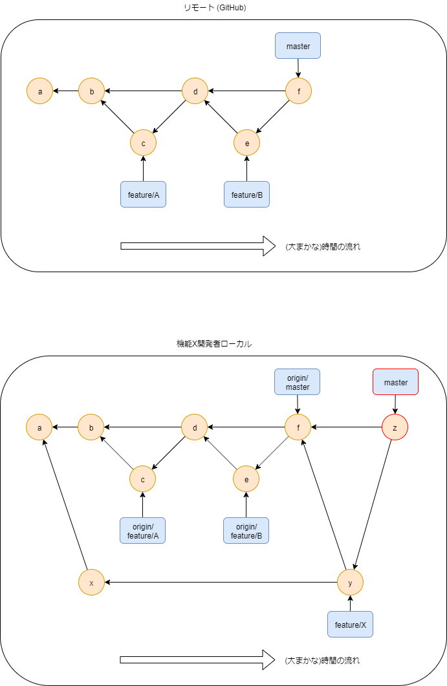

```sh
git push origin master
```

<figure class="figure-image figure-image-fotolife" title="世界は救われた">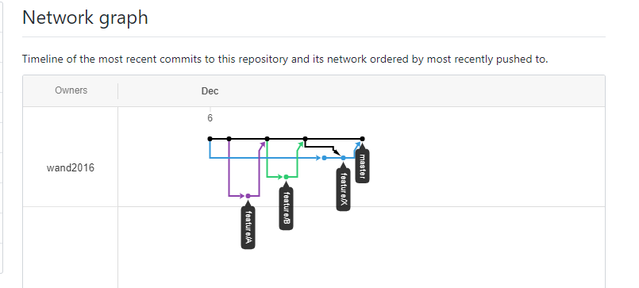<figcaption>世界は救われた</figcaption></figure>

`--no-ff`とは、「no fast-forward」の意味。

fast-forwardとはマージの一種で、超ざっくりいうと

「差分がない場合はコミットを作成しない」

です。

**`--no-ff`はその否定(no)なので、「差分がなくてもコミットを作成する」の意味**です。

上記のマルと矢印の絵でいうと、**コミット`z`がno fast-forward commit**にあたります。

[https://qiita.com/nog/items/c79469afbf3e632f10a1#%E8%A8%AD%E5%AE%9A%E3%81%AB%E5%85%A5%E3%82%8C%E3%81%A6%E8%87%AA%E5%8B%95%E5%8C%96%E3%81%97%E3%82%88%E3%81%86:embed:cite]

configで強制することが可能なので、チームのルールに取り入れるとよいのかもしれない。

**いやPR (MR)出せや！！！って話なんですけどね！！！！！！**
