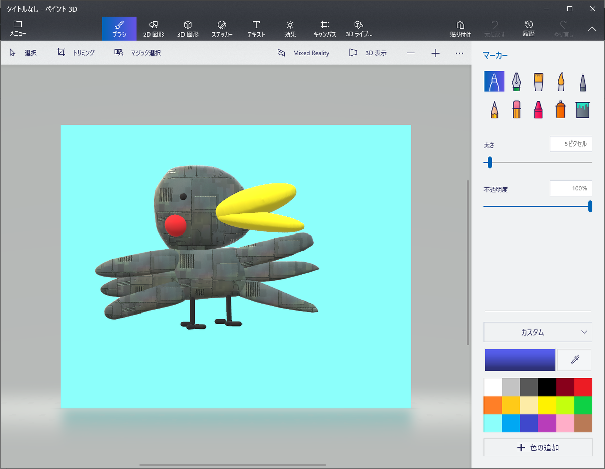
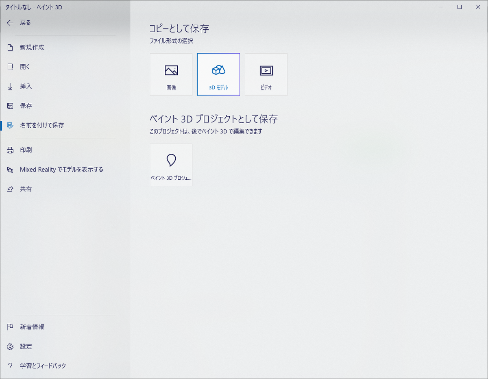
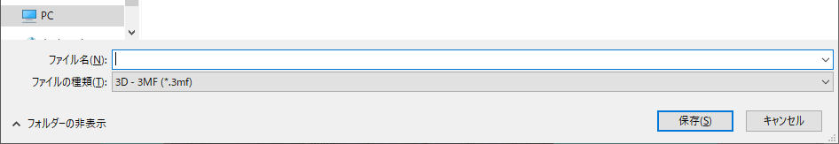

---
title: Paint 3Dで制作した3Dモデルをthree.jsで描画した
tags:
- webgl
- JavaScript
- 勉強メモ
date: 2019-12-21T17:45:34+09:00
URL: https://wand-ta.hatenablog.com/entry/2019/12/21/174534
EditURL: https://blog.hatena.ne.jp/wand_ta/wand-ta.hatenablog.com/atom/entry/26006613487356155
----------------------------------bibliography: https://github.com/wand2016/three.js

[f:id:wand_ta:20191224002403g:plain]


# Paint 3Dで描く


[https://www.microsoft.com/ja-jp/p/%E3%83%9A%E3%82%A4%E3%83%B3%E3%83%88-3d/9nblggh5fv99?activetab=pivot:overviewtab:embed:cite]

いつの間にかこんなゴキゲンなアプリが標準搭載されていたんですね～




たのしい

あひるbotテクスチャを貼る前のプロジェクトは間違えて消してしまった

一度貼って保存したテクスチャの剥がし方はわからなかった







3MF形式で保存する。FBX形式でもthree.jsで読めるかもしれない(未確認)


# Three.jsで読み込む

公式サンプルをforkした


[https://github.com/wand2016/three.js:title]

下記コマンドで試せるよ

```sh
docker container run --rm -d -v ${PWD}:/usr/local/apache2/htdocs -p 8080:80 httpd:2.4

# then, access to http://localhost:8080/examples/webgl_loader_3mf.html
```


Paint 3Dで保存したモデルはやたら小さい？

scaleを100くらいにしないと顕微鏡が必要な感じになる


```javascript
loader.load('./models/3mf/ahiru.3mf', function(object) {
    object.scale.set(100, 100, 100);
    scene.add(object);
    render();
});
```

