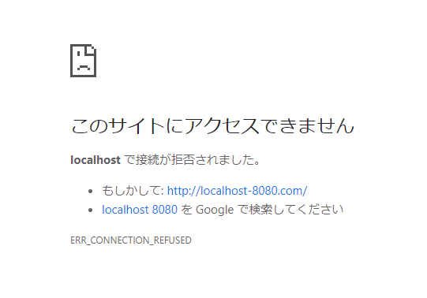
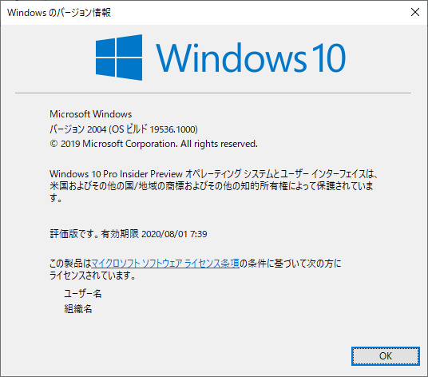
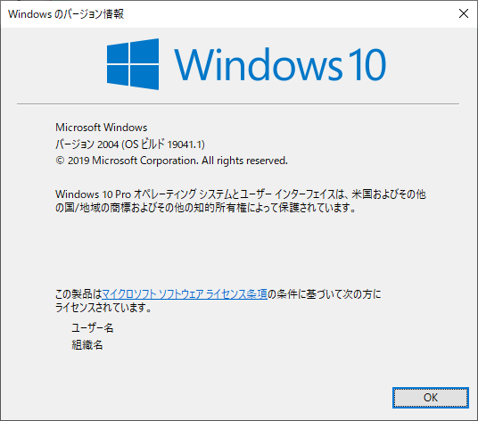

---
title: 【解決】WindowsのlocalhostがWSL2に正常にフォワーディングされない問題
tags:
- WSL2
date: 2019-12-31T17:31:18+09:00
URL: https://wand-ta.hatenablog.com/entry/2019/12/31/173118
EditURL: https://blog.hatena.ne.jp/wand_ta/wand-ta.hatenablog.com/atom/entry/26006613491396963
-------------------------------------


# 結論

- 19536.1000のバグ
- 19041.1に下げたら直った


# 現象

例えば、WSL2側でhttpd2を立てる

```sh
docker container run --rm -d -p 8080:80 httpd:2.4
```

Windows側のブラウザで`http://localhost:8080`にアクセスすると、WSL2の8080ポートにフォワーディングされてIt works!が表示されるべきであるが、そうならない



`netsh interface portproxy add v4tov4` とかやって頑張ると一応ポートフォワードできるが、面倒くさい

2019年12月のいつ頃からか起こるようになった


# Windowsのバグっぽい

- 同じ現象を踏んでいる人々多数:

[WSL2 localhost forwarding doesn't seem to work #4636](https://github.com/microsoft/WSL/issues/4636)


> This started happening to me recently. I'm currently running:  
>  
> Windows 10 Insider Preview 19536.1000 (rs_prerelease)  

まさにこのビルドだった

```sh
winver
```




# 前のビルドに下げたら直った


[参考](https://pc-karuma.net/windows-10-restore-previous-version/)

[f:id:wand_ta:20200101153306p:plain]


