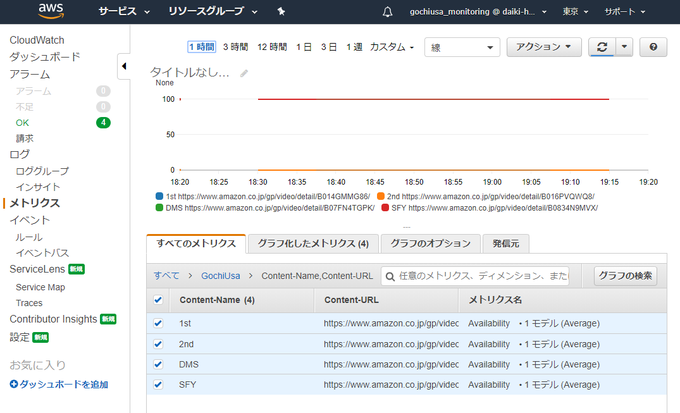
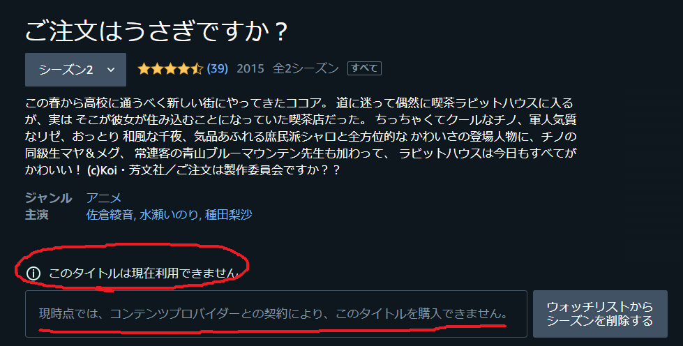
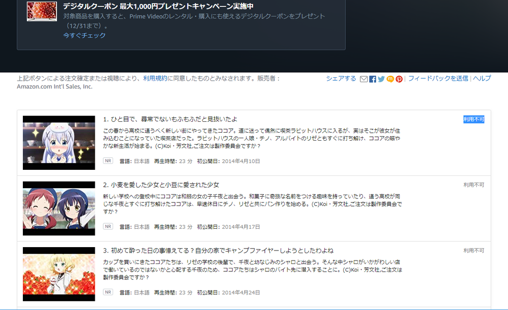
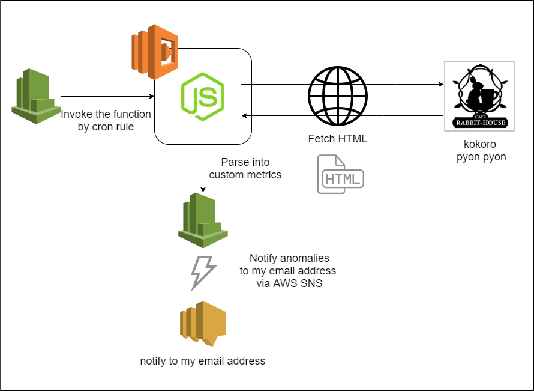
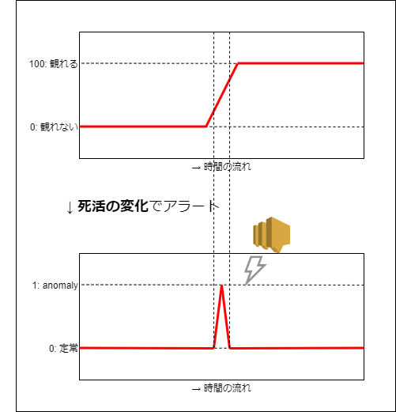

---
title: Amazon Prime Videoのごちうさ監視システムをサーバーレスで構築した
tags:
- AWS
- ごちうさ
- 勉強メモ
- 作った系
date: 2020-01-04T00:09:38+09:00
URL: https://wand-ta.hatenablog.com/entry/2020/01/04/000938
EditURL: https://blog.hatena.ne.jp/wand_ta/wand-ta.hatenablog.com/atom/entry/26006613492770913
-------------------------------------

# つくったもの

<figure class="figure-image figure-image-fotolife" title="CloudWatch カスタムメトリクスで、Amazon Prime Videoのごちうさの死活を監視している"><figcaption>CloudWatch カスタムメトリクスで、Amazon Prime Videoのごちうさの死活を監視している</figcaption></figure>

[https://github.com/wand2016/gochiusa_prime_video_monitoring:embed:cite]

# 背景

- Amazon Prime Videoでは毎年定期的にごちうさが観られなくなる

<figure class="figure-image figure-image-fotolife" title="この世の終わり"><figcaption>この世の終わり</figcaption></figure>

<figure class="figure-image figure-image-fotolife" title="2018年12月の様子"><figcaption>2018年12月の様子</figcaption></figure>

- 1年前(2018年末)に観られなくなったときも、「ごちうさが復活してたらメール通知するプログラム」を書いてローカルPCで動かした
- 今年はクラウドでリメイクした

# 去年の

## インフラ・仕様

- Windowsのタスクスケジューラで毎朝8時に起動
- puppeteer on dockerでスクレイピング
- nodejsでメール通知

## 問題点

- PCの電源が点いていないと動かない
- ごちうさが視聴可能になったら毎日メールが届いてしまっていた
- テストを書かなかった

# 今年の

## インフラ・仕様

<figure class="figure-image figure-image-fotolife" title="構成"><figcaption>構成</figcaption></figure>

- AWS LambdaをCloudWatch Eventsで定期実行
- puppeteer不使用。HTTPレスポンスを単純にパース
- 死活をCloudWatchのカスタムメトリクスとして書き出す
- 死活の変化を監視し、アラームを発する
- アラームでSNSをトリガーし、メールを送信する

<figure class="figure-image figure-image-fotolife" title="死活の変化でメール通知"><figcaption>死活の変化でメール通知</figcaption></figure>

## 改善点

- PCの電源が点いていないと動かない
    - -> クラウドで常に動いている！
- ごちうさが視聴可能になったら毎日メールが届いてしまっていた
    -  -> **死活の変化**を監視するので、通知が飛び続けない
- テストを書かなかった
    -  -> まじめに書きました

## その他意識して学びをねじ込んだこと

- テスタビリティを考慮した設計
    - モジュールのインタフェースと実装の分離
    - DI
        - InversifyJS
- 見積もり
    - trivariate estimation
        - The Clean Coderに書いてあったやつ
        - Optimistic (<1%), Nominal, Pessinistic(<1%)の3通り見積もって分布を算出するやつ
        - 見積もり7時間に対して実作業時間は7時間10分だった。すごい
- IaC
    - 初めてCloudFormationを使った
        - 直接は使ってないけど…
        - Serverless Frameworkというのを使った
- JavaScriptのエコシステム周り
    - tslint初めて使った
    - TypeScriptのコンフィグ少し書いた
        - path aliasとか
            - webpackとTSとjestそれぞれに書かないといけないの何とかならないの

## ソフトウェア設計

[https://www.plantuml.com/plantuml/png/bLDDQnD16BxlhnXwIj7D3uXbQMYf1Yq4G_KW7YQpasReV2opiuMY7ZOZuj637r1HL7gGWlNWnOF_PWZ-3MUoas6px5eb9EITvtcVUPztdztD5PIgO3H25EOvC8klHlym-gNHbqP_C8kBgeoY3A8JU8p1CCieGL0HmITOdXA4mHFVV5kWEJdAuQ7WH0b9-B65061LkIUumbpbGvwEYoab-VmGAqbGtjkEdjbFk65VC4XuKFLz1n1PaRELuWs098OAUwZ78SCtGI6fKzfiytp7S7ySoN681UKC8kld518AfuGITROtn-W4o_KThdAmHtkeaXoijRS7O2e4nP3VsjJqnhpD89XjslPoUT1xzBWslobVc_ApAL-OyeqfhyQICFo0f5WOVMxqBxFuQK-Fxjzp7M5r8pwJC5UoGAgGxi5uiHQJ8vPH3pVczLZDpnt5w05Mo4ALavaht6blhbXjwu7fHG2nFvWvbtN83kPQEgO2SPpKsL7DuFBYxU_pvwQyNBx_jFpsQhLOR_7XPB9_DvIhtk5u50vg2oolZFwusk5ti_XYj3RwdPl7VRjU012dSTAIy2XgINrioPRzpuymQcIyd_QJ4E01sDhPgVAU95jhAX2n_9yhMgTC6YzN1wijFbtKPfIkkRWj0tRLDK93i85sPgXVzFjFMoTlADRvBUD7xNHdmIUk4Na7XVJzBUBN9d8NyxHWz0y0:image=http://www.plantuml.com/plantuml/png/bLDDQnD16BxlhnXwIj7D3uXbQMYf1Yq4G_KW7YQpasReV2opiuMY7ZOZuj637r1HL7gGWlNWnOF_PWZ-3MUoas6px5eb9EITvtcVUPztdztD5PIgO3H25EOvC8klHlym-gNHbqP_C8kBgeoY3A8JU8p1CCieGL0HmITOdXA4mHFVV5kWEJdAuQ7WH0b9-B65061LkIUumbpbGvwEYoab-VmGAqbGtjkEdjbFk65VC4XuKFLz1n1PaRELuWs098OAUwZ78SCtGI6fKzfiytp7S7ySoN681UKC8kld518AfuGITROtn-W4o_KThdAmHtkeaXoijRS7O2e4nP3VsjJqnhpD89XjslPoUT1xzBWslobVc_ApAL-OyeqfhyQICFo0f5WOVMxqBxFuQK-Fxjzp7M5r8pwJC5UoGAgGxi5uiHQJ8vPH3pVczLZDpnt5w05Mo4ALavaht6blhbXjwu7fHG2nFvWvbtN83kPQEgO2SPpKsL7DuFBYxU_pvwQyNBx_jFpsQhLOR_7XPB9_DvIhtk5u50vg2oolZFwusk5ti_XYj3RwdPl7VRjU012dSTAIy2XgINrioPRzpuymQcIyd_QJ4E01sDhPgVAU95jhAX2n_9yhMgTC6YzN1wijFbtKPfIkkRWj0tRLDK93i85sPgXVzFjFMoTlADRvBUD7xNHdmIUk4Na7XVJzBUBN9d8NyxHWz0y0]

- 推移的な依存や相互依存がなくて、結構キレイなんじゃないでしょうか(自画自賛)
    - 1年間ダラダラ学んできただけのことはある
- インタフェースに`I`とか`Interface`とか付けない試みを試してみた
    - [Clean Code ch2 -- Meaningful Names](https://wand-ta.hatenablog.com/entry/2020/01/01/175846#Interfaces-and-Implementations)より
    - 利用側はそれがinterfaceなのかclassなのか意識しないのが望ましいという考え
    - 代わりに実装クラス側に`Impl`を付けてみた
        - これはこれでBridge Patternっぽくてヤダ…
- 言語機構以外のものがどこに位置するかも意識した
    - 例: Prime VideoのURL
        - これはインフラではなくてドメイン知識といって差し支えないかと
- 今回は`Content`クラスは単なるデータストアクラスとした
    - `content.isAvailable(): boolean` とか生やそうかと思ったけどやめた
        - `Content`に`AvailableChecker`をコンストラクタ注入しようと思ったが、InversifyJSでの実現方法がわからず

# 備忘録

- なにか思い出したら書く
    - 書くほどのことはなかった気もする
