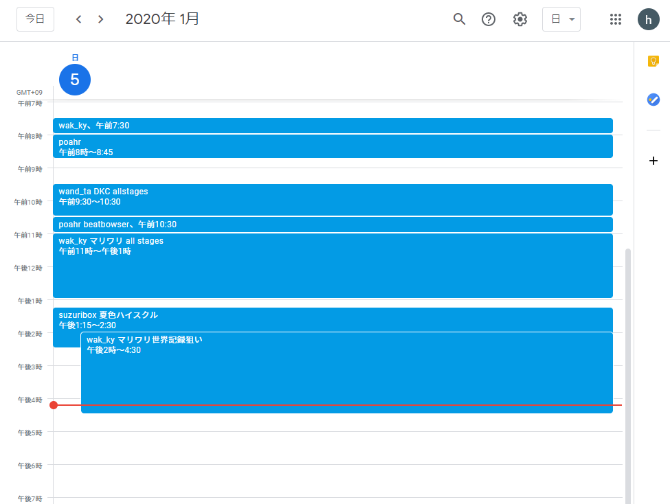
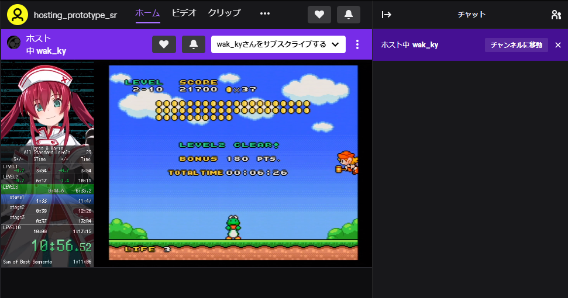
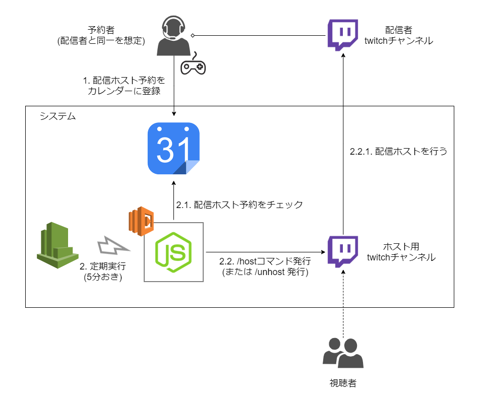
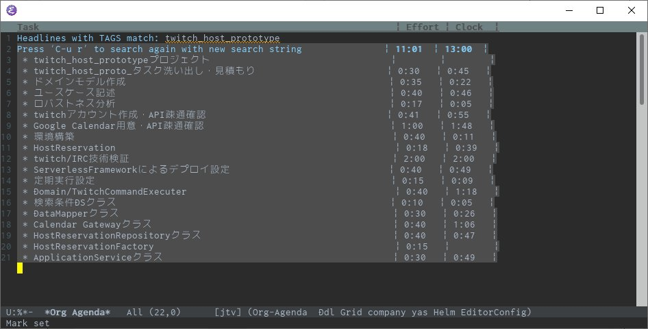

---
title: twitchの配信ホスト予約システムを作った (ゆるいRTAイベント用)
tags:
- 作った系
- 勉強メモ
date: 2020-01-05T17:11:01+09:00
URL: https://wand-ta.hatenablog.com/entry/2020/01/05/171101
EditURL: https://blog.hatena.ne.jp/wand_ta/wand-ta.hatenablog.com/atom/entry/26006613493597399
-------------------------------------

# つくったもの

- [Google Calendar](
https://calendar.google.com/calendar/r?cid=dHdpdGNoLmhvc3Rpbmcuc3JAZ21haWwuY29t)に配信ホスト予約を登録しておくと、[ホスト用チャンネル](https://www.twitch.tv/hosting_prototype_sr)が自動ホストしてくれるサービス

# モチベーション #

- ゆるい自動進行形RTAイベントの模索
    - 運営の負荷をできるだけ少なくし、気軽に開催できるイベントをつくりたい
- 「走者が好き勝手に枠を予約する感じの仕組みを作ったら需要があるのではないか」
    - @wak_ky氏, @suzuribox氏発案

# 成果物

[https://github.com/wand2016/twitch_host_prototype:embed:cite]

## 構成 ##

## Lambda関数の設計 ##

- DataMapperを格納しているMappersディレクトリは、実際にはDomain,Infrastructureと並列に置いてしまったが、依存の向き的に、図のようにInfrastructureに含めたほうが良さそうだ
- 予約取得(クエリ)と配信ホスト実行(コマンド)でLambda関数を分けたほうが良かったかも
    - SRP違反
        - Google Calendarに変更があっても、あるいはTwitchに変更があっても、コードに修正が必要になってしまう

# 学び

## 意図しなかった学び

- IRC: Internet Relay Chatプロトコル
    - twitchの`/host`, `/unhost`コマンド発行は、当初HTTP POSTか何かで行う想定だった
    - 調べてみると、[twitchのチャットはIRC](https://dev.twitch.tv/docs/irc/)らしいので急遽色々調べて触った
        - そういやchattyはIRCクライアントだった
    - [tmi.js](https://github.com/tmijs/tmi.js) -- twtich向けIRCクライアントのJS実装

## 意識してねじ込んだ学び

- ユースケース駆動モデリング
    - ユースケース記述から書き始めた
    - 続いてドメインモデル作成
    - 語彙のすり合わせを行い、抜け漏れを埋めた
    - ロバストネス分析は行わなかった
        - ユーザとのインタラクションがカレンダー登録しかないので
- Serverless Frameworkの復習
    - [Prime Videoごちうさ監視システム](https://wand-ta.hatenablog.com/entry/2020/01/04/000938)で使ったので反復練習
- CI/CDを先に整備してから実装を進めた
    - 何もしない最低限のhandler.tsを起き、先にCDを構築した
- 見積もり
    - trivate estimates続投
        - 2時間ばかりオーバーしてしまった。まだまだ楽観的すぎる
            - 技術検証と謎のバグ追跡が重かった
        - <1%の悲観的見積もりをもっと極端に盛らないといけない

