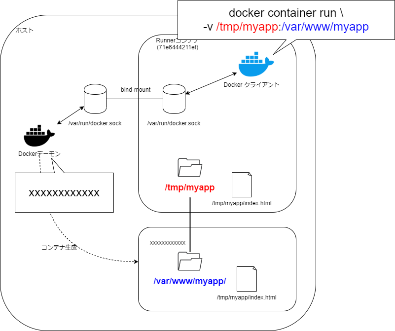

# 経緯 #

- GitLab private instanceを使っている案件にアサインした
- CIを構築するも、ランナー上でdockerを動かしたとき、bind-mountが意図通り動作しない
    - 中身のあるディレクトリをマウントしたはずなのに、コンテナからは見えない


# 再現

## ランナー相当のDooD構築

- ホストのdockerdのバージョンをまず調べる

```sh
host:~$ docker --version
```

```
Docker version 18.09.7, build 2d0083d
```

- コンテナ内のDockerクライアントから、コンテナ外(ホストマシン)のDockerデーモンにDocker リモートAPIを送信できるよう、ソケットをマウントする
- ホストのdockerdとバージョンの一致するdockerイメージを使用する


```sh
host:~$ docker container run --rm -dit -v /var/run/docker.sock:/var/run/docker.sock --name runner docker:18.09
host:~$ docker ps
```

```
CONTAINER ID        IMAGE               COMMAND                  CREATED             STATUS              PORTS               NAMES
71e6444211ef        docker:18.09        "docker-entrypoint.s…"   3 seconds ago       Up 2 seconds                            runner
```


- この時点でこういう状態:


- 簡単のために、以下、ホストのDockerクライアントとRunnerコンテナのDockerデーモンを省く:


## Runnerコンテナにログイン


```sh
host:~$ docker container exec -it runner sh
```

```
/ #
```

- Runnerコンテナ内でコンテナを一覧する

```sh
docker ps
```


```
CONTAINER ID        IMAGE               COMMAND                  CREATED             STATUS              PORTS               NAMES
71e6444211ef        docker:18.09        "docker-entrypoint.s…"   5 minutes ago       Up 5 minutes                            runner
```

- Runnerコンテナ自身が見えている
- 外側(ホスト側)のDockerデーモンにDocker リモートAPIを送信できているからに他ならない


## Runner内でコンテナ生成

```sh
# in Runner
docker container run --rm -dit alpine sh
docker ps
```

```
CONTAINER ID        IMAGE               COMMAND                  CREATED             STATUS              PORTS               NAMES
0ff3670c39c1        alpine              "sh"                     3 seconds ago       Up 2 seconds                            sad_mclean
71e6444211ef        docker:18.09        "docker-entrypoint.s…"   22 minutes ago      Up 22 minutes                           runner
```


 ここまではふつう

## Runner内でコンテナ生成する際、Runner内のファイルのbind-mountを試みる

- これになりたい:





- が、実際やってみるとおかしなことが起きる
- まずRunnerコンテナ内でファイルを用意

```sh
# in Runner
mkdir /tmp/myapp
echo 'index' > /tmp/myapp/index.html
cat /tmp/myapp/index.html
```

```
index
```

- bind-mountしてコンテナ生成を試みる

```sh
# in Runner
docker container run --rm -dit -v /tmp/myapp:/var/www/myapp busybox sh
```

```
41d34cf4052a...
```

- ログインしてファイルを見に行くと…

```sh
#in Runner
docker container exec -it 41d34cf4052a sh

# in new container
ls /var/www/myapp -la
```

```
total 8
drwxr-xr-x    2 root     root          4096 Jan 10 13:36 .
drwxr-xr-x    1 root     root          4096 Jan 10 13:36 ..
```

- **ファイルがない**
    - ディレクトリはある


- 新しく生成されたコンテナ側の`/var/www/myapp/`でファイルをtouchしても、Runner側の`/tmp/myapp/`には反映されない。
- mountできてないのでは…？


# 真相

- ホスト側のディレクトリがマウントされてました、というオチ
```sh
host:~$ ls /tmp/myapp -ld
```

```
drwxr-xr-x 2 root root 4096 Jan 10 22:36 /tmp/myapp
```


```sh
docker container run -v srcPath:destPath ...
```

の`srcPath`は、**DockerクライアントではなくDockerデーモンから見たパス**である

(考えてみれば当然。相対パスが使えないのもそれが理由だろうし)


世の中ではこの問題をどうやって解決しているんだろうか…
