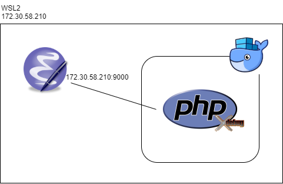
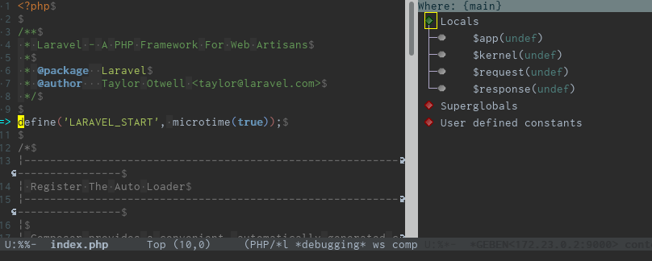
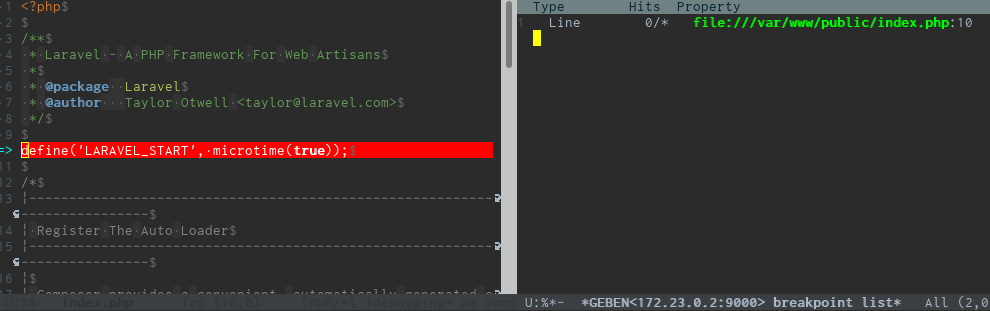
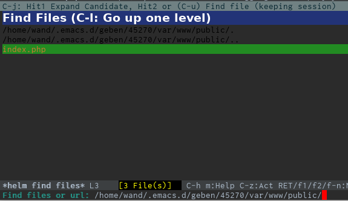
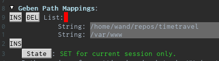
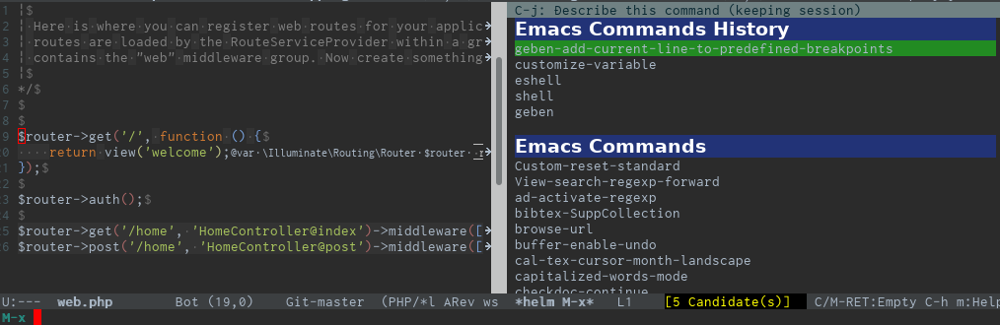
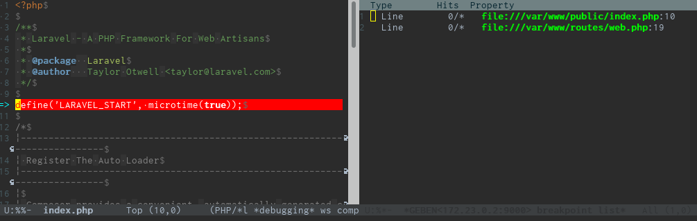
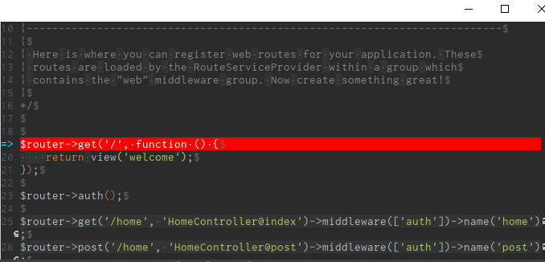

この組み合わせの資料が見当たらず、若干詰まったのでメモ書き


-------------------------------------


# サンプルリポジトリ #

- アプリケーション

[https://github.com/wand2016/timetravel-sample:embed:cite]

- docker環境

[https://github.com/wand2016/docker-php:embed:cite]


# リモートデバッグを動かすまで #

## 俯瞰図 ##



## WSL2のIPアドレス取得 ##

- Xdebugのクライアントがphp-fpmから見て`127.0.0.1`じゃないので、調べて設定する必要がある

```sh
# on WSL2
ifconfig eth0
```

```
eth0: flags=4163<UP,BROADCAST,RUNNING,MULTICAST>  mtu 1500
        inet 172.30.58.210  netmask 255.255.240.0  broadcast 172.30.63.255
...
```

- 必要なところだけ抽出

```sh
ifconfig eth0 | grep 'inet ' | awk '{print $2}'
```

```
172.30.58.210
```

- これはWSL2を起動するたびに毎回変わる


## Xdebugの設定 ##

- php-fpmコンテナのphp.ini (抜粋)
- リモートデバッグの有効/無効、リモートホストを環境変数で流し込む

```ini
[xdebug]
zend_extension=xdebug.so
xdebug.remote_enable=${XDEBUG_REMOTE_ENABLE}
xdebug.remote_autostart=off
xdebug.remote_handler=dbgp
xdebug.remote_host=${XDEBUG_REMOTE_ADDRESS}
xdebug.remote_port=9000
xdebug.remote_log=/var/log/php/xdebug.log
```

- php-fpmコンテナの環境変数

.env

```
...
XDEBUG_REMOTE_ENABLE=1
XDEBUG_REMOTE_ADDRESS=172.30.58.210
...
```


## リモートデバッグが動くことを確認 ##

- `http://localhost:10080/?XDEBUG_SESSION_START=1` にアクセス



🎉


# ストレスなくデバッグを進めるための設定 #



- デバッグしたい場所までステップするとか地獄なのでブレークポイントを張りたい



- しかし、デバッグセッションが開始するたびに  
`~/.emacs/geben/<毎回変わる番号>/`  
下にphp一時ファイルが生成されるため、この一時ファイルにあらかじめブレークポイントを張っておくことは不可能
- これを解決するには、`geben-path-mappings`変数を使う

## geben-path-mappingsの設定 ##



- `M-x customize-variable RET geben-path-mappings`
- WSL2ローカル上のプロジェクトルートと、dockerコンテナ上のリモートプロジェクトルートを設定する
    - ローカル: `/home/wand/repos/timetravel`
    - リモート: `/var/www`
        - ブレークポイントリストの `file:///var/www/` から `file://`スキーマを除いたもの



- ローカルファイル上で`geben-add-current-line-to-predefined-breakpoints` (長い) を実行しておくと





- 無事ブレークポイントを張ることが出来た🎉
