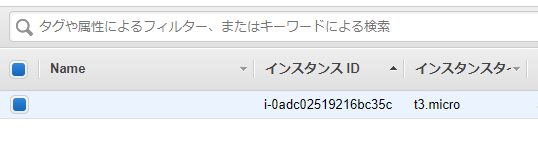

---
title: 実践Terraform ch2 基本操作
tags:
- Terraform
- 勉強メモ
date: 2020-03-03T22:56:14+09:00
URL: https://wand-ta.hatenablog.com/entry/2020/03/03/225614
EditURL: https://blog.hatena.ne.jp/wand_ta/wand-ta.hatenablog.com/atom/entry/26006613529731825
bibliography: https://nextpublishing.jp/book/10983.html
-------------------------------------

[https://github.com/wand2016/terraform_ch2_example:embed:cite]


# リソースの作成 #


- 最初にやるやつ

```sh
docker-compose run terraform init
```

```
Creating network "terraform-practice_default" with the default driver

Initializing the backend...

Initializing provider plugins...
- Checking for available provider plugins...
- Downloading plugin for provider "aws" (hashicorp/aws) 2.51.0...

The following providers do not have any version constraints in configuration,
so the latest version was installed.

To prevent automatic upgrades to new major versions that may contain breaking
changes, it is recommended to add version = "..." constraints to the
corresponding provider blocks in configuration, with the constraint strings
suggested below.

* provider.aws: version = "~> 2.51"

Terraform has been successfully initialized!

You may now begin working with Terraform. Try running "terraform plan" to see
any changes that are required for your infrastructure. All Terraform commands
should now work.

If you ever set or change modules or backend configuration for Terraform,
rerun this command to reinitialize your working directory. If you forget, other
commands will detect it and remind you to do so if necessary.
```

- 実行計画

```sh
docker-compose run terraform plan
```

```
Refreshing Terraform state in-memory prior to plan...
The refreshed state will be used to calculate this plan, but will not be
persisted to local or remote state storage.


------------------------------------------------------------------------

An execution plan has been generated and is shown below.
Resource actions are indicated with the following symbols:
  + create

Terraform will perform the following actions:

  # aws_instance.example will be created
  + resource "aws_instance" "example" {
      + ami                          = "ami-0c3fd0f5d33134a76"
      + arn                          = (known after apply)
      + associate_public_ip_address  = (known after apply)
      + availability_zone            = (known after apply)
      + cpu_core_count               = (known after apply)
      + cpu_threads_per_core         = (known after apply)
      + get_password_data            = false
      + host_id                      = (known after apply)
      + id                           = (known after apply)
      + instance_state               = (known after apply)
      + instance_type                = "t3.micro"
      + ipv6_address_count           = (known after apply)
      + ipv6_addresses               = (known after apply)
      + key_name                     = (known after apply)
      + network_interface_id         = (known after apply)
      + password_data                = (known after apply)
      + placement_group              = (known after apply)
      + primary_network_interface_id = (known after apply)
      + private_dns                  = (known after apply)
      + private_ip                   = (known after apply)
      + public_dns                   = (known after apply)
      + public_ip                    = (known after apply)
      + security_groups              = (known after apply)
      + source_dest_check            = true
      + subnet_id                    = (known after apply)
      + tenancy                      = (known after apply)
      + volume_tags                  = (known after apply)
      + vpc_security_group_ids       = (known after apply)

      + ebs_block_device {
          + delete_on_termination = (known after apply)
          + device_name           = (known after apply)
          + encrypted             = (known after apply)
          + iops                  = (known after apply)
          + kms_key_id            = (known after apply)
          + snapshot_id           = (known after apply)
          + volume_id             = (known after apply)
          + volume_size           = (known after apply)
          + volume_type           = (known after apply)
        }

      + ephemeral_block_device {
          + device_name  = (known after apply)
          + no_device    = (known after apply)
          + virtual_name = (known after apply)
        }

      + network_interface {
          + delete_on_termination = (known after apply)
          + device_index          = (known after apply)
          + network_interface_id  = (known after apply)
        }

      + root_block_device {
          + delete_on_termination = (known after apply)
          + encrypted             = (known after apply)
          + iops                  = (known after apply)
          + kms_key_id            = (known after apply)
          + volume_id             = (known after apply)
          + volume_size           = (known after apply)
          + volume_type           = (known after apply)
        }
    }

Plan: 1 to add, 0 to change, 0 to destroy.

------------------------------------------------------------------------

Note: You didn't specify an "-out" parameter to save this plan, so Terraform
can't guarantee that exactly these actions will be performed if
"terraform apply" is subsequently run.
```

実行

```sh
docker-compose run terraform apply
```

```
An execution plan has been generated and is shown below.
Resource actions are indicated with the following symbols:
  + create

Terraform will perform the following actions:

  # aws_instance.example will be created
  + resource "aws_instance" "example" {
      + ami                          = "ami-0c3fd0f5d33134a76"
      + arn                          = (known after apply)
...
    }

Plan: 1 to add, 0 to change, 0 to destroy.

Do you want to perform these actions?
  Terraform will perform the actions described above.
  Only 'yes' will be accepted to approve.

  Enter a value: yes
yes

aws_instance.example: Creating...
aws_instance.example: Still creating... [10s elapsed]
aws_instance.example: Creation complete after 13s [id=i-0adc02519216bc35c]

Apply complete! Resources: 1 added, 0 changed, 0 destroyed.
```

- promptされるので`yes`するとリソースが構築される




# 更新、再構築、削除 #

- タグ追加の場合、差分だけ更新される

```sh
docker-compose run terraform apply
```

```
aws_instance.example: Refreshing state... [id=i-0adc02519216bc35c]

An execution plan has been generated and is shown below.
Resource actions are indicated with the following symbols:
  ~ update in-place

Terraform will perform the following actions:

  # aws_instance.example will be updated in-place
  ~ resource "aws_instance" "example" {
        ami                          = "ami-0c3fd0f5d33134a76"
...
        subnet_id                    = "subnet-495cfd11"
      ~ tags                         = {
          + "Name" = "example"
        }
        tenancy                      = "default"
...
    }

Plan: 0 to add, 1 to change, 0 to destroy.

Do you want to perform these actions?
  Terraform will perform the actions described above.
  Only 'yes' will be accepted to approve.

  Enter a value: yes
yes

aws_instance.example: Modifying... [id=i-0adc02519216bc35c]
aws_instance.example: Modifications complete after 1s [id=i-0adc02519216bc35c]
```

- user dataを記述すると、再構築される


```sh
docker-compose run terraform apply
```

```
aws_instance.example: Refreshing state... [id=i-0adc02519216bc35c]

An execution plan has been generated and is shown below.
Resource actions are indicated with the following symbols:
-/+ destroy and then create replacement

Terraform will perform the following actions:

  # aws_instance.example must be replaced
-/+ resource "aws_instance" "example" {
        ami                          = "ami-0c3fd0f5d33134a76"
      ~ arn                          = "arn:aws:ec2:ap-northeast-1:646279979860:instance/i-0adc02519216bc35c" -> (known after apply)
...
      - tags                         = {
          - "Name" = "example"
        } -> null
      ~ tenancy                      = "default" -> (known after apply)
      + user_data                    = "655c303ddd9e02635f849fe2993693f147f4baf1" # forces replacement
      ~ volume_tags                  = {} -> (known after apply)
...
    }

Plan: 1 to add, 0 to change, 1 to destroy.

Do you want to perform these actions?
  Terraform will perform the actions described above.
  Only 'yes' will be accepted to approve.

  Enter a value: yes
yes

aws_instance.example: Destroying... [id=i-0adc02519216bc35c]
aws_instance.example: Still destroying... [id=i-0adc02519216bc35c, 10s elapsed]
aws_instance.example: Still destroying... [id=i-0adc02519216bc35c, 20s elapsed]
aws_instance.example: Still destroying... [id=i-0adc02519216bc35c, 30s elapsed]
aws_instance.example: Still destroying... [id=i-0adc02519216bc35c, 40s elapsed]
aws_instance.example: Still destroying... [id=i-0adc02519216bc35c, 50s elapsed]
aws_instance.example: Destruction complete after 1m0s
aws_instance.example: Creating...
aws_instance.example: Still creating... [10s elapsed]
aws_instance.example: Creation complete after 13s [id=i-099fb4f9558ea6177]

Apply complete! Resources: 1 added, 0 changed, 1 destroyed.
```


- 後始末

```sh
docker-compose run terraform destroy
```

```
aws_instance.example: Refreshing state... [id=i-099fb4f9558ea6177]

An execution plan has been generated and is shown below.
Resource actions are indicated with the following symbols:
  - destroy

Terraform will perform the following actions:

  # aws_instance.example will be destroyed
  - resource "aws_instance" "example" {
      - ami                          = "ami-0c3fd0f5d33134a76" -> null
      - arn                          = "arn:aws:ec2:ap-northeast-1:646279979860:instance/i-099fb4f9558ea6177" -> null
...
    }

Plan: 0 to add, 0 to change, 1 to destroy.

Do you really want to destroy all resources?
  Terraform will destroy all your managed infrastructure, as shown above.
  There is no undo. Only 'yes' will be accepted to confirm.

  Enter a value: yes
yes

aws_instance.example: Destroying... [id=i-099fb4f9558ea6177]
aws_instance.example: Still destroying... [id=i-099fb4f9558ea6177, 10s elapsed]
aws_instance.example: Still destroying... [id=i-099fb4f9558ea6177, 20s elapsed]
aws_instance.example: Destruction complete after 30s

Destroy complete! Resources: 1 destroyed.
```


# tfstateファイル #

- apply時、必要な部分のみ適切にリソースを更新するための情報

```json
{
  "version": 4,
  "terraform_version": "0.12.21",
  "serial": 1,
  "lineage": "9b0c8556-cf5a-63bc-39e0-c40ab191bbbf",
  "outputs": {},
  "resources": [
    {
      "mode": "managed",
      "type": "aws_instance",
      "name": "example",
      "provider": "provider.aws",
      "instances": [
        {
          "schema_version": 1,
          "attributes": {
            "ami": "ami-0c3fd0f5d33134a76",
```

- 今回は作業ログとしてgit管理したけど実運用ではNG
    - コンフリクトすると死ぬ
    - https://blog.gruntwork.io/how-to-manage-terraform-state-28f5697e68fa
