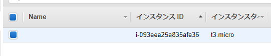
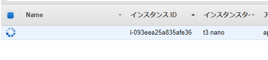
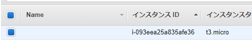
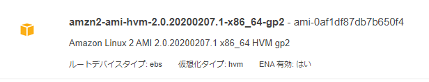
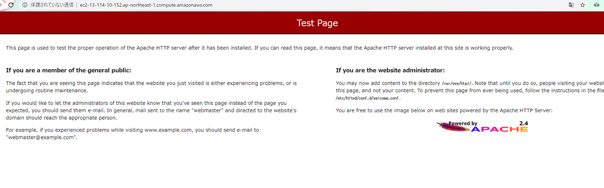

---
title: 実践Terraform ch3 基本構文
tags:
- Terraform
- 勉強メモ
date: 2020-03-04T03:27:06+09:00
URL: https://wand-ta.hatenablog.com/entry/2020/03/04/032706
EditURL: https://blog.hatena.ne.jp/wand_ta/wand-ta.hatenablog.com/atom/entry/26006613529794522
bibliography: https://nextpublishing.jp/book/10983.html
-------------------------------------

[https://github.com/wand2016/terraform_ch3_example:embed:cite]

# 変数 #

```tf
variable "example_instance_type" {
  default = "t3.micro"
}

resource "aws_instance" "example" {
  ami = "ami-0c3fd0f5d33134a76"
  instance_type = var.example_instance_type
}
```

- デフォルトで実行すると、t3.microインスタンスが生える

```sh
docker-compose run terraform apply
```



- 変数を設定して実行すると、そのインスタンスタイプのインスタンスが生える

```sh
docker-compose run terraform plan -var 'example_instance_type=t3.nano'
```

```
Refreshing Terraform state in-memory prior to plan...
The refreshed state will be used to calculate this plan, but will not be
persisted to local or remote state storage.

aws_instance.example: Refreshing state... [id=i-093eea25a835afe36]

------------------------------------------------------------------------

An execution plan has been generated and is shown below.
Resource actions are indicated with the following symbols:
  ~ update in-place

Terraform will perform the following actions:

  # aws_instance.example will be updated in-place
  ~ resource "aws_instance" "example" {
        ami                          = "ami-0c3fd0f5d33134a76"
...
        instance_state               = "running"
      ~ instance_type                = "t3.micro" -> "t3.nano"
        ipv6_address_count           = 0
...
        }
    }

Plan: 0 to add, 1 to change, 0 to destroy.

------------------------------------------------------------------------

Note: You didn't specify an "-out" parameter to save this plan, so Terraform
can't guarantee that exactly these actions will be performed if
"terraform apply" is subsequently run.
```

- 実行

```sh
docker-compose run terraform apply -var 'example_instance_type=t3.nano'
```




# ローカル変数 #

```
locals {
  example_ami = "ami-0c3fd0f5d33134a76"
  example_instance_type = "t3.nano"
}

resource "aws_instance" "example" {
  ami = local.example_ami
  instance_type = local.example_instance_type
}

resource "aws_instance" "example2" {
  ami = local.example_ami
  instance_type = local.example_instance_type
}
```

- コマンドラインで上書きできないやつ


# 出力値 #

- 生成したEC2インスタンスのIDを出力する

```
locals {
  example_instance_type = "t3.micro"
}

resource "aws_instance" "example" {
  ami = "ami-0c3fd0f5d33134a76"
  instance_type = local.example_instance_type
}

output "example_instance_id" {
  value = aws_instance.example.id
}
```


``` sh
docker-compose run terraform apply
```

```
...

Apply complete! Resources: 0 added, 1 changed, 0 destroyed.

Outputs:

example_instance_id = i-093eea25a835afe36
```




# データソース #

```
  ami = "ami-0c3fd0f5d33134a76"
```

- ↑これをやめたい
- AWSのAPIを叩いて、最新のAmazon Linux 2のAMIを取ってくる

```
data "aws_ami" "recent_amazon_linux_2" {
  most_recent = true
  owners = ["amazon"]

  filter {
    name = "name"
    values = ["amzn2-ami-hvm-2.0.*-x86_64-gp2"]
  }

  filter {
    name = "state"
    values = ["available"]
  }
}

resource "aws_instance" "example" {
  ami = data.aws_ami.recent_amazon_linux_2.image_id
  instance_type = "t3.micro"
}

output "example_ami" {
  value = data.aws_ami.recent_amazon_linux_2.image_id
}
```

```
...
Outputs:

example_ami = ami-0af1df87db7b650f4
```



- 確かに最新が取ってこれた (2020/3/4現在)
- wildcard が使える
    - `?`
    - `*`


# プロバイダ #


```
provider "aws" {
  region = "ap-northeast-1"
}
```

- ここまで、↑が暗黙的に検出・補完されていた


# 参照 #

- httpdを立て、かつ80番でアクセスできるようにする
    - ch2のhttpdはインバウンド80番を開けていなかったのでアクセスできなかった

```
resource "aws_security_group" "example_ec2" {
  name = "example-ec2"

  ingress {
    from_port = 80
    to_port = 80
    protocol = "tcp"
    cidr_blocks = ["0.0.0.0/0"]
  }

  egress {
    from_port = 0
    to_port = 0
    protocol = "-1"
    cidr_blocks = ["0.0.0.0/0"]
  }
}

resource "aws_instance" "example" {
  ami = data.aws_ami.recent_amazon_linux_2.image_id
  instance_type = "t3.micro"
  vpc_security_group_ids = [aws_security_group.example_ec2.id]

  user_data = <<EOF
    #!/bin/bash
    yum install -y httpd
    systemctl start httpd.service
EOF
}
```

- セキュリティグループリソース`aws_security_group.example_ec2`を作成し、EC2インスタンスリソース`aws_instance.example`の設定に渡している

``` sh
docker-compose run terraform apply
```



🎉

# 組み込み関数 #

```
  user_data = <<EOF
    #!/bin/bash
    yum install -y httpd
    systemctl start httpd.service
EOF
```

- ↑これをやめたい


`user_data.sh`ファイルに切り出して

``` sh
#!/bin/bash
yum install -y httpd
systemctl start httpd.service
```

- `file(path)`関数で読み込む

```
  user_data = file("./user_data.sh")
```

# モジュール #

- tfファイルを分割して管理したい

`main.tf`

```
module "web_server" {
  source = "./http_server"
  instance_type = "t3.micro"
}

output "example_public_dns" {
  value = module.web_server.public_dns
}
```

`http_server/main.tf`

```
module "security_group" {
  source = "../security_group"
}

variable "instance_type" {}

resource "aws_instance" "default" {
  ami = data.aws_ami.recent_amazon_linux_2.image_id
  instance_type = var.instance_type
  vpc_security_group_ids = [module.security_group.id]

  user_data = file("./user_data.sh")
}

data "aws_ami" "recent_amazon_linux_2" {
  most_recent = true
  owners = ["amazon"]

  filter {
    name = "name"
    values = ["amzn2-ami-hvm-2.0.*-x86_64-gp2"]
  }

  filter {
    name = "state"
    values = ["available"]
  }
}

output "public_dns" {
  value = aws_instance.default.public_dns
}
```

`security_group/main.tf`

```
resource "aws_security_group" "default" {
  name = "ec2"

  ingress {
    from_port = 80
    to_port = 80
    protocol = "tcp"
    cidr_blocks = ["0.0.0.0/0"]
  }

  egress {
    from_port = 0
    to_port = 0
    protocol = "-1"
    cidr_blocks = ["0.0.0.0/0"]
  }
}

output "id" {
  value = aws_security_group.default.id
}
```


```sh
docker-compose run terraform plan
```

```
Error: Module not installed

  on main.tf line 1:
   1: module "web_server" {

This module is not yet installed. Run "terraform init" to install all modules
required by this configuration.
```

- モジュールを読み込む必要がある

```sh
docker-compose run terraform get

docker-compose run terraform plan
docker-compose run terraform apply
```

```
...
module.web_server.module.security_group.aws_security_group.default: Creating...
module.web_server.module.security_group.aws_security_group.default: Creation complete after 2s [id=sg-08bf3a304ffa6a3a8]
module.web_server.aws_instance.default: Creating...
module.web_server.aws_instance.default: Still creating... [10s elapsed]
module.web_server.aws_instance.default: Creation complete after 12s [id=i-03665de43ec019e2d]

Apply complete! Resources: 2 added, 0 changed, 0 destroyed.
```


