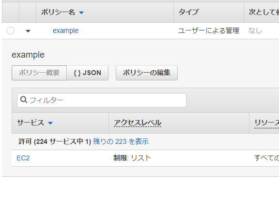
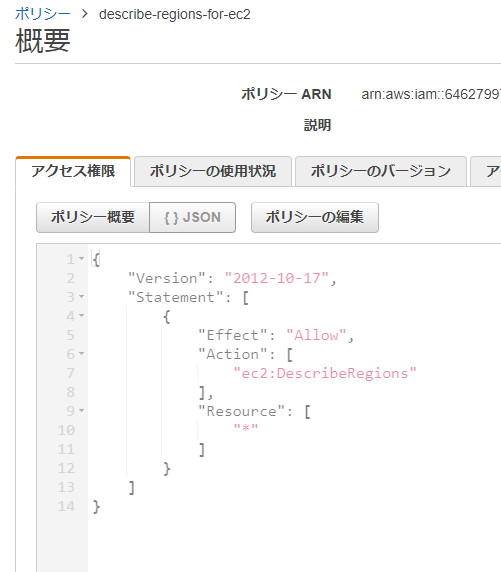
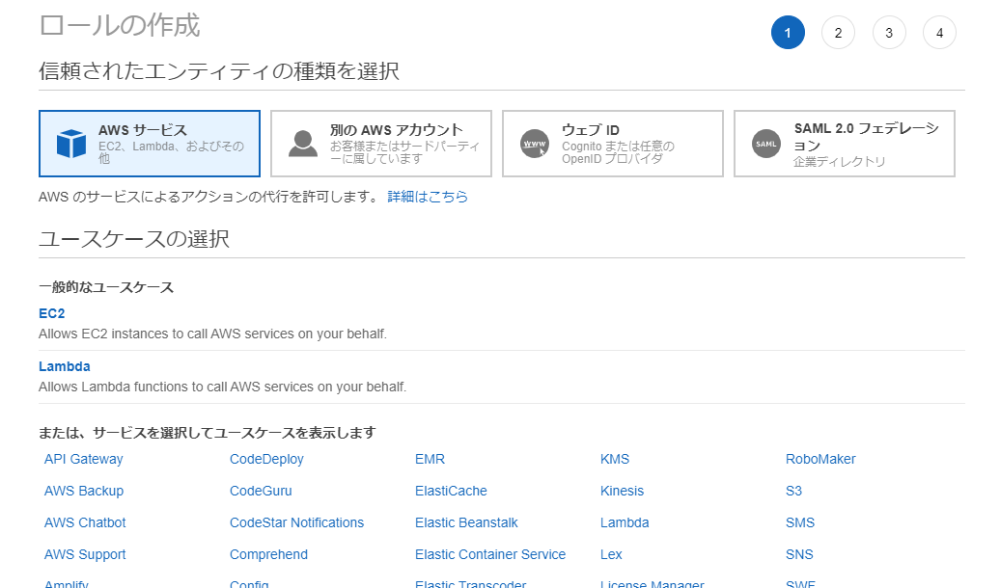
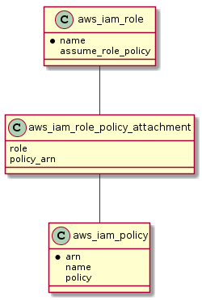

---
title: 実践Terraform ch5 権限管理
tags:
- Terraform
- 勉強メモ
date: 2020-03-05T00:01:35+09:00
URL: https://wand-ta.hatenablog.com/entry/2020/03/05/000135
EditURL: https://blog.hatena.ne.jp/wand_ta/wand-ta.hatenablog.com/atom/entry/26006613530211328
bibliography: https://nextpublishing.jp/book/10983.html
-------------------------------------


[https://github.com/wand2016/terraform_ch5_example:embed:cite]


# ポリシー #

main.tf

```tf
data "aws_iam_policy_document" "allow_describe_regions" {
  statement {
    effect = "Allow"
    actions = ["ec2:DescribeRegions"]
    resources = ["*"]
  }
}

resource "aws_iam_policy" "example" {
  name = "example"
  policy = data.aws_iam_policy_document.allow_describe_regions.json
}
```




- JSONファイルに外出しして`file()`関数で読み込んでも同じ



policy.json

```json
{
    "Version": "2012-10-17",
    "Statement": [
        {
            "Effect": "Allow",
            "Action": ["ec2:DescribeRegions"],
            "Resource": ["*"]
        }
    ]
}
```

```tf
...
resource "aws_iam_policy" "example" {
  name = "example"
  policy = file("./policy.json")
}
```


```
------------------------------------------------------------------------

No changes. Infrastructure is up-to-date.

This means that Terraform did not detect any differences between your
configuration and real physical resources that exist. As a result, no
actions need to be performed.
```

- HCLの利点
    - 変数を使える
    - コメントを書くことができる


# ロール #

## 信頼ポリシー ##

- [公式/リソースベースのポリシー](https://docs.aws.amazon.com/ja_jp/IAM/latest/UserGuide/access_policies.html#policies_resource-based)
- 「この種類のサービスにのみアタッチできるよ」ってやつ




## IAMロール作成、IAMポリシーアタッチ ##




- IAMユーザー・ロール・グループにIAMポリシーをアタッチするという世界観
    - `role`は`name`で指して、`policy`は`arn`で指す…？

```tf
resource "aws_iam_role" "default" {
  name = var.name
  assume_role_policy = data.aws_iam_policy_document.assume_role.json
}

...

resource "aws_iam_policy" "default" {
  name = var.name
  policy = var.policy
}

resource "aws_iam_role_policy_attachment" "default" {
  role = aws_iam_role.default.name
  policy_arn = aws_iam_policy.default.arn
}
```

[https://github.com/wand2016/terraform_ch5_example/blob/master/iam_role/main.tf:embed:cite]

- 名前とポリシーと信頼ポリシーを`var`で流し込んで、以降のハンズオンで再利用できるようにする
