---
title: 実践Terraform ch6 権限管理 + AWS Certified Developer Associate試験対策
tags:
- Terraform
- 勉強メモ
date: 2020-03-05T03:13:18+09:00
URL: https://wand-ta.hatenablog.com/entry/2020/03/05/031318
EditURL: https://blog.hatena.ne.jp/wand_ta/wand-ta.hatenablog.com/atom/entry/26006613530248710
bibliography: https://nextpublishing.jp/book/10983.html
-------------------------------------

[https://github.com/wand2016/terraform_ch6_example:embed:cite]

# プライベートバケット #

```tf
resource "aws_s3_bucket" "private" {
  bucket = "terraform-practice-wand-20200305"

  versioning {
    enabled = true
  }

  server_side_encryption_configuration {
    rule {
      apply_server_side_encryption_by_default {
        sse_algorithm = "AES256"
      }
    }
  }
}
```

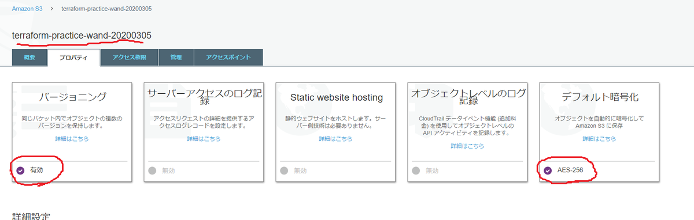

## 【補習】SSE-KMS ##

- [Terraformサンプル](https://www.terraform.io/docs/providers/aws/r/s3_bucket.html)

``` tf
resource "aws_kms_key" "mykey" {
  description             = "This key is used to encrypt bucket objects"
  deletion_window_in_days = 10
}

resource "aws_s3_bucket" "private" {
  bucket = "terraform-practice-wand-20200305"

  versioning {
    enabled = true
  }

  server_side_encryption_configuration {
    rule {
      apply_server_side_encryption_by_default {
        kms_master_key_id = aws_kms_key.mykey.arn
        sse_algorithm = "aws:kms"
      }
    }
  }
}

output mykey_arn {
  value = aws_kms_key.mykey.arn
}
```

```sh
docker-compose run terraform apply
```

```
...
Outputs:

mykey_arn = arn:aws:kms:ap-northeast-1:646279979860:key/38f00cc8-1dad-46f6-b1db-bb575b79b218
```

- KMSのキー確認

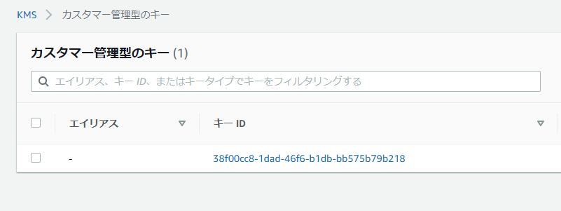

- バケットがSSE-KMSで暗号化されていることを確認

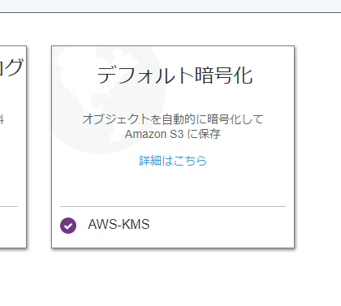


## ブロックパブリックアクセス ##

```tf
...

resource "aws_s3_bucket_public_access_block" "private" {
  bucket = aws_s3_bucket.private.id
  block_public_acls = true
  block_public_policy = true
  ignore_public_acls = true
  restrict_public_buckets = true
}
...
```

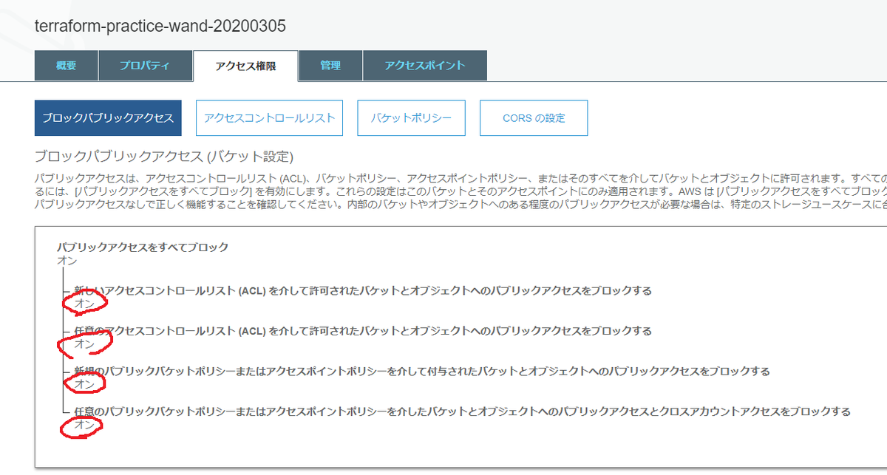


# パブリックバケット #

``` tf
resource "aws_s3_bucket" "public" {
  bucket = "terraform-practice-wand-20200305-public"
  acl = "public-read"

  cors_rule {
    allowed_origins = ["https://example.com"]
    allowed_methods = ["GET"]
    allowed_headers = ["*"]
    max_age_seconds = 3000
  }
}
```

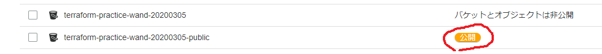

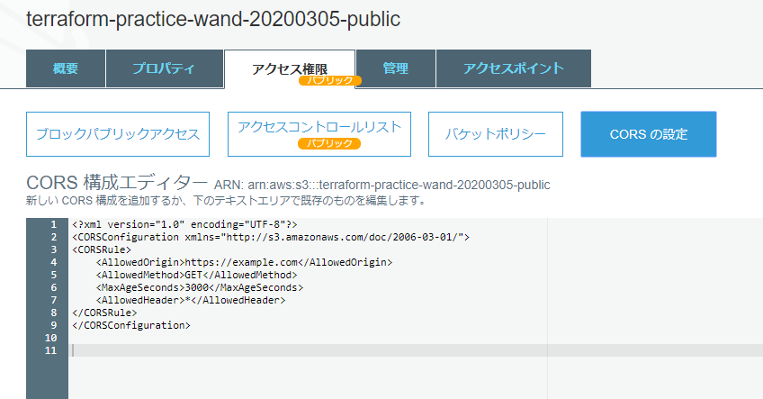

# ログバケット #

## ログローテーションバケット・バケットポリシー ##

```tf
resource "aws_s3_bucket" "alb_log" {
  bucket = "terraform-practice-wand-20200305-log"

  lifecycle_rule {
    enabled = true

    expiration {
      days = "180"
    }
  }
}

resource "aws_s3_bucket_policy" "alb_log" {
  bucket = aws_s3_bucket.alb_log.id
  policy = data.aws_iam_policy_document.alb_log.json
}

data "aws_iam_policy_document" "alb_log" {
  statement {
    effect = "Allow"
    actions = ["s3:PutObject"]
    resources = ["arn:aws:s3:::${aws_s3_bucket.alb_log.id}/*"]

    principals {
      type = "AWS"
      identifiers = ["582318560864"]
    }
  }
}
```


- `ap-northeast-1`リージョンのElastic Load Balancing アカウント ID: `582318560864`
    - [公式](https://docs.aws.amazon.com/ja_jp/elasticloadbalancing/latest/classic/enable-access-logs.html#attach-bucket-policy)

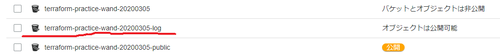

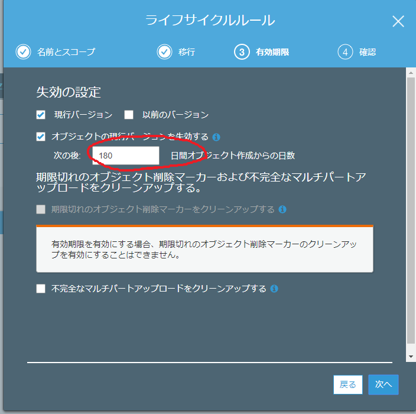


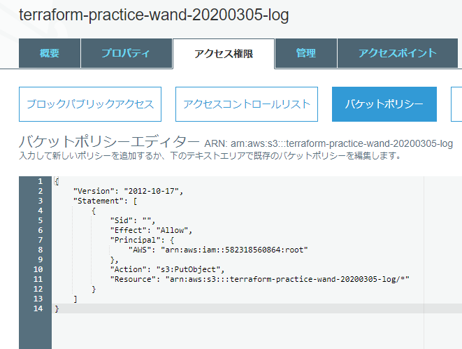


### 【補習】SSE-KMS暗号化を強制するバケットポリシーを作ってみる ###

- [公式](https://docs.aws.amazon.com/ja_jp/AmazonS3/latest/dev/UsingServerSideEncryption.html)
- SSE-KMSを強制してみる
    - SSE-S3でアップロードしたらエラー
    - SSEを使用しないとエラー


```tf
resource "aws_s3_bucket_policy" "private" {
  bucket = aws_s3_bucket.private.id
  policy = data.aws_iam_policy_document.private.json
}

data "aws_iam_policy_document" "private" {
  # SSE-KMSでない暗号化を禁止
  statement {
    sid = "DenyIncorrectEncryptionHeader"
    effect = "Deny"
    principals {
      type = "*"
      identifiers = ["*"]
    }
    actions = ["s3:PutObject"]
    resources = ["arn:aws:s3:::${aws_s3_bucket.private.id}/*"]
    condition {
      test = "StringNotEquals"
      variable = "s3:x-amz-server-side-encryption"
      values = [
        "aws:kms"
      ]
    }
  }
  # 暗号化されていないアップロードを禁止
  statement {
    sid = "DenyUnEncryptedObjectUploads"
    effect = "Deny"
    principals {
      type = "*"
      identifiers = ["*"]
    }
    actions = ["s3:PutObject"]
    resources = ["arn:aws:s3:::${aws_s3_bucket.private.id}/*"]
    condition {
      test = "Null"
      variable = "s3:x-amz-server-side-encryption"
      values = [
        "true"
      ]
    }
  }
}
```

- SSE-S3でアップロードを試みると、エラーを出してくれる

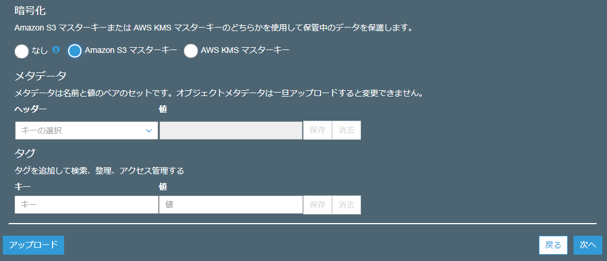

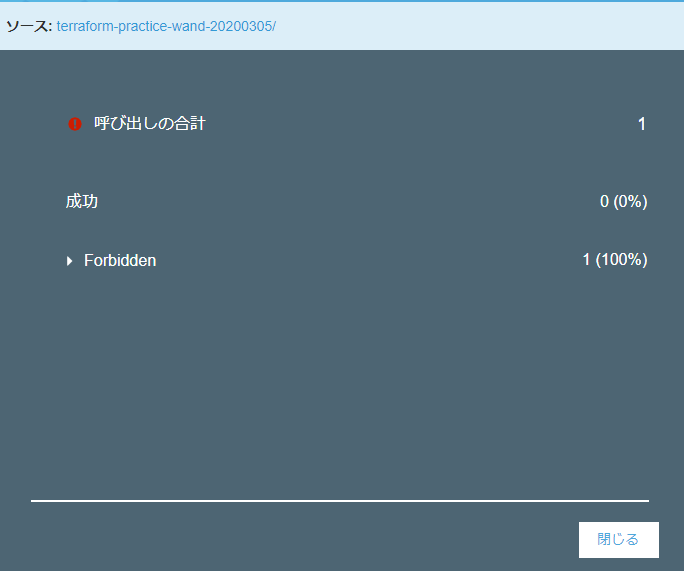

- サーバサイド暗号化なしでも同様にエラー
- SSE-KMSでアップロードしたときだけ成功する

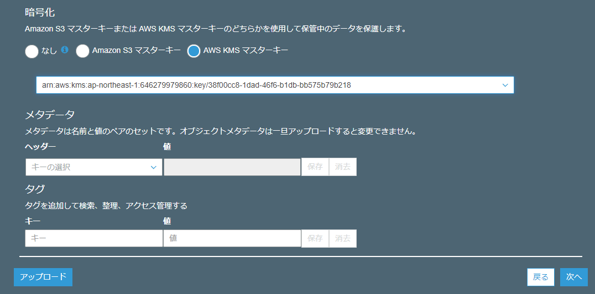

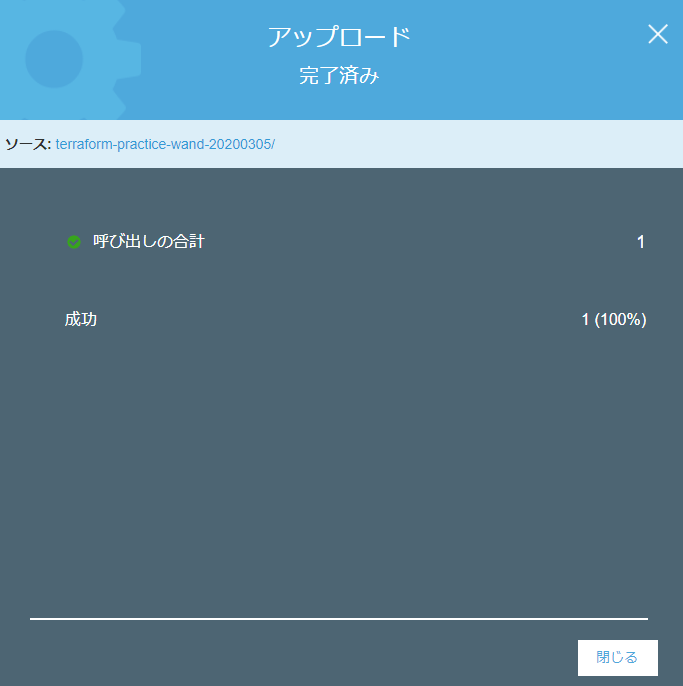
