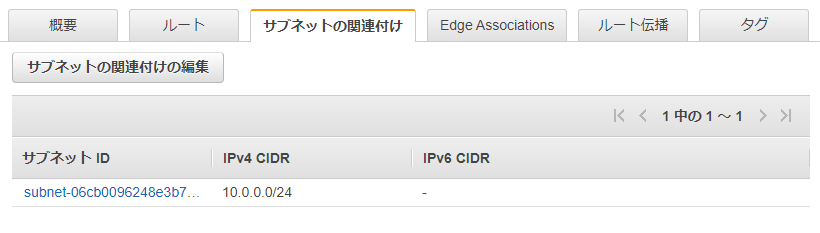
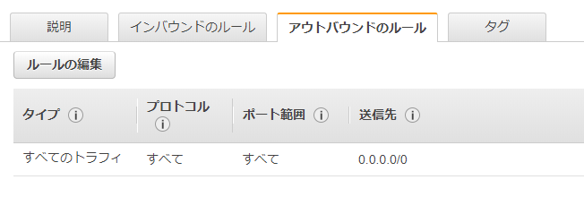

---
title: 実践Terraform ch7 権限管理
tags:
- Terraform
- 勉強メモ
date: 2020-03-06T00:00:00+09:00
URL: https://wand-ta.hatenablog.com/entry/2020/03/06/000000
EditURL: https://blog.hatena.ne.jp/wand_ta/wand-ta.hatenablog.com/atom/entry/26006613531293859
bibliography: https://nextpublishing.jp/book/10983.html
-------------------------------------


[https://github.com/wand2016/terraform_ch7_example:embed:cite]


# パブリックネットワーク #

## VPC: Virtual Private Cloud ##

``` tf
resource "aws_vpc" "example" {
  cidr_block = "10.0.0.0/16"
  enable_dns_support = true
  enable_dns_hostnames = true

  tags = {
    Name = "example"
  }
}
```


- CIDRブロックは後から変えられないのでまじめに設計する
    - [VPCピアリング](https://docs.aws.amazon.com/ja_jp/vpc/latest/userguide/vpc-peering.html)等考慮して
        - 2つのVPC間でプライベートなトラフィックのルーティングを可能にする
- 名前解決
    - `enable_dns_support = true`
        - AWSのDNSサーバーによる名前解決を有効化
    - `enable_dns_hostnames = true`
        - VPC内のリソースにパブリックDNSホスト名を自動的に割り当てる


## パブリックサブネット ##

``` tf
resource "aws_subnet" "public" {
  vpc_id = aws_vpc.example.id
  cidr_block = "10.0.0.0/24"
  map_public_ip_on_launch = true
  availability_zone = "ap-northeast-1a"

  tags = {
    Name = "example"
  }
}
```


- CIDRブロック
    - VPCでは`/16`、サブネットでは`/24`にするとわかりやすい
- `map_public_ip_on_launch = true`
    - このサブネットで起動したインスタンスにパブリックIPアドレス自動割り当て
- `availability_zone = "ap-northeast-1a"`
    - アベイラビリティゾーンをまたいだサブネットは作れない


## インターネットゲートウェイ・ルートテーブル ##

``` tf
resource "aws_internet_gateway" "example" {
  vpc_id = aws_vpc.example.id

  tags = {
    Name = "example"
  }
}
```


``` tf
resource "aws_route_table" "public" {
  vpc_id = aws_vpc.example.id

  tags = {
    Name = "example"
  }
}
```


- インターネットに接続するためのやつ
- VPC内の通信のため、local routeが自動的に作られる
    - 変更や削除不可
    - terraformからも制御できない


## ルート ##

``` tf
resource "aws_route" "public" {
  route_table_id = aws_route_table.public.id
  gateway_id = aws_internet_gateway.example.id
  destination_cidr_block = "0.0.0.0/0"
}
```


## ルートテーブルの関連付け ##

``` tf
resource "aws_route_table_association" "public" {
  subnet_id = aws_subnet.public.id
  route_table_id = aws_route_table.public.id
}
```




# プライベートネットワーク #

- インターネットからアクセスしないリソースを配置する
    - DB
    - アプリケーションサーバー
- パブリックネットワークに置くものは最小限に


## プライベートサブネット ##

``` tf
resource "aws_subnet" "private" {
  vpc_id = aws_vpc.example.id
  cidr_block = "10.0.64.0/24"
  availability_zone = "ap-northeast-1a"
  map_public_ip_on_launch = false

  tags = {
    Name = "example"
  }
}
```


- CIDRブロック
    - パブリックサブネットとは別のCIDRブロックを充てること
- `map_public_ip_on_launch = false`
    - このサブネットで起動したインスタンスにパブリックIPアドレス自動割り当て不要


## ルートテーブル作成・関連付け ##

``` tf
resource "aws_route_table" "private" {
  vpc_id = aws_vpc.example.id

  tags = {
    Name = "example_private"
  }
}

resource "aws_route_table_association" "private" {
  subnet_id = aws_subnet.private.id
  route_table_id = aws_route_table.private.id
}
```


## NATゲートウェイ ##

- NAT: Network Address Translation

``` tf
resource "aws_eip" "nat_gateway" {
  vpc = true
  depends_on = [aws_internet_gateway.example]
}

resource "aws_nat_gateway" "example" {
  allocation_id = aws_eip.nat_gateway.id
  subnet_id = aws_subnet.public.id
  depends_on = [aws_internet_gateway.example]
}

resource "aws_route" "private" {
  route_table_id = aws_route_table.private.id
  nat_gateway_id = aws_nat_gateway.example.id
  destination_cidr_block = "0.0.0.0/0"
}
```


# マルチAZ #


## パブリックネットワークのマルチAZ化 ##

``` diff
- resource "aws_subnet" "public" {
-   vpc_id = aws_vpc.example.id
-   cidr_block = "10.0.0.0/24"
-   map_public_ip_on_launch = true
-   availability_zone = "ap-northeast-1a"
-  
-   tags = {
-     Name = "example"
-   }
- }

+ resource "aws_subnet" "public_0" {
+   vpc_id = aws_vpc.example.id
+   cidr_block = "10.0.1.0/24"
+   map_public_ip_on_launch = true
+   availability_zone = "ap-northeast-1a"
+  
+   tags = {
+     Name = "example-1a"
+   }
+ }
+  
+ resource "aws_subnet" "public_1" {
+   vpc_id = aws_vpc.example.id
+   cidr_block = "10.0.2.0/24"
+   map_public_ip_on_launch = true
+   availability_zone = "ap-northeast-1c"
+  
+   tags = {
+     Name = "example-1c"
+   }
+ }
```


``` diff
- resource "aws_route_table_association" "public" {
-   subnet_id = aws_subnet.public.id
-   route_table_id = aws_route_table.public.id
- }
-  
+ resource "aws_route_table_association" "public_0" {
+   subnet_id = aws_subnet.public_0.id
+   route_table_id = aws_route_table.public.id
+ }
+  
+ resource "aws_route_table_association" "public_1" {
+   subnet_id = aws_subnet.public_1.id
+   route_table_id = aws_route_table.public.id
+ }
```

``` diff
  resource "aws_nat_gateway" "example" {
    allocation_id = aws_eip.nat_gateway.id
-   subnet_id = aws_subnet.public.id
+   subnet_id = aws_subnet.public_0.id
    depends_on = [aws_internet_gateway.example]
  }
```


## プライベートネットワークのマルチAZ化 ##


``` diff
- resource "aws_subnet" "private" {
-   vpc_id = aws_vpc.example.id
-   cidr_block = "10.0.64.0/24"
-   availability_zone = "ap-northeast-1a"
-   map_public_ip_on_launch = false
-  
-   tags = {
-     Name = "example_private"
-   }
- }
   
+ resource "aws_subnet" "private_0" {
+   vpc_id = aws_vpc.example.id
+   cidr_block = "10.0.65.0/24"
+   availability_zone = "ap-northeast-1a"
+   map_public_ip_on_launch = false
+  
+   tags = {
+     Name = "example_private_1a"
+   }
+ }
+  
+ resource "aws_subnet" "private_1" {
+   vpc_id = aws_vpc.example.id
+   cidr_block = "10.0.66.0/24"
+   availability_zone = "ap-northeast-1c"
+   map_public_ip_on_launch = false
+  
+   tags = {
+     Name = "example_private_1c"
+   }
+ }
```

``` diff
- resource "aws_eip" "nat_gateway" {
-   vpc = true
-   depends_on = [aws_internet_gateway.example]
- }

+ resource "aws_eip" "nat_gateway_0" {
+   vpc = true
+   depends_on = [aws_internet_gateway.example]
+ }
+  
+ resource "aws_eip" "nat_gateway_1" {
+   vpc = true
+   depends_on = [aws_internet_gateway.example]
+ }
```

``` diff
- resource "aws_nat_gateway" "example" {
-   allocation_id = aws_eip.nat_gateway.id
-   subnet_id = aws_subnet.public_0.id
-   depends_on = [aws_internet_gateway.example]
- }

+ resource "aws_nat_gateway" "nat_gateway_0" {
+   allocation_id = aws_eip.nat_gateway_0.id
+   subnet_id = aws_subnet.public_0.id
+   depends_on = [aws_internet_gateway.example]
+ }
+  
+ resource "aws_nat_gateway" "nat_gateway_1" {
+   allocation_id = aws_eip.nat_gateway_1.id
+   subnet_id = aws_subnet.public_1.id
+   depends_on = [aws_internet_gateway.example]
+ }
```

``` diff
- resource "aws_route_table" "private" {
-   vpc_id = aws_vpc.example.id
-  
-   tags = {
-     Name = "example_private"
-   }
- }

+ resource "aws_route_table" "private_0" {
+   vpc_id = aws_vpc.example.id
+  
+   tags = {
+     Name = "example_private_0"
+   }
+ }
+  
+ resource "aws_route_table" "private_1" {
+   vpc_id = aws_vpc.example.id
+  
+   tags = {
+     Name = "example_private_1"
+   }
+ }
```

``` diff
- resource "aws_route_table_association" "private" {
-   subnet_id = aws_subnet.private.id
-   route_table_id = aws_route_table.private.id
- }

+ resource "aws_route_table_association" "private_0" {
+   subnet_id = aws_subnet.private_0.id
+   route_table_id = aws_route_table.private_0.id
+ }
+  
+ resource "aws_route_table_association" "private_1" {
+   subnet_id = aws_subnet.private_1.id
+   route_table_id = aws_route_table.private_1.id
+ }
```

``` diff
- resource "aws_route" "private" {
-   route_table_id = aws_route_table.private.id
-   nat_gateway_id = aws_nat_gateway.example.id
-   destination_cidr_block = "0.0.0.0/0"
- }

+ resource "aws_route" "private_0" {
+   route_table_id = aws_route_table.private_0.id
+   nat_gateway_id = aws_nat_gateway.nat_gateway_0.id
+   destination_cidr_block = "0.0.0.0/0"
+ }
+  
+ resource "aws_route" "private_1" {
+   route_table_id = aws_route_table.private_1.id
+   nat_gateway_id = aws_nat_gateway.nat_gateway_1.id
+   destination_cidr_block = "0.0.0.0/0"
+ }
```


# ファイアウォール #

- ネットワークACLとセキュリティグループがある
- ここでは、セキュリティグループを学ぶ


``` tf
resource "aws_security_group" "example" {
  name = "example"
  vpc_id = aws_vpc.example.id
  tags = {
    Name = "example"
  }
}

resource "aws_security_group_rule" "ingress_example" {
  type = "ingress"
  from_port = "80"
  to_port = "80"
  protocol = "tcp"
  cidr_blocks = ["0.0.0.0/0"]
  security_group_id = aws_security_group.example.id
}

resource "aws_security_group_rule" "egress_example" {
  type = "egress"
  from_port = 0
  to_port = 0
  protocol = "-1"
  cidr_blocks = ["0.0.0.0/0"]
  security_group_id = aws_security_group.example.id
}
```



