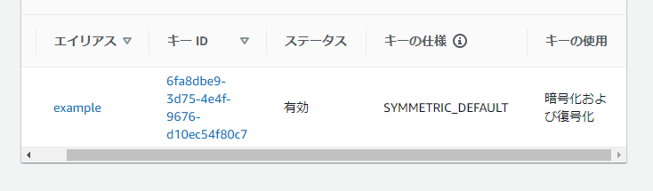
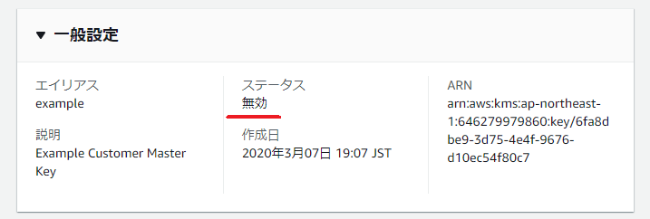
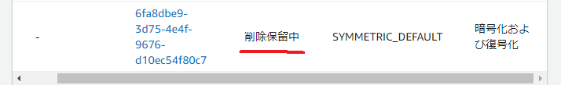
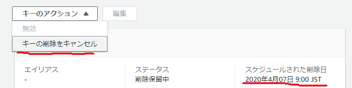

---
title: 実践Terraform ch11 鍵管理
tags:
- Terraform
- 勉強メモ
date: 2020-03-07T19:32:53+09:00
URL: https://wand-ta.hatenablog.com/entry/2020/03/07/193253
EditURL: https://blog.hatena.ne.jp/wand_ta/wand-ta.hatenablog.com/atom/entry/26006613531341821
bibliography: https://nextpublishing.jp/book/10983.html
-------------------------------------


# KMS: Key Management Service #

- [公式/AWS Key Management Service の概念](https://docs.aws.amazon.com/ja_jp/kms/latest/developerguide/concepts.html#data-keys)
- AWS KMS カスタマーマスターキー (CMK) を使用して、データキーの生成、暗号化、復号化を実行する
    - CMKで直接暗号化・復号化は行わない


``` tf
resource "aws_kms_key" "example" {
  description = "Example Customer Master Key"
  enable_key_rotation = true
  is_enabled = true
  deletion_window_in_days = 30
}

resource "aws_kms_alias" "example" {
  name = "alias/example"
  target_key_id = aws_kms_key.example.key_id
}
```



- 削除は非推奨
- 代わりに無効化を使うべき

``` diff
-   is_enabled = true
+   is_enabled = false
```




- 削除する場合

```sh
docker-compose run terraform destroy
```





- `deletion_window_in_days`で指定した日数の間は削除が保留される
    - デフォルト30日
    - 期間内ならば削除をキャンセルできる
