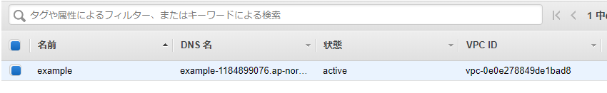
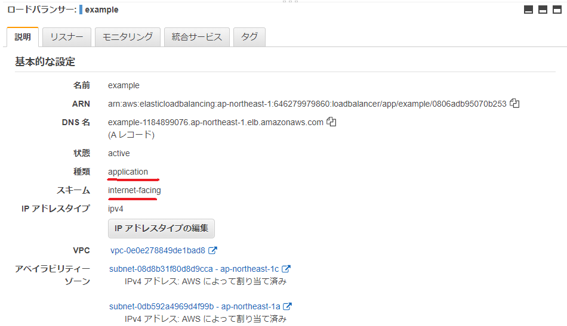
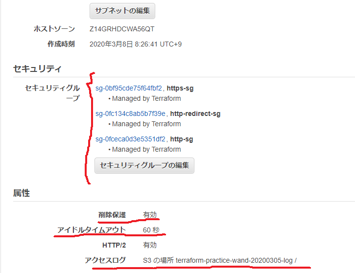
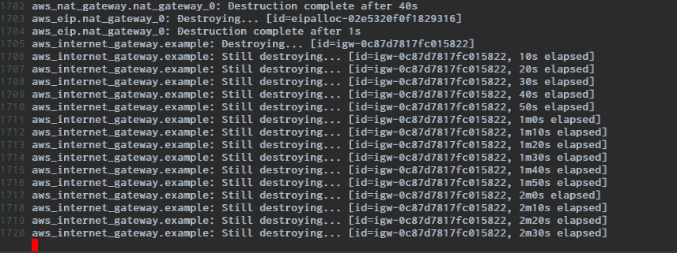
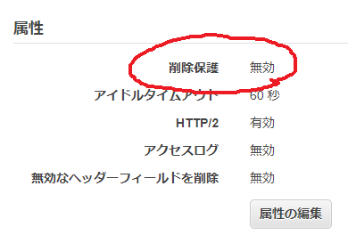
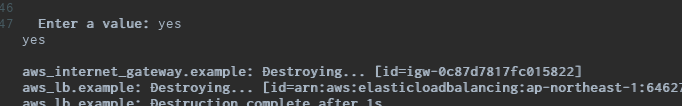

---
title: 実践Terraform ch8 ロードバランサーとDNS (1/2)
tags:
- 勉強メモ
- Terraform
date: 2020-03-08T10:13:57+09:00
URL: https://wand-ta.hatenablog.com/entry/2020/03/08/101357
EditURL: https://blog.hatena.ne.jp/wand_ta/wand-ta.hatenablog.com/atom/entry/26006613531593599
bibliography: https://nextpublishing.jp/book/10983.html
-------------------------------------

[https://github.com/wand2016/terraform_ch8_example:embed:cite]


# HTTP用ロードバランサー #

```tf
resource "aws_lb" "example" {
  name = "example"
  load_balancer_type = "application"
  internal = false
  idle_timeout = 60
  enable_deletion_protection = true

  subnets = [
    aws_subnet.public_0.id,
    aws_subnet.public_1.id
  ]

  access_logs {
    bucket = aws_s3_bucket.alb_log.id
    enabled = true
  }

  security_groups = [
    module.http_sg.security_group_id,
    module.https_sg.security_group_id,
    module.https_redirect_sg.security_group_id
  ]
}
```



- `load_balancer_type = "application"`
    - "network"だとNLBになる
- `internal = false`
    - true: VPC内部向け
    - false: インターネット向け
- `idle_timeout = 60`
    - デフォルト60秒
- `enable_deletion_protection = true`
    - [公式/LBの削除保護](https://docs.aws.amazon.com/ja_jp/elasticloadbalancing/latest/application/application-load-balancers.html#deletion-protection)
- サブネット
    - [公式/ALBクロスゾーン負荷分散](https://docs.aws.amazon.com/ja_jp/elasticloadbalancing/latest/userguide/how-elastic-load-balancing-works.html#cross-zone-load-balancing)
     

```tf
subnets = [
  aws_subnet.public_0.id,
  aws_subnet.public_1.id
]
```

- AZの異なる2つ以上のサブネットを指定しないとエラーになる


```
Error: Error creating application Load Balancer: ValidationError: At least two subnets in two different Availability Zones must be specified
	status code: 400, request id: cac1ce58-dd9b-47e6-a650-3fbc9e5cd436
```

- アクセスログ

``` tf
access_logs {
  bucket = aws_s3_bucket.alb_log.id
  enabled = true
}
```

- セキュリティグループ
    
``` tf
security_groups = [
  module.http_sg.security_group_id,
  module.https_sg.security_group_id,
  module.https_redirect_sg.security_group_id
]
```






## リスナー ##


``` tf
resource "aws_lb_listener" "http" {
  load_balancer_arn = aws_lb.example.arn
  port = "80"
  protocol = "HTTP"

  default_action {
    type = "fixed-response"

    fixed_response {
      content_type = "application/json"
      message_body = "{\"message\":\"これは『HTTP』です\"}"
      status_code = "200"
    }
  }
}

output "public_dns" {
  value = aws_lb.example.dns_name
}
```

``` sh
docker-compose run terraform apply
```

```
...
public_dns = example-870645885.ap-northeast-1.elb.amazonaws.com
```

- [公式/ALBのリスナー](https://docs.aws.amazon.com/ja_jp/elasticloadbalancing/latest/application/load-balancer-listeners.html)

``` sh
curl example-870645885.ap-northeast-1.elb.amazonaws.com
```

```json
{"message":"これは『HTTP』です"}
```

- `protocol = "HTTP"`
    - ALBではHTTP/HTTP
- `port = "80"`
    - リッスンするポート
    - HTTPなので80

```tf
default_action {
  type = "fixed-response"

  fixed_response {
    content_type = "application/json"
    message_body = "{\"message\":\"これは『HTTP』です\"}"
    status_code = "200"
  }
}
```

- デフォルトアクション
    - [公式/ルール](https://docs.aws.amazon.com/ja_jp/elasticloadbalancing/latest/application/load-balancer-listeners.html#rule-action-types)
    - 認証系
        - `authenticate-cognito`
        - `authenticate-oidc`
    - `fixed-response`
    - 転送系
        - `forward`
            - 別のターゲットグループへ転送
        - `redirect`
            - 別のURLへ転送


#【追記】terraform destroyでハング #



- still destroying...のまま永久に返ってこない
- ALBの削除保護が有効になっていると、エラーになることもなくハングする模様





- ALBの削除保護を無効にして再試行すると、無事削除できた
- ↓現象を確認したバージョン

```
Terraform v0.12.21
+ provider.aws v2.52.0
```
