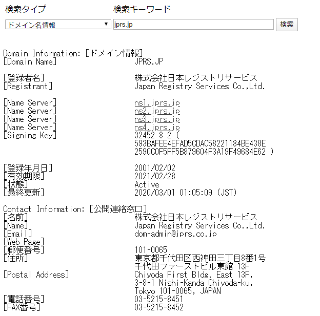
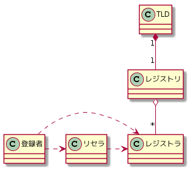
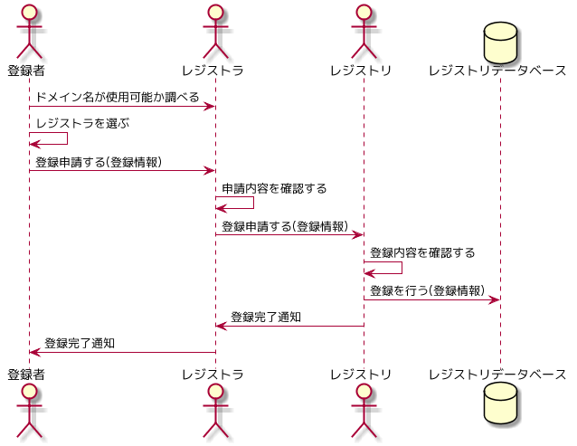

---
title: DNSがよくわかる教科書 ch2
tags:
- DNS
- 勉強メモ
date: 2020-03-08T13:19:04+09:00
URL: https://wand-ta.hatenablog.com/entry/2020/03/08/131904
EditURL: https://blog.hatena.ne.jp/wand_ta/wand-ta.hatenablog.com/atom/entry/26006613531664792
bibliography: https://www.sbcr.jp/products/4797394481.html?sku=4797394481
-------------------------------------

# レジストリとは #

- インターネットは分散管理・委任が原則
- しかし、インターネットに接続されたホストの識別子に関しては例外的に一元的に管理する
    - さもないと利用者が混乱するため
- 「レジストリ」
    - レジストリオペレーター
    - レジストリデータベース
- 本書では前者の意

## IPアドレスとドメイン名の管理の違い ##

- IPアドレスのレジストリ
    - 限りある資源の公平な割り当て重視
- ドメイン名のレジストリ
    - そうではないので柔軟性をもつ
    - 商標権に関する紛争解決等の仕組みも担う

## レジストリの役割 ##

- レジストリデータベースの運用管理
    - 個人名、組織名、連絡先等の情報の管理
- ポリシーに基づいた登録規則の策定
    - 登録規則・細則等の策定・周知
- 登録申請の受付
- Whoisサービスの提供
- ネームサーバーの運用
- 情報発信・教育啓発運動

<figure class="figure-image figure-image-fotolife" title="Whoisサービス">

<figcaption>Whoisサービス</figcaption>
</figure>

### Column: ドメイン名のライフサイクル ###

- 有効期限を過ぎると、一定期間をへて「廃止」(suspended)になる
- 廃止後、一定期間をへて「削除」となる
- 廃止の間は、先願制で誰でも登録申請ができる
    - ドロップキャッチ
        - 登録可能になる瞬間を狙って素早く登録しようとする行為
- DRPに該当する事由がない限り、第三者による登録・利用差し止めはできない
    - 商標権の侵害等
- ので、ドメイン名の廃止の際には十分な留意を要する

## レジストリとTLDの関係 ##

- TLDごとにレジストリが存在する
- TLDの分類
    - ccTLD: Country Code -
        - 国や地域ごと
        - `.jp`とか
    - gTLD: Generic - 
        - 国や地域によらない
        - `.com`とか
        - `.gov`など、登録に制限のあるものも

## ドメイン名と商標権 ##

- サイバースクワッティング
    - ドメイン名を不正な目的で登録・使用する行為
- 例
    - 転売目的で他人が権利を持つ商標や商号のドメインを先に取る
    - 著名な名前を使用して混同惹起する
- 該当しない例
    - 同様のサービスを提供する企業同士のドメイン名の取り合い
- DRP: domain name Dispute Resolution Policy (ドメイン名紛争処理方針)
    - 不正な目的によるドメイン名の登録・使用に関して生じた紛争を処理するためのしくみ
    - TLDごとに策定・適用される
    - UDRP: Uniform -
        - gTLDに適用されるもの
    - JP-DRP
        - JPドメイン名に適用されるもの
        - UDRPをもとに作られた

# レジストリ・レジストラモデルとレジストラの役割 #

## レジストリ・レジストラモデル ##

- `.jp`や`.com`,`.net`等、主要なTLDで採用されている
- レジストリ
    - 一元管理する人
    - 登録されるドメイン名の一意性の確保
- レジストラ
    - 登録申請を取り次ぐ人
    - 価格やサービス面の多様性の確保
    - JPRSでは「指定事業者」と呼ぶ
- リセラ
    - 登録者とレジストラの間に入って各種申請を取り次ぐ人
    - 「WHOIS情報公開代行サービス」とか呼ばれるやつ

## レジストラの役割 ##

- 登録者からの登録申請受付
- レジストリへの登録依頼取り次ぎ
- 自身が取り扱うドメイン名についてのWhoisサービス提供
- 登録者情報管理

# ドメイン名を登録する #

## 登録者が行うこと補足 ##

1. ドメイン名が使用可能か調べる
    - 原則先願制
    - Whois等で
1. ドメイン名を申請可能なレジストラを選ぶ
    - 価格やサービス等を勘案してを選ぶ
1. 提出すべき情報を揃える
    - 個人名
    - 組織名
    - 各種連絡先
    - ドメイン名の種類によっては、要件を満たしていることの証明
        - `.edu`は米国教育機関だけ、とかそういうの

# ドメイン名を使えるようにする #

## 登録者が行うこと ##

1. 自分のドメイン名(例: `example.jp`)を取り扱うネームサーバーをインターネット上で動かす
2. 登録したドメイン名に関する情報を、1.で動かしたネームサーバー(例: `ns1.example.jp`, `192.0.2.1`)に設定する
    - Aレコード `example.jp 192.0.2.10`等
3. ネームサーバーが、インターネットから聞かれたことに答えられるかを確認する
    - 「`example.jp`のIPアドレスは`192.0.2.10`です」
4. ネームサーバー情報の設定をレジストラに申請する

## レジストラが行うこと ##

1. ネームサーバー情報の設定申請をレジストリに取り次ぐ

## レジストリが行うこと ##

例: JP TLD

1. 申請情報の登録
1. レジストリの管理するネームサーバーに、登録者のネームサーバー情報を登録する
   - 親(`jp`)に子(`example.jp`)のネームサーバー情報が設定される
   - レジストリと登録者はDNSにおける親子関係になる

### Column: 外部サービスの利用 ###

- きょうびはネームサーバーの管理もレジストラにやってもらうのが一般的
- とはいえ裏側で何が行われているのか知ることは肝要
    - サービスの利用・選定の際に役に立つ

# ドメイン名のグローバルな管理体制 #

> The Internet is for Everyone  (Vint Cerf)

- 基本は分散管理

## インターネットガバナンスとは ##

- [ICANN用語集](https://www.icann.org/icann-acronyms-and-terms/en/G0033)

> The rules, norms, mechanisms, and organizations  
> through which the global Internet community’s many stakeholders work together  
> to shape the evolution and use of the Internet.

## インターネットの識別子に関するグローバルな管理・調整 ##

- ICANN: Internet Corporation for Assigned Names and Numbers
    - 米国非営利団体
- 役割
    - インターネットの識別子の管理・調整
    - DNSのルートサーバーシステムの運用・調整
    - 上記2つの技術的機能に関するポリシーの作成・調整

## ドメイン名に関するポリシーの検討 ##

- ICANNの支持組織2つで検討される
- ccNSO: Country Code Names Supporting Organisation
    - ccTLD全体に関すること
    - (organi**s**ationはtypoではない)
- GNSO: Generic Names Supporting Organization
    - gTLDに関すること

## IANA: Internet Assigned Numbers Authority ##

- ICANNのいち機能
    - ICANNの子会社(affiliate of ICANN)、PTI: Public Technical Iditifiers が運用
- インターネットの識別子に関する管理・調整を担う
    - ドメイン名
    - IPアドレス
    - AS番号
        - [JPNIC/4バイトAS番号とは](https://www.nic.ad.jp/ja/basics/terms/as4bytes.html)
        - AS: Autonomous System (自律システム)
            - BGPによる経路制御の単位
        - ASに対して割り当てられる一意な番号
    - 通信プロトコルで使われる名前・番号
        - [Service Name and Transport Protocol Port Number Registry](https://www.iana.org/assignments/service-names-port-numbers/service-names-port-numbers.xhtml)
        - well-known portsがずらり
