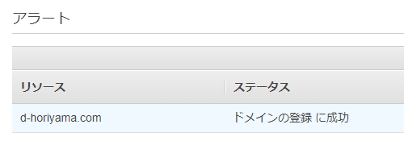
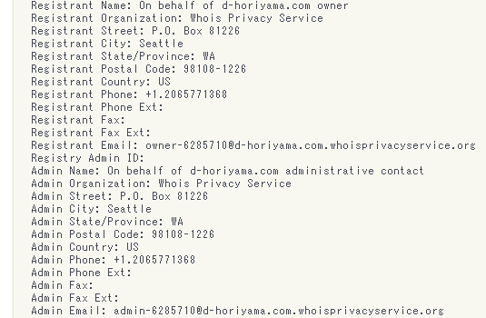
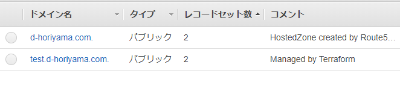
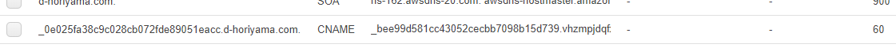
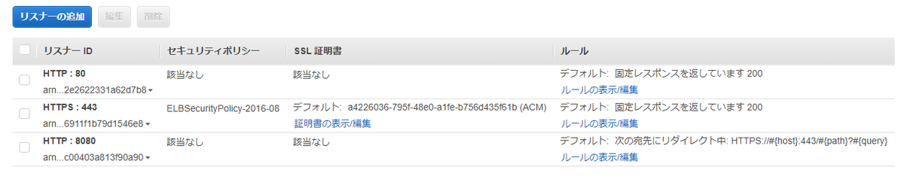
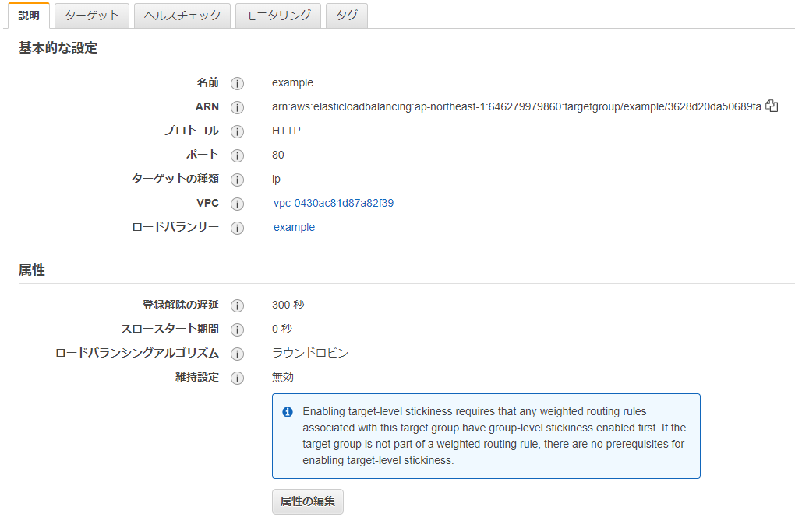
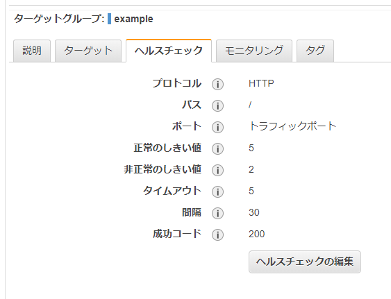
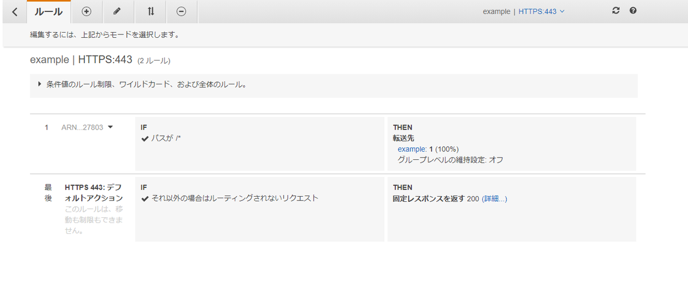

---
title: 実践Terraform ch8 ロードバランサーとDNS (2/2)
tags:
- Terraform
- 勉強メモ
date: 2020-03-09T22:18:19+09:00
URL: https://wand-ta.hatenablog.com/entry/2020/03/09/221819
EditURL: https://blog.hatena.ne.jp/wand_ta/wand-ta.hatenablog.com/atom/entry/26006613532546058
bibliography: https://nextpublishing.jp/book/10983.html
-------------------------------------

[https://github.com/wand2016/terraform_ch8_example:embed:cite]

# Route 53 #

## ドメインの登録 ##

- マネジメントコンソール上でポチポチする
    - Terraform上からは実行できない



- [Route53で登録可能なドメイン](https://docs.aws.amazon.com/Route53/latest/DeveloperGuide/registrar-tld-list.html#C)
    - `.com`なんかは、Whois情報公開代行もしてくれる




## ホストゾーン ##

- [AWS公式](https://docs.aws.amazon.com/ja_jp/Route53/latest/DeveloperGuide/hosted-zones-working-with.html)
    - `example.com`やそのサブドメインの特定のドメイントラフィックをどのようにルーティングするかに関する情報を保持する
- 種類
    - パブリックホストゾーン
        - トラフィックをインターネットでどのようにルーティングするか
    - プライベートホストゾーン
        - トラフィックをAmazon VPCでどのようにルーティングするか
- Route53でドメイン名を取得すると、ホストゾーンが自動生成される
- 自動生成されたものの取得

```
data "aws_route53_zone" "exmample" {
  name = "d-horiyama.com"
}
```

- サブドメインのホストゾーンを作る
    - ドメイン名をよそで取得して、サブドメインだけRoute53のネームサーバーに管理を委譲する場合などにも

```tf
resource "aws_route53_zone" "test_d-horiyama" {
  name = "test.d-horiyama.com"
}
```




## DNSレコード ##

```tf
data "aws_route53_zone" "example" {
  name = "d-horiyama.com"
}

resource "aws_route53_record" "example" {
  zone_id = data.aws_route53_zone.example.zone_id
  name = data.aws_route53_zone.example.name
  type = "A"

  alias {
    name = aws_lb.example.dns_name
    zone_id = aws_lb.example.zone_id
    evaluate_target_health = true
  }
}

output "domain_name" {
  value = aws_route53_record.example.name
}
```

- `type = "A"`
    - Aレコード
- ALIASレコード
    - AWS独自拡張、DNS的には単なるAレコード
    - AWSの各種サービスを指す時に使う
    - 今回はALBを指した
        - name
        - zone_id
            - [CanonocalHostedZoneID](https://docs.aws.amazon.com/ja_jp/AWSCloudFormation/latest/UserGuide/aws-resource-elasticloadbalancingv2-loadbalancer.html#CanonicalHostedZoneID-fn::getatt)
            - ロードバランサーに関連付けられるRoute53ホストゾーンのID
            - `Z14GRHDCWA56QT` とか

``` sh
curl http://d-horiyama.com
```

```json
{"message":"これは『HTTP』です"}
```


# ACM: AWS Certificate Manager #

- SSL証明書管理のマネージドサービス
    - 自動更新とか


``` tf
resource "aws_acm_certificate" "example" {
  domain_name = aws_route53_record.example.name
  subject_alternative_names = []
  validation_method = "DNS"

  lifecycle {
    create_before_destroy = true
  }
}
```

- `domain_name = aws_route53_record.example.name`
    - ドメイン名
    - `*`を使うとワイルドカード証明書を発行できる
- `subject_alternative_names = []`
    - ドメイン名追加
- `validation_method = "DNS"`
    - DNS検証か、Eメール検証か
- ライフサイクル
    - デフォルトは「リソースを削除してから作成する」
    - これを「リソースを作成してから削除する」に変更することで、ダウンタイムを最小にする

``` tf
  lifecycle {
    create_before_destroy = true
  }
```

## SSL証明書の検証 (DNSによる) ##

- 検証用レコード(CNAME)リソース


``` tf
resource "aws_route53_record" "example_certificate" {
  name = aws_acm_certificate.example.domain_validation_options[0].resource_record_name
  type = aws_acm_certificate.example.domain_validation_options[0].resource_record_type
  records = [aws_acm_certificate.example.domain_validation_options[0].resource_record_value]
  zone_id = data.aws_route53_zone.example.id
  ttl = 60
}
```




- 検証の実行リソース
    - 実際に何か構築するわけではない特殊なリソース


``` tf
resource "aws_acm_certificate_validation" "exmaple" {
  certificate_arn = aws_acm_certificate.example.arn
  validation_record_fqdns = [aws_route53_record.example_certificate.fqdn]
}
```

- plan:


```
An execution plan has been generated and is shown below.
Resource actions are indicated with the following symbols:
  + create

Terraform will perform the following actions:

  # aws_acm_certificate_validation.exmaple will be created
  + resource "aws_acm_certificate_validation" "exmaple" {
      + certificate_arn         = "arn:aws:acm:ap-northeast-1:646279979860:certificate/a4226036-795f-48e0-a1fe-b756d435f61b"
      + id                      = (known after apply)
      + validation_record_fqdns = [
          + "_0e025fa38c9c028cb072fde89051eacc.d-horiyama.com",
        ]
    }

Plan: 1 to add, 0 to change, 0 to destroy.
```

- applyすると検証が実施される


# HTTPS用ロードバランサー #

``` tf
resource "aws_lb_listener" "https" {
  load_balancer_arn = aws_lb.example.arn
  port = "443"
  protocol = "HTTPS"
  certificate_arn = aws_acm_certificate.example.arn

  default_action {
    type = "fixed-response"

    fixed_response {
      content_type = "application/json"
      message_body = "{\"message\":\"これは『HTTPS』です\"}"
      status_code = "200"
    }
  }
}
```

- HTTPS 443をリッスンする
- `certificate_arn = aws_acm_certificate.example.arn`
    - 証明書のarnを渡す


``` sh
curl https://d-horiyama.com
```

```
{"message":"これは『HTTPS』です"}
```

## HTTP->HTTPSリダイレクト ##


```tf
resource "aws_lb_listener" "redirect_http_to_https" {
  load_balancer_arn = aws_lb.example.arn
  port = "8080"
  protocol = "HTTP"

  default_action {
    type = "redirect"

    redirect {
      port = "443"
      protocol = "HTTPS"
      status_code = "HTTP_301"
    }
  }
}
```


``` sh
curl http://d-horiyama.com:8080
```

```
<html>
<head><title>301 Moved Permanently</title></head>
<body bgcolor="white">
<center><h1>301 Moved Permanently</h1></center>
</body>
</html>
```

```sh
curl -L http://d-horiyama.com:8080
```

```
{"message":"これは『HTTPS』です"}
```

## ここまでに作ったリスナー ##




# リクエストフォワーディング #

## ターゲットグループ ##

- リクエストフォワード対象
    - 【所感】を表す述語、ともいえそう
        - なにを以てhealthyとするか

``` tf
resource "aws_lb_target_group" "example" {
  name = "example"
  target_type = "ip"
  vpc_id = aws_vpc.example.id
  port = 80
  protocol = "HTTP"
  deregistration_delay = 300

  health_check {
    path = "/"
    healthy_threshold = 5
    unhealthy_threshold = 2
    timeout = 5
    interval = 30
    matcher = 200
    port = "traffic-port"
    protocol = "HTTP"
  }

  depends_on = [aws_lb.example]
}
```

- `target_type = "ip"`
    - EC2インスタンス、IPアドレス、Lambda関数などを指せる
- `deregistration_delay = 300`
    - ターゲットの登録を解除するさいの待機時間
    - 既存のコネクションを切断しないが、新規のコネクションを流さない
- ヘルスチェックの設定
    - `protocol = "HTTP"`
    - `port = "traffic-port"`
    - `path = "/"`
        - HTTP、80番(トラフィックと同じ)、`/`をヘルスチェックに用いる
    - `matcher = 200`
        - HTTP 200OKでhealthy
    - `interval = 30`
    - `timeout = 5`
        - 30秒間隔、5秒でタイムアウト
    - `healthy_threshold = 5`
        - 正常判定を行うまでの回数
    - `unhealthy_threshold = 2`
        - 異常判定を行うまでの回数
- `depends_on = [aws_lb.example]`
    - 先にLBを作ってあること







## リスナールール ##

- [公式](https://docs.aws.amazon.com/ja_jp/elasticloadbalancing/latest/application/load-balancer-listeners.html#rule-condition-types)
- リスナーのデフォルトルールをオーバライドするやつ


``` tf
resource "aws_lb_listener_rule" "example" {
  listener_arn = aws_lb_listener.https.arn
  priority = 100

  action {
    type = "forward"
    target_group_arn = aws_lb_target_group.example.arn
  }

  condition {
    path_pattern {
      values = ["/*"]
    }
  }
}
```


- 条件
    - [公式](https://docs.aws.amazon.com/ja_jp/elasticloadbalancing/latest/application/load-balancer-listeners.html#rule-condition-types)
    - L7の情報で振り分けられる
        - ホスト名
        - HTTPヘッダ
        - HTTPリクエストメソッド
        - パス
        - クエリ文字列
    - L4以下も
        - 送信元IPアドレス


```
condition {
  path_pattern {
    values = ["/*"]
  }
}
```


