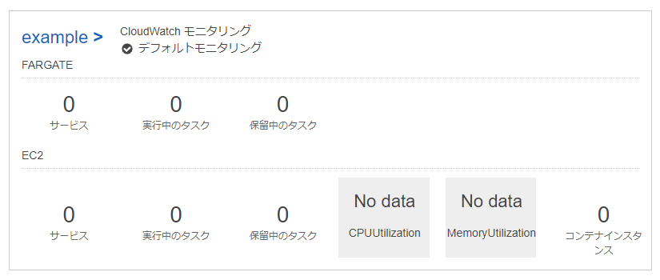
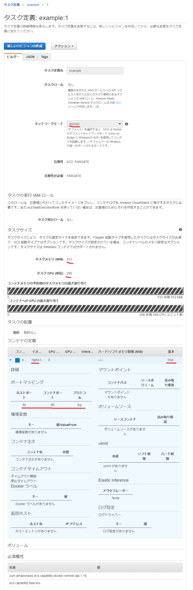
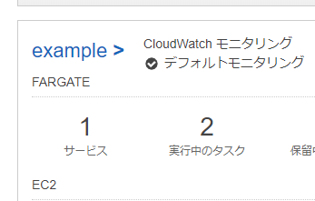
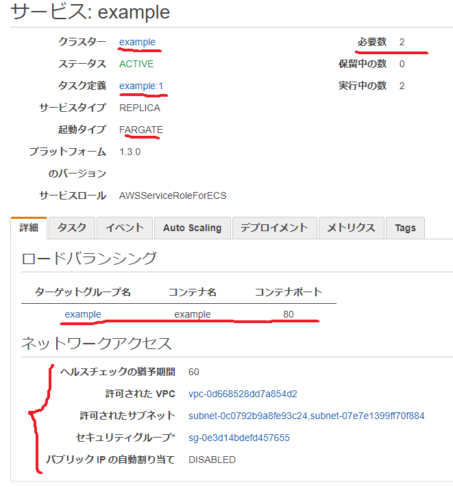
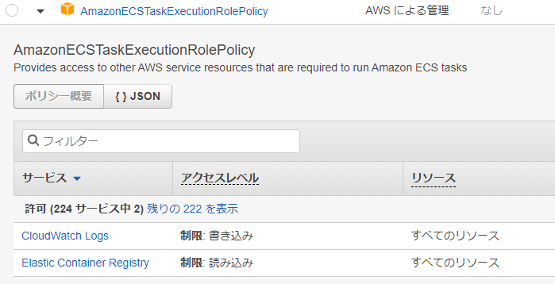
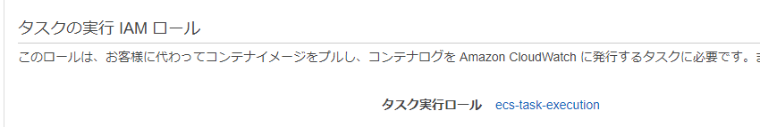
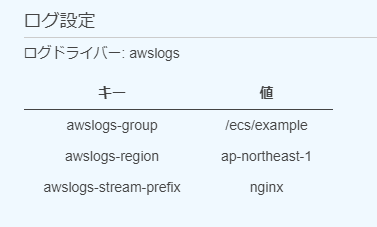
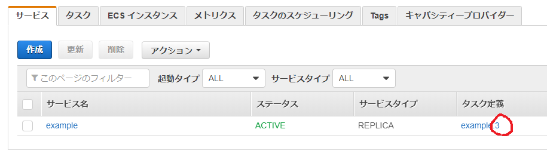
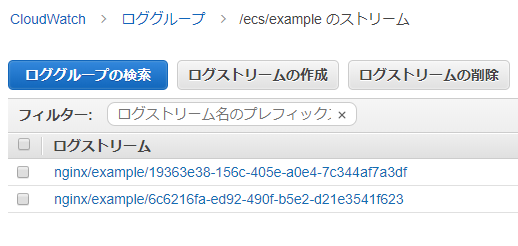
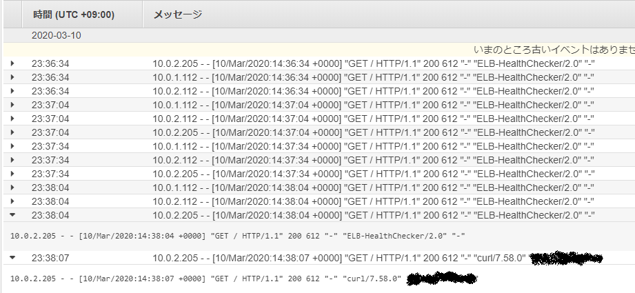

---
title: 実践Terraform ch9 コンテナオーケストレーション
tags:
- Terraform
- 勉強メモ
date: 2020-03-10T23:54:27+09:00
URL: https://wand-ta.hatenablog.com/entry/2020/03/10/235427
EditURL: https://blog.hatena.ne.jp/wand_ta/wand-ta.hatenablog.com/atom/entry/26006613533165472
bibliography: https://nextpublishing.jp/book/10983.html
-------------------------------------


[https://github.com/wand2016/terraform_ch9_example:embed:cite]


# ECSの構成要素 #

- つかったことあって知ってるので略

# ECSの起動タイプ #


|             | EC2 | Fargate |
|-------------|-----|---------|
| SSHデバッグ | o   | x       |
| Spot Fleetでコスト抑えたり  | o   | x       |
| 運用が簡便  | x   | o       |


- 今回はFargateを使う


# Webサーバーの構築 #

## ECSクラスタ(Fargate) ##


``` tf
resource "aws_ecs_cluster" "example" {
  name = "example"
}
```




## タスク定義 ##


``` tf
resource "aws_ecs_task_definition" "example" {
  family = "example"
  cpu = "256"
  memory = "512"
  network_mode = "awsvpc"
  requires_compatibilities = ["FARGATE"]
  container_definitions = file("./container_definitions.json")
}
```

- `family = "example"`
    - タスク定義名のプレフィックス
    - これ+リビジョン番号がタスク定義名になる
- `network_mode = "awsvpc"`
    - Fargate起動タイプの場合はこれを選択する


`container_definitions.js`


``` json
[
  {
    "name": "example",
    "image": "nginx:latest",
    "essential": true,
    "portMappings": [
      {
        "protocol": "tcp",
        "containerPort": 80
      }
    ]
  }
]
```

- `"essential": true,`
    - タスク実行に必須かどうか
    - ローカライズミスで「基本」と訳されている…




## ECSサービス ##

- コンテナ起動・処理実行後、終了してしまわないようにする
- LBとの関連付け

``` tf
resource "aws_ecs_service" "example" {
  name = "example"
  cluster = aws_ecs_cluster.example.arn
  task_definition = aws_ecs_task_definition.example.arn
  desired_count = 2
  launch_type = "FARGATE"
  platform_version = "1.3.0"
  health_check_grace_period_seconds = 60


  network_configuration {
    assign_public_ip = false
    security_groups = [module.nginx_sg.security_group_id]

    subnets = [
      aws_subnet.private_0.id,
      aws_subnet.private_1.id,
    ]
  }

  load_balancer {
    target_group_arn = aws_lb_target_group.example.arn
    container_name = "example"
    container_port = 80
  }

  lifecycle {
    ignore_changes = [task_definition]
  }
}

module "nginx_sg" {
  source = "./security_group"
  name = "nginx-sg"
  vpc_id = aws_vpc.example.id
  port = 80
  cidr_blocks = [aws_vpc.example.cidr_block]
}
```

- `cluster = aws_ecs_cluster.example.arn`
- `task_definition = aws_ecs_task_definition.example.arn`
    - 指定のクラスタ上で指定のタスク定義でタスクを動かす
- `desired_count = 2`
    - タスクの実行数
    - 2以上にしよう
        - 1だと可用性が損なわれる
- `platform_version = "1.3.0"`
    - デフォルトは`LATEST` (最新とは言ってない)
    - バージョンを明示しよう
    - [公式](https://docs.aws.amazon.com/ja_jp/AmazonECS/latest/developerguide/platform_versions.html#platform-version-considerations)

> LATEST と指定すると、タスクは利用可能な最近のプラットフォームを使用しますが、これは最新のプラットフォームバージョンではない場合があります。
    
- `health_check_grace_period_seconds = 60`
    - タスク起動後のヘルスチェック猶予時間(秒)
    - デフォルト値`0`
    - コンテナ起動後、アプリケーションとして準備万端になるまでに時間がかかる場合に指定する
        - 指定しないと、ヘルスチェックに引っかかり、永久にタスクの終了を再起動が繰り返される
- `network_configuration`
    - `assign_public_ip = false`
        - プライベートネットワークで動かすのでパブリックIPを割り当てない
- `load_balancer`
    - コンテナとLBとの関連付け
    - `container_name = "example"`
    - `container_port = 80`
        - exampleコンテナ(nginx:latest)の80番
- `lifecycle`
    - `ignore_changes = [task_definition]`
        - Fargateでは、デプロイのたびにタスク定義に差分が生じる
        - `terraform plan`のたびに差分が出るが、これを無視したい





## コンテナの動作確認 ##

``` sh
curl https://d-horiyama.com
```

```html
<!DOCTYPE html>
<html>
<head>
<title>Welcome to nginx!</title>
<style>
    body {
        width: 35em;
        margin: 0 auto;
        font-family: Tahoma, Verdana, Arial, sans-serif;
    }
</style>
</head>
<body>
<h1>Welcome to nginx!</h1>
<p>If you see this page, the nginx web server is successfully installed and
working. Further configuration is required.</p>

<p>For online documentation and support please refer to
<a href="http://nginx.org/">nginx.org</a>.<br/>
Commercial support is available at
<a href="http://nginx.com/">nginx.com</a>.</p>

<p><em>Thank you for using nginx.</em></p>
</body>
</html>
```


# Fargateにおけるロギング #

- EC2起動タイプと異なり、SSHデバッグができない
- コンテナのログを直接見に行くこともできない
- CloudWatch Logsと連携する


## CloudWatch Logs ##

``` tf
resource "aws_cloudwatch_log_group" "for_ecs" {
  name = "/ecs/exmaple"
  retention_in_days = 180
}
```

## ECSタスク実行IAMロール ##

- ECSからCloudWatch Logs(とECR)を利用するためのロールを作る
- AWS管理ポリシーがあるのでそれを継承する



``` tf
data "aws_iam_policy" "ecs_task_execution_role_policy" {
  arn = "arn:aws:iam::aws:policy/service-role/AmazonECSTaskExecutionRolePolicy"
}

data "aws_iam_policy_document" "ecs_task_execution" {
  source_json = data.aws_iam_policy.ecs_task_execution_role_policy.policy

  statement {
    effect = "Allow"
    actions = ["ssm:GetParameters", "kms:Decrypt"]
    resources = ["*"]
  }
}

module "ecs_task_execution_role" {
  source = "./iam_role"
  name = "ecs-task-execution"
  identifier = "ecs-tasks.amazonaws.com"
  policy = data.aws_iam_policy_document.ecs_task_execution.json
}
```

- `source_json = data.aws_iam_policy.ecs_task_execution_role_policy.policy`
    - AWS管理ポリシー(CloudWatch Logs, ECRアクセス)を継承
- SSM,KMSのアクセス権も付与している

## Dockerコンテナのロギング ##

``` diff
  resource "aws_ecs_task_definition" "example" {
    family = "example"
    cpu = "256"
    memory = "512"
    network_mode = "awsvpc"
    requires_compatibilities = ["FARGATE"]
    container_definitions = file("./container_definitions.json")
+   execution_role_arn = module.ecs_task_execution_role.iam_role_arn
  }
```



```diff
  [
    {
      "name": "example",
      "image": "nginx:latest",
      "essential": true,
+     "logConfiguration": {
+       "logDriver": "awslogs",
+       "options": {
+         "awslogs-region": "ap-northeast-1",
+         "awslogs-stream-prefix": "nginx",
+         "awslogs-group": "/ecs/example"
+       }
+     },
      "portMappings": [
        {
          "protocol": "tcp",
          "containerPort": 80
        }
      ]
    }
  ]
```



- タスク定義を変更し、サービスを再度デプロイしたいので、サービスの`lifecycle`の`ignore_changes`を一旦外してapplyする

```diff
...
  lifecycle {
-   ignore_changes = [task_definition]
+   # ignore_changes = [task_definition]
  }
...
```




- ログが取れるか確認

```sh
curl https://d-horiyama.com
```






- nginxのアクセスログが取れた
