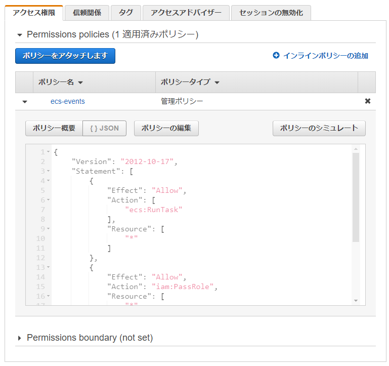
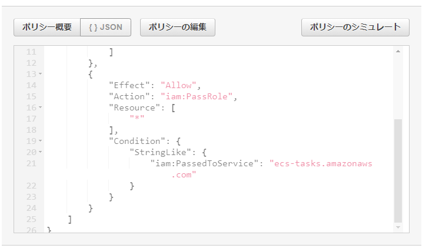
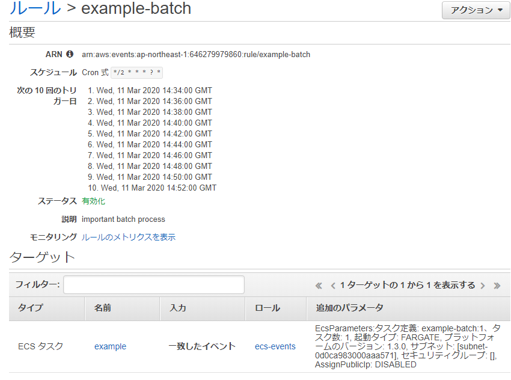
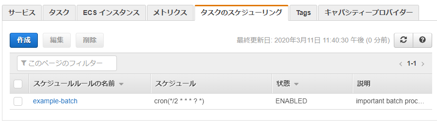

---
title: 実践Terraform ch10 バッチ
tags:
- Terraform
- 勉強メモ
date: 2020-03-11T23:51:17+09:00
URL: https://wand-ta.hatenablog.com/entry/2020/03/11/235117
EditURL: https://blog.hatena.ne.jp/wand_ta/wand-ta.hatenablog.com/atom/entry/26006613533768499
bibliography: https://nextpublishing.jp/book/10983.html
-------------------------------------

# バッチ設計 #

- エラーハンドリング
    - 通知
    - ロギング
- リトライ
    - 自動
    - 手動
    - **リトライできるように設計されていること**
- 依存関係制御
    - 「ジョブAはジョブBのあと」とか
    - 単に時刻をずらして暗黙的に依存関係を表現するのはアンチパターン
        - 【所感】処理時間が伸びてきたりリトライが走ったりすると狂うからかな
- ジョブ管理
    - cron
        - 手軽
        - 反面、きちんと管理するのが困難
            - 謎cron
            - エラー通知やリトライがおざなり
            - 依存関係制御なし
    - ジョブ管理システム
        - エラー通知、リトライ、依存関係制御の仕組みが組み込まれている
        - 例
            - Rundeck
                - [クラメソ](https://dev.classmethod.jp/server-side/server/try-rundeck-job/)
            - JP1
                - [日立公式](http://www.hitachi.co.jp/Prod/comp/soft1/jp1/)


# ECS Scheduled Tasks #

- cronよりはマシ
- ジョブ管理システムには及ばない
    - エラー通知、リトライはアプリケーションで自前実装の必要あり
    - 依存関係制御不可

## タスク定義・コンテナ定義 ##

- 略


## CloudWatch Events ##

- 定期実行するためにCloudWatch Eventsを使う

``` tf
resource "aws_cloudwatch_event_rule" "example_batch" {
  name = "example-batch"
  description = "important batch process"
  schedule_expression = "cron(*/2 * * * ? *)"
}
```

- `schedule_expression = "cron(*/2 * * * ? *)"`
    - cron式とrate式が使える
    - cron式
        - いつもの
    - rate式
        - `rate(2 minutes)`とか `rate(1 hour)`とか書ける


## CloudWatchイベントIAMロール ##

- CloudWatch EventsからECSタスクを実行するためにIAMロールを付与する

``` tf
module "ecs_events_role" {
  source = "./iam_role"
  name = "ecs-events"
  identifier = "events.amazonaws.com"
  policy = data.aws_iam_policy.ecs_events_role_policy.policy
}

data "aws_iam_policy" "ecs_events_role_policy" {
  arn = "arn:aws:iam::aws:policy/service-role/AmazonEC2ContainerServiceEventsRole"
}
```




- ECSタスクの実行権と、IAMロールの付与権がある
    - ECSタスク実行ロールの付与用

## CloudWatchイベントターゲット ##

``` tf
resource "aws_cloudwatch_event_target" "example_batch" {
  target_id = "example-batch"
  rule = aws_cloudwatch_event_rule.example_batch.name
  role_arn = module.ecs_events_role.iam_role_arn
  arn = aws_ecs_cluster.example.arn

  ecs_target {
    launch_type = "FARGATE"
    task_count = 1
    platform_version = "1.3.0"
    task_definition_arn = aws_ecs_task_definition.example_batch.arn

    network_configuration {
      assign_public_ip = "false"
      subnets = [aws_subnet.private_0.id]
    }
  }
}
```





- 2分ごとにタスクが実行される
- 動作確認としてログ取得

```sh
docker-compose run aws logs filter-log-events --log-group-name /ecs-scheduled-tasks/example
```

```json
{
    "events": [
        {
            "logStreamName": "batch/alpine/f639dc0f-2420-4b33-b5c6-82235ce683a2",
            "timestamp": 1583938382268,
            "message": "Wed Mar 11 14:53:02 UTC 2020",
            "ingestionTime": 1583938382358,
            "eventId": "35323006273131463711376913605029740017760879600706060288"
        }
    ],
    "searchedLogStreams": [
        {
            "logStreamName": "batch/alpine/f639dc0f-2420-4b33-b5c6-82235ce683a2",
            "searchedCompletely": true
        }
    ]
}
```
