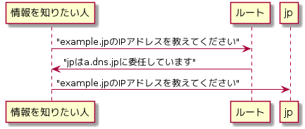

---
title: DNSがよくわかる教科書 ch3
tags:
- DNS
- 勉強メモ
date: 2020-03-12T09:15:48+09:00
URL: https://wand-ta.hatenablog.com/entry/2020/03/12/091548
EditURL: https://blog.hatena.ne.jp/wand_ta/wand-ta.hatenablog.com/atom/entry/26006613533931579
bibliography: https://www.sbcr.jp/products/4797394481.html?sku=4797394481
-------------------------------------

# 名前解決の仕組み #

## 問い合わせと応答 ##

- 問い合わせと応答は常に1対1
- 知りたい情報の名前(ドメイン名)と種類(タイプ)を問い合わせる
- 知っている情報を応答する
    - 「jpはa.dns.jpに委任しています」
    - 「xx.yy.zz.wwです」

## 階層構造をたどるということ ##

- iterative resolution
    - 頂点`.`から`jp`、`example`、というように階層構造をたどって最終的な答え(IPアドレス)を得る
- そのために、事前に委任元・委任先が親子関係になっていること
    - 子は親に自分のネームサーバー情報を登録する
    - 親は子から登録されたネームサーバー情報を自分のネームサーバーに登録・設定する

#  名前解決の負荷と時間の軽減 #

- 基本通りに毎回名前解決すると負荷が大きいのでDNSキャッシュを行う
    - 末端機器のOS
    - DNSキャッシュサーバー
        - ISP等が運用する、問い合わせ専用DNSサーバー
        - 自らはドメインの管理を行わない

# 名前解決のために必要なこと #

- 委任情報
    - 親が応答する子のネームサーバー情報
    - 「jpはa.dns.jpに委任しています」
    - 「example.jpはns1.example.jpに委任しています」
- 正しく登録されていないと当然名前解決できなくなる
    - 委任先のネームサーバーが存在しないんですけど…？ってなる
- 子は親に正しいネームサーバー情報を登録すること
- 親は子から受け取ったネームサーバー情報を委任情報として正しく登録すること

# 名前解決における委任の重要性 #

## 名前解決の仕組みがもたらすメリット ##

- ゾーンごとの分散管理
    - 分割統治による負荷分散
    - 障害時の影響範囲局所化
- 管理ポリシーをゾーンごとに決められる
    - 登録者は国内に住所があること、とか
    - 日本語ドメインとか

## 実際のインターネットにおける委任関係 ##

- `.`
    - ICANN/IANA管理
- 各TLD
    - ICANN/IANAから委任されたTLDレジストリ管理
- 2LD〜
    - ゾーンのポリシー次第
    - 3LDや4LDでドメイン名の登録を受け付ける場合もある
        - 例: ○○.ac.jp
            - acというzone apexがあるわけではない、これもjpゾーン
            - ドメイン名の登録は3LDで受け付ける

