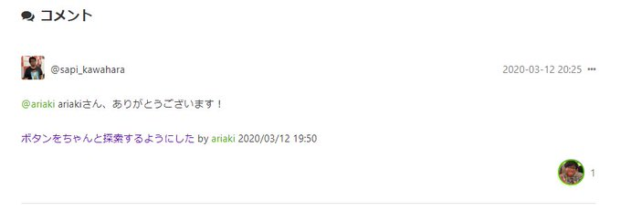
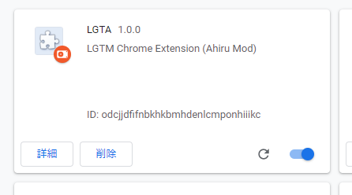
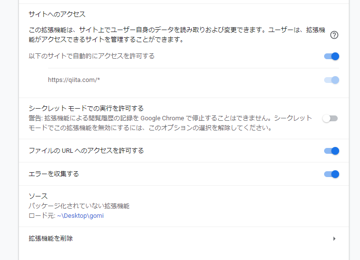

bibliography: https://qiita.com/sapi_kawahara/items/4e05845e285ac087feb5
---


content.js

```javascript
window.addEventListener('load', function () {
    document.querySelectorAll('div.likable button,div.co-Item_like button')
        .forEach(function(b) {
            b.innerHTML = '';
            b.style.backgroundImage = "url(https://pbs.twimg.com/media/D_kwp61UEAEBvmV?format=jpg&name=small)";
            b.style.backgroundSize = 'cover';
            b.style.backgroundPositionY = 'bottom';
        });
});
```


manifest.json

```json
{
  "name": "LGTA",
  "version": "1.0.0",
  "manifest_version": 2,
  "description": "LGTM Chrome Extension (Ahiru Mod)",
  "content_scripts": [{
    "matches": ["https://qiita.com/*"],
    "js": [
      "content.js"
    ]
  }]
}
```




