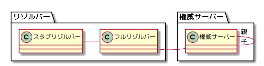

---
title: DNSがよくわかる教科書 ch4 (1/2)
tags:
- DNS
- 勉強メモ
date: 2020-03-13T09:53:46+09:00
URL: https://wand-ta.hatenablog.com/entry/2020/03/13/095346
EditURL: https://blog.hatena.ne.jp/wand_ta/wand-ta.hatenablog.com/atom/entry/26006613534466714
bibliography: https://www.sbcr.jp/products/4797394481.html?sku=4797394481
-------------------------------------


# 3種類の構成要素とその役割 #



- スタブリゾルバー
    - 情報が欲しい人
- フルリゾルバー
    - 情報が欲しい人からの依頼を受けて、名前解決をする人
- 権威サーバー
    - 情報を提供する人


## スタブリゾルバーの役割 ##

- stub (末端)
- 利用者の機器上で動作し、Webブラウザやアプリに名前解決のAPIを提供する


## フルリゾルバーの役割 ##

- 名前解決の実行
- キャッシュ

## 権威サーバーの役割 ##

- やること
    - 自分が委任を受けたゾーンの情報の管理
        - ゾーンデータ
            - リソースレコードという形で保持する
    - 自分が委任しているゾーンの委任情報の管理
- やらないこと
    - 委任先への問い合わせの取り次ぎ


## Column: DNSのクラス ##

- IP以外の通信にも対応するために「クラス」を指定できる
- が、インターネットを表す`IN`以外使われなくなっていった


## リソースレコードの構成 ##

``` sh
dig google.co.jp
```

```
; <<>> DiG 9.11.3-1ubuntu1.9-Ubuntu <<>> google.co.jp
;; global options: +cmd
;; Got answer:
;; ->>HEADER<<- opcode: QUERY, status: NOERROR, id: 28017
;; flags: qr rd ad; QUERY: 1, ANSWER: 9, AUTHORITY: 0, ADDITIONAL: 0
;; WARNING: recursion requested but not available

;; QUESTION SECTION:
;google.co.jp.			IN	A

;; ANSWER SECTION:
google.co.jp.		0	IN	A	172.217.25.99
ns1.google.com.		0	IN	AAAA	2001:4860:4802:32::a
ns2.google.com.		0	IN	AAAA	2001:4860:4802:34::a
ns3.google.com.		0	IN	AAAA	2001:4860:4802:36::a
ns4.google.com.		0	IN	AAAA	2001:4860:4802:38::a
ns1.google.com.		0	IN	A	216.239.32.10
ns2.google.com.		0	IN	A	216.239.34.10
ns3.google.com.		0	IN	A	216.239.36.10
ns4.google.com.		0	IN	A	216.239.38.10

;; Query time: 10 msec
;; SERVER: 172.21.96.1#53(172.21.96.1)
;; WHEN: Fri Mar 13 09:29:41 JST 2020
;; MSG SIZE  rcvd: 346
```

- リソースレコードの例

```
google.co.jp.		0	IN	A	172.217.25.99
```

- `google.co.jp.`
    - ドメイン名
- `0`
    - TTL
- `IN`
    - クラス
    - INternet以外使われることはなくなった
- `A`
    - タイプ
    - **A**ddress
        - IPv4アドレスを表す
- `172.217.25.99`
    - データ
    - IPv4アドレスが格納されている


## リソースレコードのタイプ ##

- A
    - IPv4アドレス
    - **A**ddress
- AAAA
    - IPv6アドレス
    - v4アドレス(32ビット)の4倍長の128ビットであることから
- NS
    - そのゾーンの権威サーバーのホスト名

``` sh
dig ns google.co.jp
```

```
...
;; QUESTION SECTION:
;google.co.jp.			IN	NS

;; ANSWER SECTION:
google.co.jp.		0	IN	NS	ns3.google.com.
google.co.jp.		0	IN	NS	ns2.google.com.
google.co.jp.		0	IN	NS	ns1.google.com.
google.co.jp.		0	IN	NS	ns4.google.com.
ns1.google.com.		0	IN	AAAA	2001:4860:4802:32::a
ns2.google.com.		0	IN	AAAA	2001:4860:4802:34::a
ns3.google.com.		0	IN	AAAA	2001:4860:4802:36::a
ns4.google.com.		0	IN	AAAA	2001:4860:4802:38::a
ns1.google.com.		0	IN	A	216.239.32.10
ns2.google.com.		0	IN	A	216.239.34.10
ns3.google.com.		0	IN	A	216.239.36.10
ns4.google.com.		0	IN	A	216.239.38.10
...
```

- これらを使って委任の階層構造を辿っていく

```
google.co.jp.		0	IN	NS	ns1.google.com.
ns1.google.com.		0	IN	A	216.239.32.10
```

- MX
    - そのドメイン名宛の電子メールの配送先と優先度を指定

```sh
dig mx google.co.jp
```

```
;; QUESTION SECTION:
;google.co.jp.			IN	MX

;; ANSWER SECTION:
google.co.jp.		0	IN	MX	40 alt3.aspmx.l.google.com.
google.co.jp.		0	IN	MX	20 alt1.aspmx.l.google.com.
google.co.jp.		0	IN	MX	10 aspmx.l.google.com.
google.co.jp.		0	IN	MX	30 alt2.aspmx.l.google.com.
google.co.jp.		0	IN	MX	50 alt4.aspmx.l.google.com.
...
```


## Column: 統一されていない名称に注意 ##

- 文献をあさると名前がブレブレ
- [RFC8499](https://www.ietf.org/rfc/rfc8499.txt)で定義されている由緒正しいDNS用語との対応
- スタブリゾルバー (Stub Resolver)
    - DNSクライアント など
- フルリゾルバー (Full Resolver)
    - キャッシュDNSサーバー
    - 参照サーバー
    - ネームサーバー
    - DNSサーバー など
- 権威サーバー (Authoritative Server)
    - 権威DNSサーバー
    - ゾーンサーバー
    - ネームサーバー
    - DNSサーバー など


