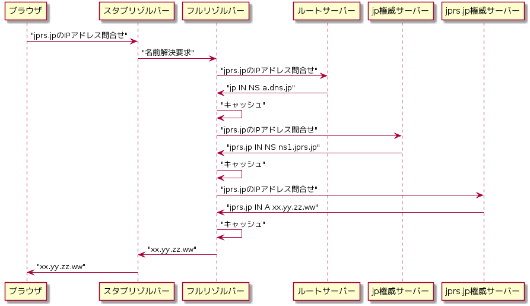
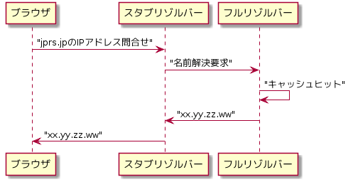

---
title: DNSがよくわかる教科書 ch4 (2/2)
tags:
- DNS
- 勉強メモ
date: 2020-03-14T07:45:17+09:00
URL: https://wand-ta.hatenablog.com/entry/2020/03/14/074517
EditURL: https://blog.hatena.ne.jp/wand_ta/wand-ta.hatenablog.com/atom/entry/26006613534921053
bibliography: https://www.sbcr.jp/products/4797394481.html?sku=4797394481
-------------------------------------

# 構成要素の連携による名前解決 #

- 例: ブラウザでjprs.jpにアクセス
- 仮定: キャッシュにはなにも入っていない



## Column: ルートサーバーのIPアドレスはどうやって知る？ ##

- フルリゾルバーが最初から持っている
    - ヒントファイル
- 不変ではないので、特定のタイミングで最新のルートサーバーのIP一覧を取得する仕組みがある
    - プライミング
    - [JPRS用語辞典](https://jprs.jp/glossary/index.php?ID=0222)

## Column: 名前解決要求と名前解決の実行の違い ##

- 名前解決要求
    - スタブリゾルバー->フルリゾルバー
    - 「**私の代わりに**名前解決をして」
- 名前解決実行
    - フルリゾルバー->権威サーバー
    - 「名前解決をして」


# DNSの処理の効率化と可用性の向上 #

## キャッシュとネガティブキャッシュ ##



- ネガティブキャッシュ
    - 当該リソースレコードが「存在しない」という結果もキャッシュする


### キャッシュとネガティブキャッシュのメリット/保持してもよい時間 ###

- メリット
    - フルリゾルバー、権威サーバーの負荷軽減
    - ターンアラウンドタイムの短縮
    - トラフィック軽減
- キャッシュの保持時間は、ゾーン側管理
    - TTL: Time To Live
        - レコードごとに設定される、「キャッシュを保持してもよい時間」

```sh
docker-compose exec client dig server
```

```
; <<>> DiG 9.11.3-1ubuntu1.11-Ubuntu <<>> server
;; global options: +cmd
;; Got answer:
;; ->>HEADER<<- opcode: QUERY, status: NOERROR, id: 13259
;; flags: qr rd ra; QUERY: 1, ANSWER: 1, AUTHORITY: 0, ADDITIONAL: 0

;; QUESTION SECTION:
;server.				IN	A

;; ANSWER SECTION:
server.			600	IN	A	172.23.0.2

;; Query time: 0 msec
;; SERVER: 127.0.0.11#53(127.0.0.11)
;; WHEN: Fri Mar 13 22:29:48 UTC 2020
;; MSG SIZE  rcvd: 46
```

- これ

```
server.			600	IN	A	172.23.0.2
```

- 10分キャッシュ可能、の意


## 複数台の権威サーバーを設置する ##

``` sh
dig ns google.co.jp
```

```
...
;; QUESTION SECTION:
;google.co.jp.			IN	NS

;; ANSWER SECTION:
google.co.jp.		0	IN	NS	ns3.google.com.
google.co.jp.		0	IN	NS	ns2.google.com.
google.co.jp.		0	IN	NS	ns4.google.com.
google.co.jp.		0	IN	NS	ns1.google.com.
...
```

- 冗長化・負荷分散のために、同じゾーンデータを持つ権威サーバーを複数台設置する


### 権威サーバー間でのゾーンデータのコピー ###

- ゾーン転送
    - 権威サーバー間でゾーン情報を同期する手法
    - [JPRS用語辞典](https://jprs.jp/glossary/index.php?ID=0170)
    - セカンダリがプライマリにゾーンデータをリクエスト
    - プライマリは必要な情報をレスポンス
- 【所感】RDBのレプリケーションそっくり
    - あれもセカンダリ主導

### フルリゾルバーにおける権威サーバーの選択 ###

- RTT: Round Trip Timeの短い権威サーバーへ優先的に問い合わせる

# 正引きと逆引き #

- 正引き
    - ドメイン名->IPアドレス
- 逆引き
    - IPアドレス->ドメイン名
    - アクセス元確認に用いる
