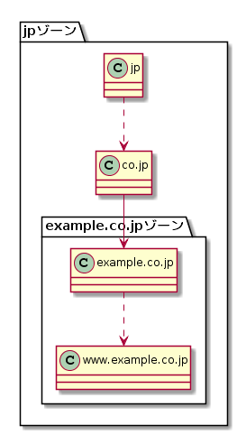
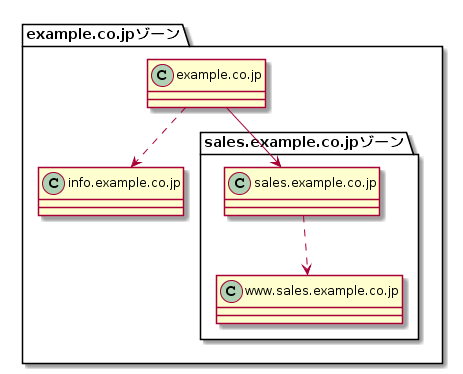

---
title: DNSがよくわかる教科書 ch5 自分のドメイン名を設計する
tags:
- DNS
- 勉強メモ
date: 2020-03-14T16:08:33+09:00
URL: https://wand-ta.hatenablog.com/entry/2020/03/14/160833
EditURL: https://blog.hatena.ne.jp/wand_ta/wand-ta.hatenablog.com/atom/entry/26006613535085011
bibliography: https://www.sbcr.jp/products/4797394481.html?sku=4797394481
-------------------------------------

# DNSを動かすために必要なこと #

- 権威サーバーを動かす
    - 自分のドメイン名をインターネット上で使えるようにする
- フルリゾルバーを動かす
    - インターネットで使われているドメイン名を自分で使えるようにする
- DNSを動かし続け、可用性を高める
    - 一度動かして終わりではなく、保守し続ける
        - 監視
        - サイバー攻撃対策
        - 信頼性向上

# ドメイン名を設計するための基本的な考え方 #

- サブドメインの作成・利用は要件次第
    - フラット
        - 例: 小規模
    - サブドメインを作成するが、委任はしない
        - 例: 広報部門専用のサブドメインを作るが、管理はシステム部門
    - サブドメインを作成し、委任もする
        - 例: サポート部門専用のサブドメインを作り、ゾーンの管理も委任する
- 組織内の要望を要件・ルールに落とし込む作業は十分に時間をかけて行おう

# EXAMPLE社を例にした設計・構築 #

- 組織内の要望を**管理・運用要件要件**に落とし込む

## 会社のドメインとしてexample.co.jpを登録し、システム部門で管理する ##

実線:委任あり、破線:委任なし

- 委任先(example.co.jp)の権威サーバーを正しく設定しても、委任元(jp)の権威サーバーに委任情報を正しく設定してもらえないと名前解決できない
- example.co.jpの権威サーバーのホスト名やIPアドレス名を変更する場合は、委任元の更新が必要
- 親子で同じ内容のNSレコードを設定する
    - 親: 委任先の権威サーバーの案内
    - 子: 自身のゾーンの権威サーバーの指定

## 社内の各部門のために、サブドメインを用意する ##

実線:委任あり、破線:委任なし

- JPRSがjpのレジストリを担ったように、システム部門がexample.co.jpのレジストリを担う

