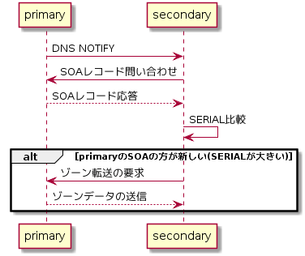

---
title: DNSがよくわかる教科書 ch6 自分のドメイン名を管理する ～権威サーバーの設定～
tags:
- DNS
- 勉強メモ
date: 2020-03-14T18:28:56+09:00
URL: https://wand-ta.hatenablog.com/entry/2020/03/14/182856
EditURL: https://blog.hatena.ne.jp/wand_ta/wand-ta.hatenablog.com/atom/entry/26006613535152341
bibliography: https://www.sbcr.jp/products/4797394481.html?sku=4797394481
-------------------------------------


# ドメイン名の管理者が管理する範囲と権威サーバー #

- サブドメインの管理を分離して、別の管理者に委任することができる
    - ゾーンカット
        - 管理の境界
    - 委任情報までが管理する範囲となる(NS、グルー)
- 親子間の委任関係を正しくつなぎ、それぞれのゾーンデータを正しく設定する必要がある


# 権威サーバーの可用性 #

## プライマリサーバーとセカンダリサーバー ##

- RDBのレプリケーションみたいなやつ
- フルリゾルバーから見て、プライマリもセカンダリも全く同じ応答
    - NSリソースレコード上も区別はない


## ゾーン転送の仕組み ##

- 転送の種類
    - AXFR: Authoritative Transfer
        - ゾーン全ての情報を転送
    - IXFR: Incremental Transfer
        - 増分のみ転送
- 前者は時間と負荷がかかるので、特に理由がなければ後者推奨
- DNS NOTIFY
    - プライマリからセカンダリへのゾーンデータ更新通知
    - これを受け取り、セカンダリ主導でゾーンデータのリクエストを開始する



## プライマリサーバーとセカンダリサーバーの配置 ##

- 読み取り性能向上というよりは可用性が主目的なので…
    - 別のN/Wに置く
    - プライマリを外からアクセス不可能にする
        - サイバー攻撃対策


# 権威サーバーが応答する情報 #

- SOA
- NS
- A
- AAAA
- MX
- CNAME
- TXT
- PTR


# ドメイン名の管理と委任のために設定する情報 #

## ドメインそのものに関する情報 - SOAリソースレコード ##

- SOA: Start of Authority
- 権威の開始、すなわち委任されたゾーンの管理情報

``` sh
dig soa google.com
```

```
...
;; QUESTION SECTION:
;google.com.			IN	SOA

;; ANSWER SECTION:
google.com.		0	IN	SOA	ns1.google.com. dns-admin.google.com. 300721879 900 900 1800 60
...
```

- `google.com.`
    - このゾーンのドメイン名
    - 絶対ドメイン名
    - `@`と略記できたりする
- `0`
    - TTL
    - キャッシュしてもよい時間(秒)
- `IN`
    - クラス
    - 現在、IN (Internet)しか使われない
- `SOA`
    - リソースレコードのタイプ
- `ns1.google.com.`
    - MNAME
    - ゾーンのプライマリサーバーのホスト名
- `dns-admin.google.com.`
    - RNAME
    - ゾーン管理者のメールアドレス
    - `dns-admin@google.com.`を意味する
- `300721879`
    - SERIAL
    - ゾーン転送時に、ゾーンデータの新旧判定に用いる
    - `<年><月><日><更新回数>`やUnixタイムスタンプ等が用いられる
- `900`
    - REFRESH
    - 設定時間(秒)が経つと、DNS NOTIFYを待たずに、ゾーンデータの更新がないかSOAリソースレコードを問い合わせる
- `900`
    - RETRY
    - ゾーンデータの更新が失敗したときのリトライ間隔(秒)
- `1800`
    - EXPIRE
    - 設定時間(秒)かけてもゾーンデータの更新が失敗し続けた場合、ゾーンデータを期限切れにする
    - 権威サーバーとしての仕事は果たせなくなるが、古すぎる情報を提供し続けるよりはマシ
- `60`
    - MINIMUM
    - ネガティブキャッシュのTTLの一律設定
        - キャッシュはリソースレコードが「存在する」ので、個別のリソースレコードのTTLを使用する
        - ネガティブキャッシュは当該リソースレコードが「存在しない」ので、代わりにSOAリソースレコードのMINIMUMを用いる
    - 実際には、SOAリソースレコード自体のTTLとのうち小さい方を用いる
        - 今回の例では0


## 委任に関する情報 - NSリソースレコード ##


``` sh
dig ns google.com
```

```
...
;; QUESTION SECTION:
;google.com.			IN	NS

;; ANSWER SECTION:
google.com.		0	IN	NS	ns2.google.com.
google.com.		0	IN	NS	ns4.google.com.
google.com.		0	IN	NS	ns3.google.com.
google.com.		0	IN	NS	ns1.google.com.
ns1.google.com.		0	IN	AAAA	2001:4860:4802:32::a
ns2.google.com.		0	IN	AAAA	2001:4860:4802:34::a
ns3.google.com.		0	IN	AAAA	2001:4860:4802:36::a
ns4.google.com.		0	IN	AAAA	2001:4860:4802:38::a
ns1.google.com.		0	IN	A	216.239.32.10
ns2.google.com.		0	IN	A	216.239.34.10
ns3.google.com.		0	IN	A	216.239.36.10
ns4.google.com.		0	IN	A	216.239.38.10
...
```

- **グルーレコード**
    - 上記レスポンスのA/AAAAリソースレコード

> フルリゾルバー「com権威サーバーさん、`google.com.`のIPアドレスを教えてください」  
> com権威サーバー「`ns1.google.com.`〜`ns4.google.com.`に委任しています」  

- 「その`google.com.`のIPアドレスが分からないから訊いてるんだろ！」という話
- なので、`ns1.google.com.`〜`ns4.google.com.`のIPアドレスがA/AAAAリソースレコードとして設定されている
    - 本来comゾーンの管理範囲外の情報なので、権威をもたない情報として扱われる
    - 【補】[JPRSの資料](https://jprs.jp/tech/material/iw2012-lunch-L3-01.pdf)でも設計上の問題が指摘されている部分


# サービスを提供するために設定する情報 #

## Webサイトを公開する ##

- A/AAAAリソースレコード

```
google.com.		0	IN	A	172.217.175.14
```

- 同一のドメイン名に複数のアドレスを指定可能
    - ラウンドロビンによる負荷分散

## メールアドレスを使えるようにする ##

``` sh
dig mx google.com
```

```
...
;; QUESTION SECTION:
;google.com.			IN	MX

;; ANSWER SECTION:
google.com.		0	IN	MX	20 alt1.aspmx.l.google.com.
google.com.		0	IN	MX	30 alt2.aspmx.l.google.com.
google.com.		0	IN	MX	50 alt4.aspmx.l.google.com.
google.com.		0	IN	MX	10 aspmx.l.google.com.
google.com.		0	IN	MX	40 alt3.aspmx.l.google.com.
...
```

- 優先順位の小さいものから順にメールの配送を試みる
    - 上記の例では`aspmx.l.google.com.`から
- 配送を行う際は、メールサーバーのホスト名を名前解決し、そのIPアドレスにメールを配送する

```
aspmx.l.google.com.	0	IN	AAAA	2404:6800:4008:c01::1a
alt1.aspmx.l.google.com. 0	IN	AAAA	2607:f8b0:4003:c12::1b
alt2.aspmx.l.google.com. 0	IN	AAAA	2607:f8b0:4001:c12::1b
alt3.aspmx.l.google.com. 0	IN	AAAA	2607:f8b0:4023::1b
alt4.aspmx.l.google.com. 0	IN	AAAA	2607:f8b0:4023:401::1b
```

## 外部のサービスを自社のドメイン名で利用する ##

- CDN等

```
www.sales.example.jp. IN CNAME cdn.example.com.
```

- ホスト名に別名をつける
- 制限
    - 他のレコードと共存できない
        - [RFC1912](https://tools.ietf.org/html/rfc1912#section-2.4)
        - > A CNAME record is not allowed to coexist with any other data.
        - ので、ゾーン頂点には設定できない
            - 最低限、委任をうけるためにはNSリソースレコードが必要だから
    - 同一ホスト名に複数のCNAMEをつけることもできない


# リソースレコードを使ってメッセージを伝える #

## ドメイン名に対応するテキストを設定する ##

- TXTリソースレコード
    - 任意のテキストを設定できる
    - SPF: Sender Policy Frameworkなどでおなじみ
        - なりすましメール対策


# リソースレコードセット(RRset) #

```
google.com.		0	IN	NS	ns2.google.com.
google.com.		0	IN	NS	ns4.google.com.
google.com.		0	IN	NS	ns3.google.com.
google.com.		0	IN	NS	ns1.google.com.
```

- こういうやつ
- 同一ドメイン名・クラス名・タイプ名のリソースレコードのまとまり
- 必ずひとまとめの集合(set)として扱われる
    - 問い合わせに一致する情報すべてを応答する
    - 順不定
