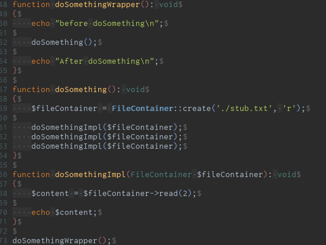
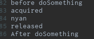

# RAII: Resource Acquisition Is Initialization #

- 「リソース取得は初期化時に」
- C++のSTLコンテナやスマートポインタが則っている概念
- 一般に[Loan Pattern](http://xerial.org/scala-cookbook/recipes/2012/06/27/loan-pattern)と呼ばれるものの一種
- コールスタック上のオブジェクトのコンストラクタにリソース取得を、デストラクタにリソース解放を紐付ける
- コールスタック上のオブジェクトは、コールスタック解体時に必ずデストラクタが呼ばれる
    - スコープ離脱
    - 例外未補足時のstack unwinding
- のでリソース解放が漏れず、タイミングも保証できるのが嬉しい


# PHPのデストラクタ #

- [公式マニュアル](https://www.php.net/manual/ja/language.oop5.decon.php)

> PHP 5 では、C++ のような他のオブジェクト指向言語に似た概念のデストラクタが導入されました。  
> デストラクタメソッドは、 特定のオブジェクトを参照するリファレンスがひとつもなくなったときにコールされます。  
> あるいは、スクリプトの終了時にも順不同でコールされます。  

- 以前まで「PHPはGC言語だからデストラクタはいつ呼ばれるかわからない」と思い込んでいた
    - ので、「PHPのデストラクタはRAIIには使えない」と思っていた
- が、実際には上記のとおり
- よそから参照されない局所変数ならば、C++のスタック変数のようにスコープを抜ける時に必ず呼ばれて、RAIIに使えるのでは？


# PHPでRAIIを試す #

[https://github.com/wand2016/php_raii_sample:embed:cite]

``` php
<?php

class FileContainer
{
    private $handle;

    public function __construct(string $filename, string $mode)
    {
        $this->handle = fopen($filename, $mode);
        if (!$this->acquired()) {
            throw new \Exception("couldn't acquire resource\n");
        }
        echo "acquired\n";
    }

    public function __destruct()
    {
        if ($this->acquired()) {
            fclose($this->handle);
            echo "released\n";
        }
    }

    public static function create(string $filename, string $mode): self
    {
        return new self($filename, $mode);
    }

    public function read(int $length)
    {
        return fread($this->handle, $length);
    }

    /**
     * カプセル化を破るけど汎用的なやつ
     */
    public function run(callable $callback): void
    {
        $callback($this->handle);
    }

    private function acquired(): bool
    {
        return $this->handle !== false;
    }
}

function doSomething(): void
{
    $fileContainer = FileContainer::create('./stub.txt', 'r');

    $content = $fileContainer->read(1024);

    echo $content;
}

function doSomething2(): void
{
    $fileContainer = FileContainer::create('./stub.txt', 'r');

    $fileContainer->run(function ($handle) {
        $content = fread($handle, 1024);
        echo $content;
    });
}

function doSomething3(): void
{
    $fileContainer = FileContainer::create('./stub.txt', 'r');

    $content = $fileContainer->read(1024);

    throw new \Exception('whoops');

    echo $content;
}


doSomething();
doSomething2();
doSomething3();
```

- `__construct`で`fopen`、`__destruct`で`fclose`する (RAII)


```sh
docker container run --rm -it -v $PWD:/app -w /app php php sample.php
```

```
acquired
nyan
released
acquired
nyan
released
acquired
released

Fatal error: Uncaught Exception: whoops in /app/sample.php:73
Stack trace:
#0 /app/sample.php(81): doSomething3()
#1 {main}
  thrown in /app/sample.php on line 73
```

- 利用側`doSomething*`ではリソース解放を意識しない
- スコープ離脱時に即座にリソース解放できている
- 例外発生時も、ちゃんともれなくリソース解放できている
- いちいち作るのは面倒だけど一応使えそう


---

追記: 引数で引き回しても大丈夫




