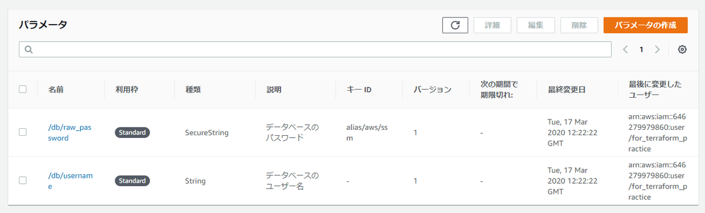
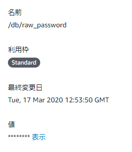
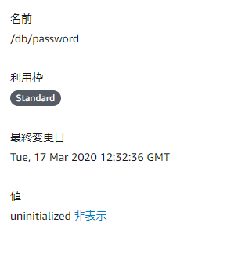
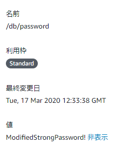
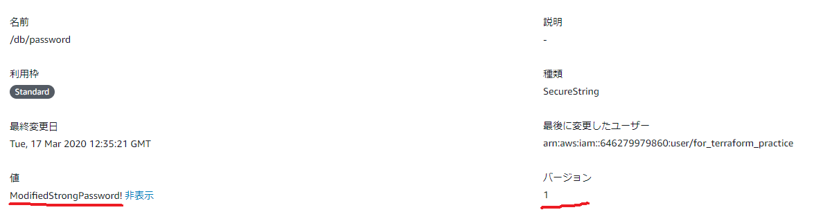
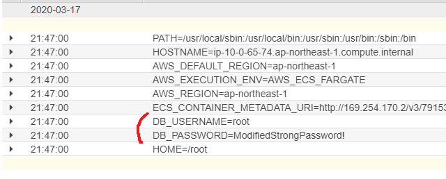

---
title: 実践Terraform ch12 設定管理
tags:
- Terraform
- 勉強メモ
date: 2020-03-17T21:57:22+09:00
URL: https://wand-ta.hatenablog.com/entry/2020/03/17/215722
EditURL: https://blog.hatena.ne.jp/wand_ta/wand-ta.hatenablog.com/atom/entry/26006613536785944
bibliography: https://nextpublishing.jp/book/10983.html
-------------------------------------


https://github.com/wand2016/terraform_ch12_example


# コンテナの設定管理 #

- 実行環境ごとに異なる設定をコンテナ実行時に注入する
    - DBホスト名、パスワード等


# SSMパラメータストア #

- SSM: Simple Systems Manager
- 設定管理のマネージドサービス
- 平文または暗号化したデータとして保存できる
    - ~4KB
        - KMSの制限


## Terraformによるコード化 ##

### よくない ###

``` tf
resource "aws_ssm_parameter" "db_username" {
  name = "/db/username"
  value = "root"
  type = "String"
  description = "データベースのユーザー名"
}

resource "aws_ssm_parameter" "db_raw_password" {
  name = "/db/raw_password"
  value = "VeryStrongPassword!"
  type = "SecureString"
  description = "データベースのパスワード"
}
```





- AWSコンソール上では伏せ字になっているが、暗号化すべき情報が`main.tf`に平文で書かれてしまう


### よい ###

``` tf
resource "aws_ssm_parameter" "db_username" {
  name = "/db/username"
  value = "root"
  type = "String"
  description = "データベースのユーザー名"
}

resource "aws_ssm_parameter" "db_password" {
  name = "/db/password"
  value = "uninitialized"
  type = "SecureString"
  description = "データベースのパスワード"

  lifecycle {
    ignore_changes = [value]
  }
}
```

- 未初期化のダミー値を入れておいてapply



- のち、aws cliで上書きする
    - lifecycleでignoreしているのでドリフトにはならない


``` sh
docker-compose run aws ssm put-parameter --name '/db/password' --type SecureString \
  --value 'ModifiedStrongPassword!' --overwrite
```

```json
{
    "Version": 2,
    "Tier": "Standard"
}
```




### コード化する必要ある？ ###

- 最初からこれでいいじゃん:

``` sh
docker-compose run aws ssm put-parameter --name '/db/password' --type SecureString \
  --value 'ModifiedStrongPassword!' --overwrite
```



- 好み
    - tfファイルにしておくと、ドキュメンテーションの場所として有用


## SSMパラメータストアとECSの統合 ##


``` diff
  [
    {
      "name": "alpine",
      "image": "alpine:latest",
      "essential": true,
      "logConfiguration": {
        "logDriver": "awslogs",
        "options": {
          "awslogs-region": "ap-northeast-1",
          "awslogs-stream-prefix": "batch",
          "awslogs-group": "/ecs-scheduled-tasks/example"
        }
      },
+     "secrets": [
+       {
+         "name": "DB_USERNAME",
+         "valueFrom": "/db/username"
+       },
+       {
+         "name": "DB_PASSWORD",
+         "valueFrom": "/db/password"
+       }
+     ],
-     "command": ["/bin/date"]
+     "command": ["/usr/bin/env"]
    }
  ]
```


