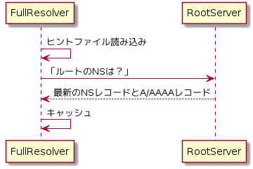
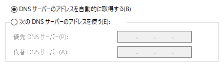
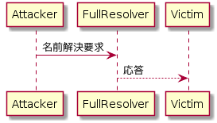

---
title: DNSがよくわかる教科書 ch7 名前解決サービスを提供する -フルリゾルバーの設定-
tags:
- DNS
- 勉強メモ
date: 2020-03-20T21:33:01+09:00
URL: https://wand-ta.hatenablog.com/entry/2020/03/20/213301
EditURL: https://blog.hatena.ne.jp/wand_ta/wand-ta.hatenablog.com/atom/entry/26006613538148431
bibliography: https://www.sbcr.jp/products/4797394481.html?sku=4797394481
-------------------------------------

# フルリゾルバーの重要性 #

- さまざまなプログラムが名前解決に依存している
    - Webサーバーへの接続
    - メールの配送
    - etc.
- それらの可用性のために必要

## Column: ヒントファイルとプライミング ##

- ヒントファイル
    - https://www.internic.net/domain/named.root で配布されている
    - 初回の名前解決を始める前に読み込む
        - ルートゾーンのNSリソースレコード
        - ルートサーバーのA/AAAAリソースレコード
- プライミング

- ルートサーバーのIPアドレスが変更された場合、ヒントファイルの更新を忘れずに行うこと
    - 半年くらいの猶予はある

# フルリゾルバーの設置と運用 #

## フルリゾルバーの設置 ##

- グローバルIPアドレスを割り当てるのが一般的
    - インターネット上の権威サーバー群に問い合わせを送るため
- ISPやデータセンターサービス事業者は、顧客用ネットワーク内に設置する
    - スタブリゾルバー(利用者)からの通信時間を短縮するため

## Column: DNSのフォワーダー ##

- スタブリゾルバーとフルリゾルバーの間で問い合わせと応答を中継する人
    - Forwarder: [RFC 8499](https://tools.ietf.org/html/rfc8499)の公式の言葉
    - 非公式に「DNSプロキシー」等と呼ばれることがある
- ホームルーター等に搭載されている
- 利点
    - 機能が限られている機器にフルリゾルバー相当の機能を持たせられる
        - スタブリゾルバーから見たら本物のフルリゾルバーに見える
    - フルリゾルバーの変更等が容易に
        - カプセル化的な

## フルリゾルバーの可用性 ##

- 復数動かすのが主流
- スタブリゾルバー側で複数設定できる

## フルリゾルバーにおけるアクセス制限 ##

### フルリゾルバーと権威サーバーのサービス対象の違い ###

- 組織内のフルリゾルバーは組織内のネットワークにのみ公開されていればよい
    - cf. 権威サーバーはインターネット上で公開されている必要がある

### フルリゾルバーにおけるアクセス制限 ###

- DNSリフレクター攻撃
    - 
    - 送信元IPアドレスを攻撃対象のIPに偽装して名前解決要求を大量に送りつける
    - フルリゾルバーは攻撃対象に大量の応答を返してしまう
    - 対策: アクセス制限
        - 例えばISPならば、サービス対象を顧客向けネットワークのみに限定する

## オープンリゾルバーの危険性 ##

- インターネット上の誰でも使えるフルリゾルバー
    - [RFC 5358](https://tools.ietf.org/html/rfc5358)にて議論されている
- 意図せずオープンになってしまっているのは深刻な危険性がある
    - DNSリフレクター攻撃の踏み台
    - DNSキャッシュポイズニング
    - etc.
- DNSサーバーとしてBINDがほぼ唯一の選択肢であったことなどが原因
    - BINDはデフォルトで権威サーバーとフルリゾルバー双方が有効化されている
    - インターネット上で公開した権威サーバーがフルリゾルバーとしても動作してしまうということ

### Column: 欠陥を持つホームルーター ###

- ホームルーターの多くがDNSフォワーダー機能を兼ね備えている
- ルーターはLANとWANをまたがっている
- 外部ネットワークからの名前解決要求を受け付けてしまう脆弱性を持つものがある
    - 意図せぬオープンリゾルバーと同じ危険性をはらむ

## パブリックDNSサービス ##

- 意図的に公開されているDNSサービス
    - Google Public DNS
    - Quad9
    - 1.1.1.1
- さまざまなセキュリティの対策が講じられている
