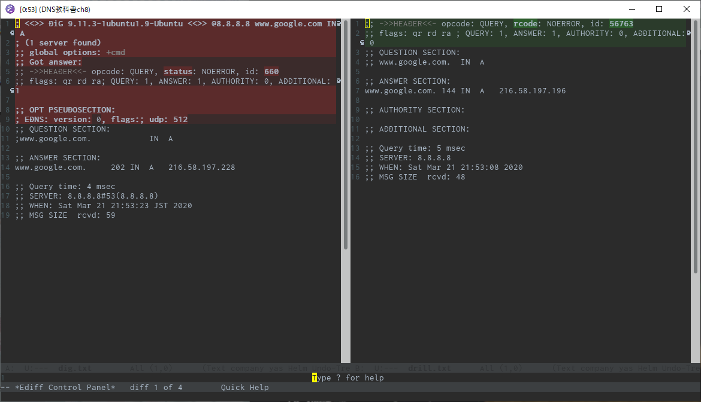
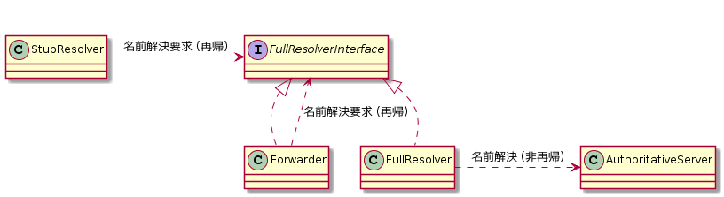
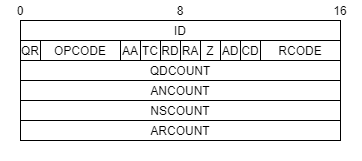

---
title: DNSがよくわかる教科書 ch8 DNSの動作確認 (1/3)
tags:
- DNS
- 勉強メモ
date: 2020-03-21T22:59:52+09:00
URL: https://wand-ta.hatenablog.com/entry/2020/03/21/225952
EditURL: https://blog.hatena.ne.jp/wand_ta/wand-ta.hatenablog.com/atom/entry/26006613538626949
bibliography: https://www.sbcr.jp/products/4797394481.html?sku=4797394481
-------------------------------------

# DNSの動作確認の基本 #


## DNSのサービス状況を確認する方法 ##

- 確認すべきこと
    - 個々の構成要素が正しく動いていること
    - 全体として正しく動いていること
- サービスの利用状況や発生するイベント・インシデントの状況を把握し、適切に対応することが重要
    - 関連サーバーのサービス状況の監視
        - 権威サーバー
        - フルリゾルバー
    - 突発的なアクセスの増加やサイバー攻撃の検知
        - アクセス数監視
        - トラフィック量監視


## Column: インシデントとアクシデント ##

- accident
    - 実際に事件・事故が発生した状況
- incident
    - アクシデントに発展する可能性を持つ出来事や事件


# コマンドラインツール #

## DNSの動作状況を確認するためのコマンド ##

- dig
    - Domain Information Groper
    - BINDに同梱
- drill
    - BINDを含まないOSにdigの代替として標準添付されていたりする
- kdig
    - digとだいたい同じ機能
    - 独自機能も
- nslookup
    - dig標準添付以前から使われている
    - Winは未だにこれ
    - 古いので他のツールを利用するのが望ましい

## digコマンドとdrillコマンド ##

- 【補】Ubuntu 18.04にはdrillは入っていないので入れる

``` sh
apt-cache search drill | grep dns
```

```
ldnsutils - ldns library for DNS programming
```

``` sh
sudo apt-get install ldnsutils
```

- dockerイメージも用意した

[https://hub.docker.com/repository/docker/wandta/drill:embed:cite]


```sh
drill @8.8.8.8 www.google.com IN A
```

```
;; ->>HEADER<<- opcode: QUERY, rcode: NOERROR, id: 56763
;; flags: qr rd ra ; QUERY: 1, ANSWER: 1, AUTHORITY: 0, ADDITIONAL: 0 
;; QUESTION SECTION:
;; www.google.com.	IN	A

;; ANSWER SECTION:
www.google.com.	144	IN	A	216.58.197.196

;; AUTHORITY SECTION:

;; ADDITIONAL SECTION:

;; Query time: 5 msec
;; SERVER: 8.8.8.8
;; WHEN: Sat Mar 21 21:53:08 2020
;; MSG SIZE  rcvd: 48
```

- digとの比較

``` sh
dig @8.8.8.8 www.google.com IN A
```

```
; <<>> DiG 9.11.3-1ubuntu1.9-Ubuntu <<>> @8.8.8.8 www.google.com IN A
; (1 server found)
;; global options: +cmd
;; Got answer:
;; ->>HEADER<<- opcode: QUERY, status: NOERROR, id: 660
;; flags: qr rd ra; QUERY: 1, ANSWER: 1, AUTHORITY: 0, ADDITIONAL: 1

;; OPT PSEUDOSECTION:
; EDNS: version: 0, flags:; udp: 512
;; QUESTION SECTION:
;www.google.com.			IN	A

;; ANSWER SECTION:
www.google.com.		202	IN	A	216.58.197.228

;; Query time: 4 msec
;; SERVER: 8.8.8.8#53(8.8.8.8)
;; WHEN: Sat Mar 21 21:53:23 JST 2020
;; MSG SIZE  rcvd: 59
```




- 細かい所が結構違う
    - ヘッダー
    - Additional Sectionの有無

## dig, drill, kdigコマンドの代表的なオプション ##

- 名前解決要求に関係するオプション
    - 名前解決**要求**
        - 「私の代わりに名前解決をしてください」というやつ
            - スタブリゾルバー -> フルリゾルバー
            - DNSフォワーダー -> フルリゾルバー
        - 再帰的問い合わせ(recursive query)ともいう
    - cf. 名前解決
        - 実際に名前解決するやつ
        - フルリゾルバー -> 権威サーバー
        - 非再帰的問い合わせ(non-recursive query)ともいう
        - 反復問い合わせ(iterative query)ともいう



```
;; ->>HEADER<<- opcode: QUERY, rcode: NOERROR, id: 56190
;; flags: qr rd ra ; QUERY: 1, ANSWER: 1, AUTHORITY: 0, ADDITIONAL: 0 
```

- `rd` <-これが「再帰的問い合わせ」有効を表す

```sh
drill -o RD @8.8.8.8 www.google.com IN A
```

```
;; ->>HEADER<<- opcode: QUERY, rcode: NOERROR, id: 56190
;; flags: qr rd ra ; QUERY: 1, ANSWER: 1, AUTHORITY: 0, ADDITIONAL: 0 
;; QUESTION SECTION:
;; www.google.com.	IN	A
...
```

``` sh
drill -o rd @8.8.8.8 www.google.com IN A
```

```
;; ->>HEADER<<- opcode: QUERY, rcode: NOERROR, id: 64366
;; flags: qr ra ; QUERY: 1, ANSWER: 1, AUTHORITY: 0, ADDITIONAL: 0 
;; QUESTION SECTION:
;; www.google.com.	IN	A
```

- 問い合わせ先がフルリゾルバーであるか権威サーバーであるかによって名前解決要求を有効にするか無効にするか使い分ける必要がある


## DNSメッセージの形式 ##

- 問い合わせと応答が同じ構造(format)であることが特徴
    - Header
    - Question
    - Answer (optional)
    - Authority (optional)
    - Additional (optional)

### Headerセクションのフォーマット ###

↓こういうのの内部表現

```
;; ->>HEADER<<- opcode: QUERY, rcode: NOERROR, id: 56190
;; flags: qr rd ra ; QUERY: 1, ANSWER: 1, AUTHORITY: 0, ADDITIONAL: 0 
```


- [IANA公式](https://www.iana.org/assignments/dns-parameters/dns-parameters.xhtml#dns-parameters-12)



- ID
    - DNSのトランザクションのID
- QR
    - 問い合わせ: 1
    - 応答: 0
- OPCODE
    - QUERY: 0
    - NOTIFY: 4
    - UPDATE: 5
- フラグフィールド
    - AA: Authoritative Answer
        - 応答用
        - 権威のある情報ならば1
        - 【補】グルーレコードなどは0のはず
    - TC: Truncated Response
        - 応答用
        - 切り詰められていたら1
    - RD: Recursion Desired
        - 問い合わせ用
        - 再帰的問い合わせ = フルリゾルバーへの問い合わせならば1
    - RA: Recursion Available
        - 応答用
        - ネームサーバーが再帰的問い合わせがサポートしていれば1
    - AD: Authentic Data
        - DNSSEC用に追加
            - [RFC 4035](https://tools.ietf.org/html/rfc4035)
        - 問い合わせ: 1で応答のADビットを解釈できることを表明
        - 応答: DNSSEC検証が成功したら1
    - CD: Checking Disabled
        - DNSSEC用に追加
            - [RFC 4035](https://tools.ietf.org/html/rfc4035)
        - 問い合わせ用
        - 1のときDNSSEC検証無効化
    - Z
        - 予約ビット(0埋め)
        - ADやCDはかつてZだった
- RCODE
    - 応答コード
        - NOERROR
            - 通常応答
        - SERVFAIL
            - Server Fail
        - NXDOMAIN
            - その名前とその下の階層にはいずれのリソースレコードも存在しない
        - REFUSED
            - アクセス制限、管理ポリシー等の理由でリクエスト拒否
- QDCOUNT
    - Question Sectionの件数
    - 常に1
- ANCOUNT
    - Answer Sectionのリソースレコード件数
- NSCOUNT
    - Authority Sectionのリソースレコード件数
- ARCOUNT
    - Additional Sectionのリソースレコード件数


## digコマンドの出力を読み解く ##

```sh
drill @8.8.8.8 www.google.com IN A
```

```
;; ->>HEADER<<- opcode: QUERY, rcode: NOERROR, id: 56763
;; flags: qr rd ra ; QUERY: 1, ANSWER: 1, AUTHORITY: 0, ADDITIONAL: 0 
;; QUESTION SECTION:
;; www.google.com.	IN	A

;; ANSWER SECTION:
www.google.com.	144	IN	A	216.58.197.196

;; AUTHORITY SECTION:

;; ADDITIONAL SECTION:

;; Query time: 5 msec
;; SERVER: 8.8.8.8
;; WHEN: Sat Mar 21 21:53:08 2020
;; MSG SIZE  rcvd: 48
```

```
;; ->>HEADER<<- opcode: QUERY, rcode: NOERROR, id: 56763
;; flags: qr rd ra ; QUERY: 1, ANSWER: 1, AUTHORITY: 0, ADDITIONAL: 0 
```

- OPCODE = QUERY (通常の問い合わせ)
- RCODE = NOERROR (通常応答)
- ID = 56763
- フラグフィールド
    - QR = 1
        - 問い合わせなので1
    - RD = 1
        - 再帰的問い合わせ有効
        - dig, drillはデフォルトで有効
    - RA = 1
        - 応答した相手(8.8.8.8 = Google Public DNS)が再帰的問い合わせをサポートしている
- 各セクション件数
    - QDCOUNT = 1
    - ANCOUNT = 1
    - NSCOUNT = 0
    - ARCOUNT = 0

--- 

- ドメインを間違えてみる

```sh
drill @8.8.8.8 www.googlecom IN A
```

```
;; ->>HEADER<<- opcode: QUERY, rcode: NXDOMAIN, id: 52958
;; flags: qr rd ra ; QUERY: 1, ANSWER: 0, AUTHORITY: 1, ADDITIONAL: 0 
;; QUESTION SECTION:
;; www.googlecom.	IN	A

;; ANSWER SECTION:

;; AUTHORITY SECTION:
.	86399	IN	SOA	a.root-servers.net. nstld.verisign-grs.com. 2020032100 1800 900 604800 86400

;; ADDITIONAL SECTION:

;; Query time: 8 msec
;; SERVER: 8.8.8.8
;; WHEN: Sat Mar 21 22:32:10 2020
;; MSG SIZE  rcvd: 106
```

- RCODE = NXDOMAIN (そんな名前ねーぞ)
