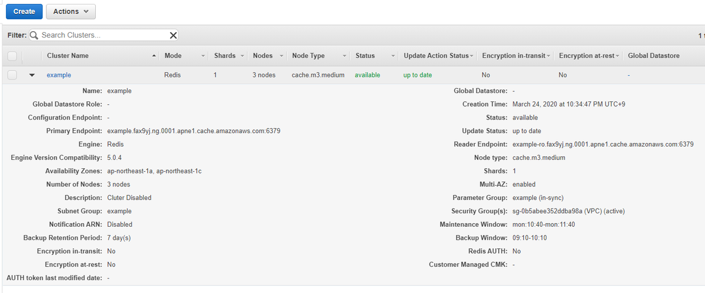

---
title: 実践Terraform ch13 データストア (2/2)
tags:
- Terraform
- 勉強メモ
date: 2020-03-24T22:44:58+09:00
URL: https://wand-ta.hatenablog.com/entry/2020/03/24/224458
EditURL: https://blog.hatena.ne.jp/wand_ta/wand-ta.hatenablog.com/atom/entry/26006613539973267
bibliography: https://nextpublishing.jp/book/10983.html
-------------------------------------

[https://github.com/wand2016/terraform_ch13_example_1:embed:cite]

# ElastiCache #


## ElastiCacheパラメータグループ ##

- クラスタモード有効/無効を選択する
- [公式](https://docs.aws.amazon.com/ja_jp/AmazonElastiCache/latest/red-ug/Replication.Redis-RedisCluster.html)
- 今回は無効

``` tf
resource "aws_elasticache_parameter_group" "example" {
  name = "example"
  family = "redis5.0"

  parameter {
    name = "cluster-enabled"
    value = "no"
  }
}
```


## ElastiCacheサブネットグループ ##

``` tf
resource "aws_elasticache_subnet_group" "example" {
  name = "example"
  subnet_ids = [aws_subnet.private_0.id, aws_subnet.private_1.id]
}
```

- フェイルオーバー設定で使用


## ElastiCacheレプリケーショングループ ##

``` tf
resource "aws_elasticache_replication_group" "example" {
  replication_group_id = "example"
  replication_group_description = "Cluter Disabled"
  engine = "redis"
  engine_version = "5.0.4"
  number_cache_clusters = 3
  node_type = "cache.m3.medium"
  snapshot_window = "09:10-10:10"
  snapshot_retention_limit = 7
  maintenance_window = "mon:10:40-mon:11:40"
  automatic_failover_enabled = true
  port = var.redis_port
  apply_immediately = false
  security_group_ids = [module.redis_sg.security_group_id]
  parameter_group_name = aws_elasticache_parameter_group.example.name
  subnet_group_name = aws_elasticache_subnet_group.example.name
}

module "redis_sg" {
  source = "./security_group"
  name = "redis-sg"
  vpc_id = aws_vpc.example.id
  port = var.redis_port
  cidr_blocks = [aws_vpc.example.cidr_block]
}
```

- `automatic_failover_enabled = true`
    - [公式/自動フェイルオーバー](https://docs.aws.amazon.com/ja_jp/AmazonElastiCache/latest/red-ug/AutoFailover.html)
    - マルチAZ前提
- `apply_immediately = false`
    - [公式/](https://docs.aws.amazon.com/ja_jp/AmazonElastiCache/latest/red-ug/Clusters.Modify.html)
    - trueならば下記属性の変更はすぐに適用される
        - ノードタイプ
        - エンジンバージョン
        - クラスターのノード数
    - falseならば次のメンテナンス期間に適用される


