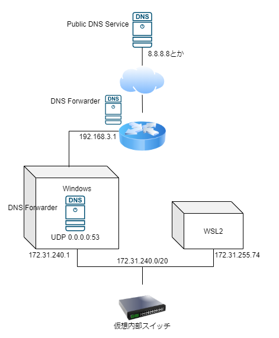
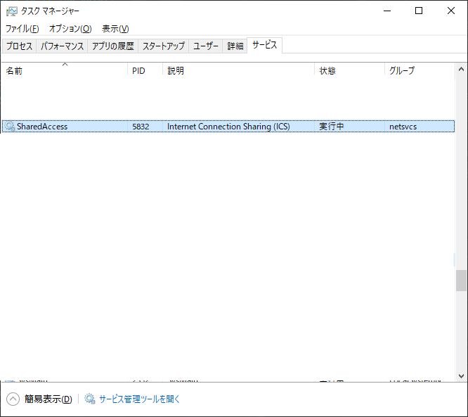
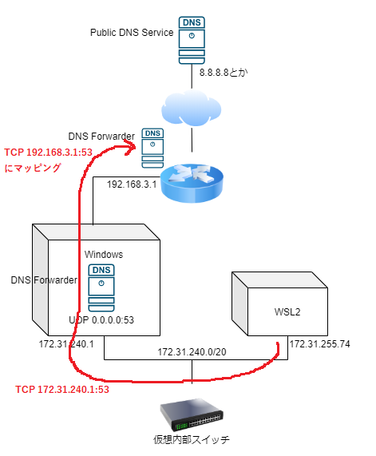

DNSとネットワークの勉強になったのでまとめてみる

-------------------------------------

# 現象: WSL2のデフォルトのフルリゾルバーにTCPで名前解決要求するとconnection refused #


- UDPは通る:

```sh
dig www.google.co.jp A
```

```
; <<>> DiG 9.11.3-1ubuntu1.9-Ubuntu <<>> www.google.co.jp A
;; global options: +cmd
;; Got answer:
;; ->>HEADER<<- opcode: QUERY, status: NOERROR, id: 63879
;; flags: qr rd ad; QUERY: 1, ANSWER: 9, AUTHORITY: 0, ADDITIONAL: 0
;; WARNING: recursion requested but not available

;; QUESTION SECTION:
;www.google.co.jp.		IN	A

;; ANSWER SECTION:
www.google.co.jp.	0	IN	A	172.217.175.35
ns1.google.com.		0	IN	AAAA	2001:4860:4802:32::a
ns2.google.com.		0	IN	AAAA	2001:4860:4802:34::a
ns3.google.com.		0	IN	AAAA	2001:4860:4802:36::a
ns4.google.com.		0	IN	AAAA	2001:4860:4802:38::a
ns1.google.com.		0	IN	A	216.239.32.10
ns2.google.com.		0	IN	A	216.239.34.10
ns3.google.com.		0	IN	A	216.239.36.10
ns4.google.com.		0	IN	A	216.239.38.10

;; Query time: 11 msec
;; SERVER: 172.31.240.1#53(172.31.240.1)
;; WHEN: Wed Mar 25 22:33:28 JST 2020
;; MSG SIZE  rcvd: 354
```


- TCPは通らない:

``` sh
dig +tcp www.google.co.jp A
```

```
;; Connection to 172.31.240.1#53(172.31.240.1) for www.google.co.jp failed: connection refused.
```


- TCPでも、public DNS serviceには名前解決要求が通る:


```sh
dig +tcp @8.8.8.8 www.google.co.jp A
```

```
; <<>> DiG 9.11.3-1ubuntu1.9-Ubuntu <<>> +tcp @8.8.8.8 www.google.co.jp A
; (1 server found)
;; global options: +cmd
;; Got answer:
;; ->>HEADER<<- opcode: QUERY, status: NOERROR, id: 43602
;; flags: qr rd ra; QUERY: 1, ANSWER: 1, AUTHORITY: 0, ADDITIONAL: 1

;; OPT PSEUDOSECTION:
; EDNS: version: 0, flags:; udp: 512
;; QUESTION SECTION:
;www.google.co.jp.		IN	A

;; ANSWER SECTION:
www.google.co.jp.	299	IN	A	172.217.25.99

;; Query time: 4 msec
;; SERVER: 8.8.8.8#53(8.8.8.8)
;; WHEN: Wed Mar 25 22:35:23 JST 2020
;; MSG SIZE  rcvd: 61
```


# 詳細 #



- WSL2のデフォルトのフルリゾルバー`172.31.240.1`はWindowsホスト
- Windows上で53をリッスンしているサービスを探す

```powershell
PS C:\WINDOWS\system32> netstat -abo | grep ":53 " -1
```


```
 [chrome.exe]
  UDP         0.0.0.0:53             *:*                                    5832
  SharedAccess
 [svchost.exe]
  UDP         0.0.0.0:53             *:*                                    5832
  SharedAccess
```



- Internet Connection Sharing(ICS)というサービスであることまでは突き止めた
    - [公式](https://support.microsoft.com/ja-jp/help/324286/how-to-set-up-internet-connection-sharing-in-windows-server-2003)
    - 小規模ネットワークでNAT、IPアドレッシング、名前解決を共有するサービス
- こいつがUDP53番ポートしかリッスンしていないのがconnection refusedの原因
- TCP53番もリッスンする方法は残念ながら見つけられなかった


# connection refusedを回避してみる #

- ところでうちのホームルーターはDNSフォワーダーを提供しており、スタブリゾルバーからは本物のフルリゾルバーに見える

```sh
dig +tcp @192.168.3.1 www.google.co.jp A
```

```
; <<>> DiG 9.11.3-1ubuntu1.9-Ubuntu <<>> +tcp @192.168.3.1 www.google.co.jp A
; (1 server found)
;; global options: +cmd
;; Got answer:
;; ->>HEADER<<- opcode: QUERY, status: NOERROR, id: 15398
;; flags: qr rd ra; QUERY: 1, ANSWER: 1, AUTHORITY: 4, ADDITIONAL: 9

;; OPT PSEUDOSECTION:
; EDNS: version: 0, flags:; udp: 4096
;; QUESTION SECTION:
;www.google.co.jp.		IN	A

;; ANSWER SECTION:
www.google.co.jp.	113	IN	A	172.217.31.131

;; AUTHORITY SECTION:
google.co.jp.		36127	IN	NS	ns3.google.com.
google.co.jp.		36127	IN	NS	ns1.google.com.
google.co.jp.		36127	IN	NS	ns2.google.com.
google.co.jp.		36127	IN	NS	ns4.google.com.

;; ADDITIONAL SECTION:
ns1.google.com.		36069	IN	AAAA	2001:4860:4802:32::a
ns2.google.com.		60175	IN	AAAA	2001:4860:4802:34::a
ns3.google.com.		81790	IN	AAAA	2001:4860:4802:36::a
ns4.google.com.		70877	IN	AAAA	2001:4860:4802:38::a
ns1.google.com.		77655	IN	A	216.239.32.10
ns2.google.com.		40284	IN	A	216.239.34.10
ns3.google.com.		41486	IN	A	216.239.36.10
ns4.google.com.		64128	IN	A	216.239.38.10

;; Query time: 29 msec
;; SERVER: 192.168.3.1#53(192.168.3.1)
;; WHEN: Wed Mar 25 23:34:41 JST 2020
;; MSG SIZE  rcvd: 319
```

- ポートマッピングで`172.31.240.1:53`をホームルーターに向けかえてconnection refusedを回避してみる



```powershell
PS C:\WINDOWS\system32> netsh interface portproxy add v4tov4 listenaddress=172.31.240.1 listenport=53 connectaddress=192.168.3.1
PS C:\WINDOWS\system32> netsh interface portproxy show all
```

```
ipv4 をリッスンする:         ipv4 に接続する:

Address         Port        Address         Port
--------------- ----------  --------------- ----------
172.31.240.1    53          192.168.3.1     53

```

- デフォルトネームサーバーでdigってみる

```sh
dig +tcp www.google.co.jp A
```

```
; <<>> DiG 9.11.3-1ubuntu1.9-Ubuntu <<>> +tcp www.google.co.jp A
;; global options: +cmd
;; Got answer:
;; ->>HEADER<<- opcode: QUERY, status: NOERROR, id: 43411
;; flags: qr rd ra; QUERY: 1, ANSWER: 1, AUTHORITY: 4, ADDITIONAL: 9

;; OPT PSEUDOSECTION:
; EDNS: version: 0, flags:; udp: 4096
;; QUESTION SECTION:
;www.google.co.jp.		IN	A

;; ANSWER SECTION:
www.google.co.jp.	285	IN	A	172.217.31.131

;; AUTHORITY SECTION:
google.co.jp.		44055	IN	NS	ns1.google.com.
google.co.jp.		44055	IN	NS	ns4.google.com.
google.co.jp.		44055	IN	NS	ns3.google.com.
google.co.jp.		44055	IN	NS	ns2.google.com.

;; ADDITIONAL SECTION:
ns1.google.com.		330105	IN	AAAA	2001:4860:4802:32::a
ns2.google.com.		318287	IN	AAAA	2001:4860:4802:34::a
ns3.google.com.		322628	IN	AAAA	2001:4860:4802:36::a
ns4.google.com.		1286	IN	AAAA	2001:4860:4802:38::a
ns1.google.com.		313658	IN	A	216.239.32.10
ns2.google.com.		327238	IN	A	216.239.34.10
ns3.google.com.		324390	IN	A	216.239.36.10
ns4.google.com.		316727	IN	A	216.239.38.10

;; Query time: 71 msec
;; SERVER: 172.31.240.1#53(172.31.240.1)
;; WHEN: Wed Mar 25 23:23:30 JST 2020
;; MSG SIZE  rcvd: 319
```

- 正常応答が帰ってくるようになった
