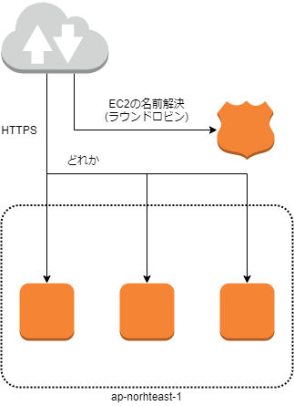
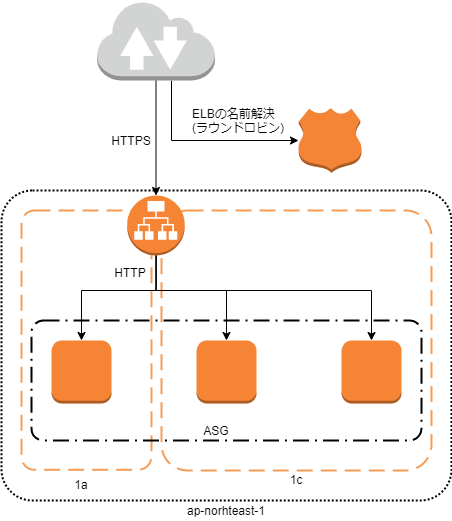
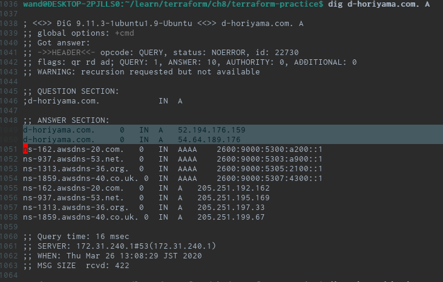
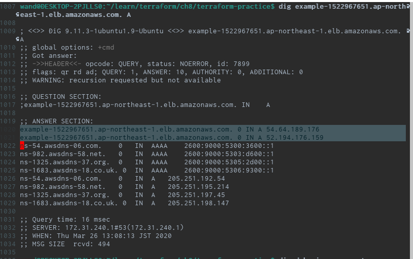
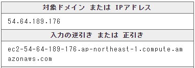
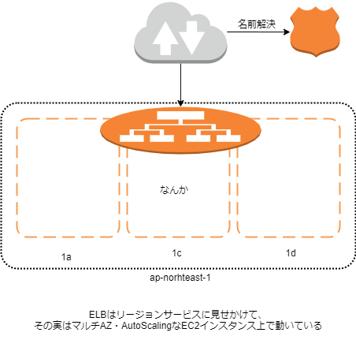

---
title: 【追記しました】Qiitaのインフラを掘った
tags:
- AWS
date: 2020-03-26T11:41:42+09:00
URL: https://wand-ta.hatenablog.com/entry/2020/03/26/114142
EditURL: https://blog.hatena.ne.jp/wand_ta/wand-ta.hatenablog.com/atom/entry/26006613540605212
-------------------------------------

# 動機 #

> 「退会してもログインできる」  
> 「3回退会してようやく退会できた」

というツイートを見かけ、

「ステートごとスケールアウトしてて同期取れてないとかだったら面白いな～」  
「普段誰も退会・ログアウトしないし気づかないよな～」

と思って調べてみた

結論、この当て推量に対する答えはないです

# digる #

```sh
dig qiita.com. A
```

```
; <<>> DiG 9.11.3-1ubuntu1.9-Ubuntu <<>> qiita.com. A
;; global options: +cmd
;; Got answer:
;; ->>HEADER<<- opcode: QUERY, status: NOERROR, id: 56568
;; flags: qr rd ad; QUERY: 1, ANSWER: 11, AUTHORITY: 0, ADDITIONAL: 0
;; WARNING: recursion requested but not available

;; QUESTION SECTION:
;qiita.com.			IN	A

;; ANSWER SECTION:
qiita.com.		0	IN	A	54.95.187.108
qiita.com.		0	IN	A	18.176.85.249
qiita.com.		0	IN	A	52.199.34.118
ns-171.awsdns-21.com.	0	IN	AAAA	2600:9000:5300:ab00::1
ns-772.awsdns-32.net.	0	IN	AAAA	2600:9000:5303:400::1
ns-1049.awsdns-03.org.	0	IN	AAAA	2600:9000:5304:1900::1
ns-1956.awsdns-52.co.uk. 0	IN	AAAA	2600:9000:5307:a400::1
ns-171.awsdns-21.com.	0	IN	A	205.251.192.171
ns-772.awsdns-32.net.	0	IN	A	205.251.195.4
ns-1049.awsdns-03.org.	0	IN	A	205.251.196.25
ns-1956.awsdns-52.co.uk. 0	IN	A	205.251.199.164

;; Query time: 8 msec
;; SERVER: 172.31.240.1#53(172.31.240.1)
;; WHEN: Thu Mar 26 10:41:23 JST 2020
;; MSG SIZE  rcvd: 428
```

- まずAWSを使っていることがわかる

# 読み解く #

## Route53 ##

```
ns-171.awsdns-21.com.	0	IN	AAAA	2600:9000:5300:ab00::1
ns-772.awsdns-32.net.	0	IN	AAAA	2600:9000:5303:400::1
ns-1049.awsdns-03.org.	0	IN	AAAA	2600:9000:5304:1900::1
ns-1956.awsdns-52.co.uk. 0	IN	AAAA	2600:9000:5307:a400::1
ns-171.awsdns-21.com.	0	IN	A	205.251.192.171
ns-772.awsdns-32.net.	0	IN	A	205.251.195.4
ns-1049.awsdns-03.org.	0	IN	A	205.251.196.25
ns-1956.awsdns-52.co.uk. 0	IN	A	205.251.199.164
```

- これはRoute53の権威サーバーの情報
- [公式/Route53の特徴](https://aws.amazon.com/jp/route53/features/#Functionality)


> ドメインの DNS レコードを格納できるホストゾーンを作成します。  
> ホストゾーンが作成されると、高水準の可用性を実現するために、4 つの異なるトップレベルドメイン (TLD) で 4 つの Route 53 のネームサーバーを受信します。

- WHOISすると、香港に1つ、バージニアに1つ、ワシントンに2つ置かれていることがわかる
    - Route53はグローバルサービス


## EC2 ##

```
qiita.com.		0	IN	A	54.95.187.108
qiita.com.		0	IN	A	18.176.85.249
qiita.com.		0	IN	A	52.199.34.118
```

- DNSラウンドロビンで3つのIPv4アドレスに振り分けている
- こいつらは何か？
- WHOIS結果: 


| IPv4アドレス  | 逆引きドメイン名                                       |
|---------------|--------------------------------------------------------|
| 54.95.187.108 | ec2-54-95-187-108.ap-northeast-1.compute.amazonaws.com |
| 18.176.85.249 | ec2-18-176-85-249.ap-northeast-1.compute.amazonaws.com |
| 52.199.34.118 | ec2-52-199-34-118.ap-northeast-1.compute.amazonaws.com |

- いずれも`ap-northeast-1`リージョンのEC2インスタンスを指している
- 1a, 1c, 1dのマルチAZとかかな？

# わかった範囲での構成図 #



- <s>裏側のことは一切わからないが、ここまではわかった</s>
- **追記 を参照のこと**

## <s>なんでこうしないんだろう</s> ##
<s>


- ELBを使った構成の利点
    - スケールのしやすさ
        - スケールアウト/スケールイン時にいちいちAレコード追加/削除したくないですよね
    - ELBでTLSを終端できる
        - EC2はHTTPトラフィックだけLISTENすればよく、負荷を下げられる
- Route53で振り分ける理由としてマルチリージョンフェイルオーバーが挙げられるが、そうもなっていない
- なぜELBを使わずにRoute53で振り分けているんだろう…安くあがるから？</s>

## 追記 ##

- ALB**だけ**立てて検証してみた
    - ap-northeast-1a, ap-northeast-1c
    - 後ろにアプリケーションサーバーなし
    - 決めの200OKレスポンスだけ返す








- 立てた覚えのないEC2インスタンス
- ELBはリージョンサービス…に見せかけて、その実態はMulti-AZ、AutoScalingなAZサービスである
- ので、おそらくELBが動いているEC2インスタンスの名前なのだろう
    - PTRの逆引き名がec2-*に統一されていると考えられる
- 以上を踏まえると、Qiitaのインフラはおそらくこう


