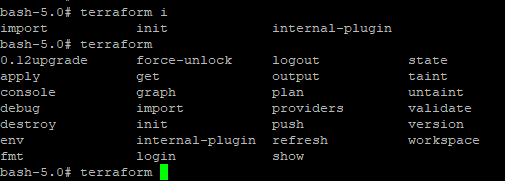

---
title: 実践Terraform ch17 Terraformベストプラクティス
tags:
- Terraform
- 勉強メモ
date: 2020-03-30T18:04:36+09:00
URL: https://wand-ta.hatenablog.com/entry/2020/03/30/180436
EditURL: https://blog.hatena.ne.jp/wand_ta/wand-ta.hatenablog.com/atom/entry/26006613542755153
bibliography: https://nextpublishing.jp/book/10983.html
-------------------------------------

# Terraformバージョンを固定する #

- terraformのバージョンを強制できる
    - チーム開発で必須

```tf
terraform {
  required_version = "0.11"
}

resource "aws_instance" "example" {
  ami = "ami-0c3fd0f5d33134a76"
  instance_type = "t2.micro"
}
```

- 合わないと怒られる


```sh
terraform version
```

```
Terraform v0.12.21

Your version of Terraform is out of date! The latest version
is 0.12.24. You can update by downloading from https://www.terraform.io/downloads.html
```


```sh
terraform init
```

```
Error: Unsupported Terraform Core version

This configuration does not support Terraform version 0.12.21. To proceed,
either choose another supported Terraform version or update the root module's
version constraint. Version constraints are normally set for good reason, so
updating the constraint may lead to other errors or unexpected behavior.
```


# ブロバイダバージョンを固定する #

```tf
terraform {
  required_version = "0.12.21"
}

provider "aws" {
  version = "2.55.0"
}

resource "aws_instance" "example" {
  ami = "ami-0c3fd0f5d33134a76"
  instance_type = "t2.micro"
}
```

```sh
terraform init
```


# 削除操作を抑止する #

```tf
terraform {
  required_version = "0.12.21"
}

provider "aws" {
  version = "2.55.0"
}

resource "aws_instance" "example" {
  ami = "ami-0c3fd0f5d33134a76"
  instance_type = "t2.micro"

  lifecycle {
    prevent_destroy = true
  }
}
```

- terraformではリソースを簡単に作成でき、簡単に削除できる
- 削除されると困るリソースは削除抑止する

```sh
terraform destroy
```

```
aws_instance.example: Refreshing state... [id=i-0e40b934d2f500f6e]

Error: Instance cannot be destroyed

  on main.tf line 9:
   9: resource "aws_instance" "example" {

Resource aws_instance.example has lifecycle.prevent_destroy set, but the plan
calls for this resource to be destroyed. To avoid this error and continue with
the plan, either disable lifecycle.prevent_destroy or reduce the scope of the
plan using the -target flag.
```

- ただし、リソース定義そのものをまるごと消してapplyするとリソースが削除されることに注意
    - 仕様

```diff
  terraform {
    required_version = "0.12.21"
  }
   
  provider "aws" {
    version = "2.55.0"
  }
   
- resource "aws_instance" "example" {
-   ami = "ami-0c3fd0f5d33134a76"
-   instance_type = "t2.micro"
-  
-   lifecycle {
-     prevent_destroy = true
-   }
- }
```


# コードフォーマットをかける #

- `terraform fmt` でコードフォーマット
- `-recursive`をつけるとサブディレクトリも
- `-check`をつけるとフォーマット済かどうかチェック

```tf
resource "aws_instance" "example" {
  ami = "ami-0c3fd0f5d33134a76"
  instance_type = "t2.micro"
}
```

```sh
terraform fmt -recursive -check
echo $?
```

- 未フォーマットだと非ゼロ

```
3
```

- フォーマット

```sh
terraform fmt -recursive
```

- イコールがいい感じに揃う


```diff
  resource "aws_instance" "example" {
-   ami = "ami-0c3fd0f5d33134a76"
+   ami           = "ami-0c3fd0f5d33134a76"
    instance_type = "t2.micro"
  }
```


```sh
terraform fmt -recursive -check
echo $?
```

- フォーマット済なので`-check`はexitコード0を返す

```
0
```


# バリデーションをかける #

```sh
terraform validate
```

```
Success! The configuration is valid.
```

- サブディレクトリにも適用する場合はfindやxargs等を駆使する


# オートコンプリートを有効にする #

```sh
terraform -install-autocomplete
cat ~/.bashrc
```

`~/.bashrc`

```sh
complete -C /bin/terraform terraform
```



# プラグインキャッシュを有効にする #

- プロバイダのバイナリファイルは、デフォルトで`terraform init`するたびにディレクトリごとにダウンロードされる

```sh
ls -lR .terraform/
```

```
.terraform/:
total 4
drwxr-xr-x 3 root root 4096 Mar 30 17:01 plugins

.terraform/plugins:
total 4
drwxr-xr-x 2 root root 4096 Mar 30 17:01 linux_amd64

.terraform/plugins/linux_amd64:
total 150316
-rwxr-xr-x 1 root root        79 Mar 30 17:30 lock.json
-rwxr-xr-x 1 root root 153919488 Mar 30 17:01 terraform-provider-aws_v2.55.0_x4
```

- このダウンロード場所を変えてキャッシュすることができる


`~/.terraformrc`

```
plugin_cache_dir = "$HOME/.terraform.d/plugin-cache"
```

- 保存先を掘っておく

```sh
mkdir -p "$HOME/.terraform.d/plugin-cache"
```

- 初回init

```sh
terraform init
ls -lR ~/.terraform.d/plugin-cache
```

```
/root/.terraform.d/plugin-cache:
total 4
drwxr-xr-x    2 root     root          4096 Mar 30 08:43 linux_amd64

/root/.terraform.d/plugin-cache/linux_amd64:
total 150312
-rwxr-xr-x    1 root     root     153919488 Mar 30 08:43 terraform-provider-aws_v2.55.0_x4
```


# TFLintで不正なコードを検出する #

```diff
  resource "aws_instance" "example" {
    ami           = "ami-0c3fd0f5d33134a76"
-   instance_type = "t2.micro"
+   instance_type = "t1.micro"
  }
```

```sh
tflint
```

```
1 issue(s) found:

Warning: "t1.micro" is previous generation instance type. (aws_instance_previous_type)

  on main.tf line 11:
  11:   instance_type = "t1.micro"

Reference: https://github.com/terraform-linters/tflint/blob/v0.15.3/docs/rules/aws_instance_previous_type.md
```

## Deep Checking ##

- AWS APIを実行して詳細なチェックを行う

```diff
  resource "aws_instance" "example" {
-   ami           = "ami-0c3fd0f5d33134a76"
+   ami           = "ami-0c3fd0f5d33134a7"
-   instance_type = "t2.micro"
+   instance_type = "t1.micro"
  }
```

```sh
tflint --deep --aws-region=ap-northeast-1
```

```
2 issue(s) found:

Error: "ami-0c3fd0f5d33134a7" is invalid AMI ID. (aws_instance_invalid_ami)

  on main.tf line 10:
  10:   ami           = "ami-0c3fd0f5d33134a7"

Warning: "t1.micro" is previous generation instance type. (aws_instance_previous_type)

  on main.tf line 11:
  11:   instance_type = "t1.micro"

Reference: https://github.com/terraform-linters/tflint/blob/v0.15.3/docs/rules/aws_instance_previous_type.md
```

Invalid AMI IDも怒ってくれるようになった
