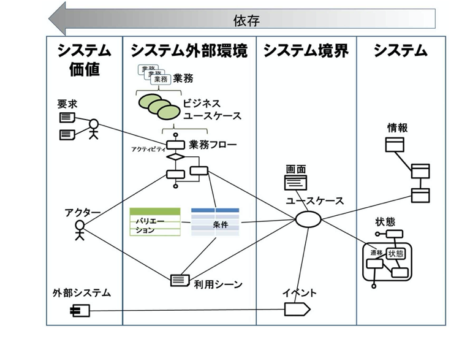

[asin:B07STQZFBX:detail]

-------------------------------------

# アイコンのつながりがレイヤーをつなぐ #

- 依存関係
  - システム価値 <- システム外部環境 <- システム境界 <- システム
- 左から右にたどるとアイコンを洗い出せる
- 右から左にたどると導出根拠が明らかになる
  - 「システムのこの情報はこのシステムユースケースで使うから必要」
  - 「このシステムユースケースはこの業務で使うから必要」
  - 「この業務はこのアクターがこの価値を生み出すために必要」
  - 右側のものについて認識が合わないときは左側のものの認識が合っているか確認する
- レイヤーの依存関係でWhyを表せるので、文章で記述しなくても様々なことが説明でき、すばやく要件をまとめられる

# 4つの視点毎に明らかにすること #

- 4つのレイヤーに当てはめて整理することで要件を素早く網羅的に整合した形で定義できる

## システム価値レイヤー ##

- 「誰にとっての価値なのか」を明らかにする
  - アクター
  - 外部システム
    - 【所感】UML的には外部システムもアクター
- 更改案件で見落とされがち
  - 既存機能や画面、データに関心が集まりすぎ、誰が使うのかに関心が向かなくなる
  - 結果、使いづらいシステムになる
- 要求を整理し、システム化の目的まで高めるのもこのレイヤー
  - 要件を決める意思決定を加速する

## システム外部環境レイヤー ##

- 「誰がシステムをどのように使うのか」を階層的に表す
  - 「なんのために使う」はシステム価値レイヤー
- ビジネスユースケース
  - 業務を分割したもの
  - 価値を届ける単位
- 業務フロー・利用シーン
  - ビジネスユースケースをアクティビティ図や文章等で表したもの

## システム境界レイヤー ##

- 「アクターがシステムとどう関わるか」を明らかにする
  - 「システムと関わってどのように使うか」はシステム外部環境
- 画面(帳票含む)
  - 人とのインタフェース
- イベント
  - 外部システムとのインタフェース
- ユースケース
  - システムを使った分割できないひと塊の作業
    - 【所感】「ビジネストランザクション」というやつかな
  - 入出力に着目する
    - whatを入力しwhatを出力する
    - howには踏み込まない
      - 要件定義の域を出る

## システムレイヤー ##

- 「システム化する情報」と、「その情報がとりうる状態」でシステムを明示する
  - やはりhowは扱わない
  - ビジネスを駆動している用語で記述する
    - 【所感】ICONIXでいう「ドメインモデル」、DDDでいう「ユビキタス言語」かな
- 情報
  - ユースケースの入出力
  - 複数のユースケースをつなぎ、要件の整合性を担保する
- 状態
  - 情報の変化を整理
  - ユースケースの妥当性を検証する
    - 「今の状態」に基づいて次に行うことが決まるから
  - 状態遷移図で記述する
