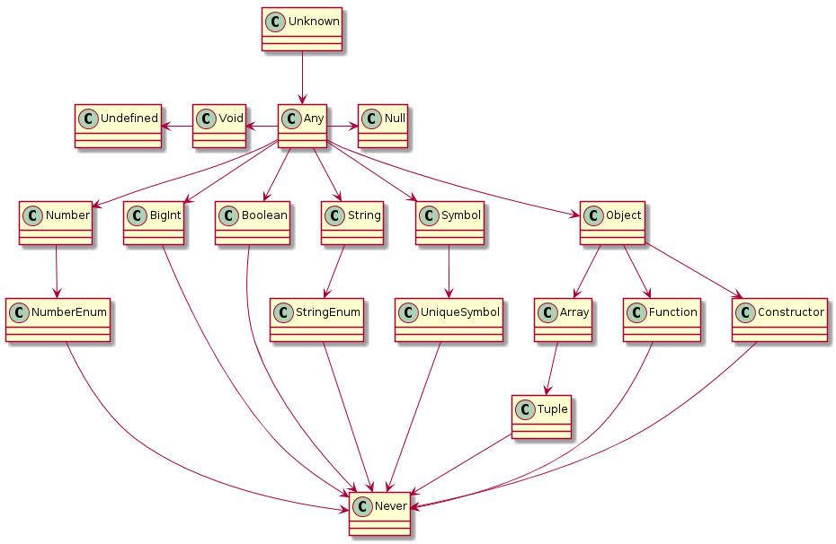

---
title: Programming TypeScript ch3 (1/2)
tags:
- TypeScript
- 勉強メモ
date: 2020-04-13T01:14:19+09:00
URL: https://wand-ta.hatenablog.com/entry/2020/04/15/011419
EditURL: https://blog.hatena.ne.jp/wand_ta/wand-ta.hatenablog.com/atom/entry/26006613550121595
bibliography: https://www.oreilly.com/library/view/programming-typescript/9781492037644/
-------------------------------------


# All About Types #

- 「型」
  - 値とそれを使ってできること(演算子とか)の集合
- 「それを使ってできること」が重要
  - typecheckerでコードの不正を検出するにあたり、何をもって正しい/正しくないとするかの定義にあたる




# Talking About Types #


```typescript
function squareOf(n: number) {
  return n * n
}
```

- 語彙の確認
  - assignability
    - `n`に`2`は代入できるが`'z'`は代入できない
  - bounds
    - `n`のupper boundは`number`だから`number|string`は代入できないよ、的なやつ
  - constraints
    - 「`n`を`number`にconstrainする」
- 後の章で詳しく掘る


# The ABCs of Types #

## any ##

> the Godfather of types

- TypeScriptではコンパイル時にすべてが型を持つ必要があり、型情報がないときのデフォルトの型がこれになる
- 最後の手段
  - 全ての値、あらゆる操作の集合だからtypecheckerで取り締まれない

### column: TSC Flag: noImplicitAny ###

- strictルールのサブセット
- anyに推論されるヤツを怒る


## unknown ##

- any同様、全ての値・全ての操作の集合
- anyと異なり、refinement(縮小変換)せずに特定の型を期待する操作を行うとエラーになってくれる

```typescript
let a: unknown = 30 // unknown
let b = a === 123   // boolean
let c = a + 10      // Error TS2571: Object is type of 'unknown'
if (typeof a === 'number') {
  let d = a + 10    // number
}
```

- 【補】union types

```typescript
let e: number|any = 10;     // any
let f: number|unknown = 10; // unknown
let g: unknown|any = 10;    // any
```

- `unknown|any`は`unknown`じゃないのか…謎


## boolean ##

```typescript
let a = true          // boolean
var b = false         // boolean
const c = true        // true
let d: boolean = true // boolean
let e: true = true    // true
let f: true = false   // Erorr TS2322 Type 'false' is not assignable to type 'true'
```

- `c`, `e`,`f`のように特定のboolean値に絞るのは type literal と呼ばれる
  - TS独特
- プリミティブのconstは他の値をとらないことが明らかなのでtype literalに推論される


## number ##

- boolean同様type literalが効く


## bigint ##

- バニラJSエンジンでサポートされていなかったりするので注意する
- 【補】ECMAScript2020,the 11th editionで入るそうな。よかったね
  - [ECMAScript仕様](https://tc39.es/ecma262/#sec-bigint-objects)
  - [Mozilla](https://developer.mozilla.org/en-US/docs/Web/JavaScript/Reference/Global_Objects/BigInt)


```typescript
let a = 1234n   // bigint
const b = 5678n // 5678n
let e = 88.5n   // Error TS1353 A bitint literal must be an integer.
```

- tsconfigのtargetのバージョンが低いと怒られる

```typescript
let a = 1234n // Error TS2737 BigInt literals are not available when targeting lower than ESNext.
```


## string ##

- 読み飛ばし

## symbol ##

- ES2015でやってきたヤツ


```typescript
let a = Symbol('a') // symbol
let b = a === 'a'   // Error: This condition will always return 'false' since the types 'symbol' and 'string' have no overlap.

const e = Symbol('e')                // typeof e
const f: unique symbol = Symbol('f') // typeof f
let g: unique symbol = Symbol('f')   // Error TS1332: A variable whose type is a 'unique symbol' type must be 'const'.

let h = e === e // boolean
let i = e === f // Error TS2367: This condition will always return 'false' since the types 'typeof e' and 'typeof f' have no overlap.
```

## Objects ##

- TSのobject型はオブジェクトの形を規定する
- TSは構造的型付け
  - 特定のプロバティを持っていることだけに興味がある
  - 型名に興味はない
  - 「ダックタイピング」とも呼ばれるヤツ

```typescript
let a: object = {
    b: 'x'
}

a.b; // Error TS2339: Property 'b' does not exist on type 'object'.
```

- `object`は`any`よりはいくぶん狭い程度の型
  - JavaScriptのObjectであること(とnullでないこと)程度しか保証してくれない
  - 【補】JavaScriptで `typeof null`が`"object"`になることを揶揄していると思われる


```typescript
let a = Math.random() < 0.5 ? { a: 1 } : null

if (typeof a === 'object') {
    a // { a: number } | null
} else {
    a // never
}
```


```typescript
let a: object = {
    b: 'x'
} // { b: string }

a.b; // string
```

- TypeScriptはobjectのプロパティについて厳しい

```typescript
let a: { x: number } = {} // Error TS2741: Property 'x' is missing in type '{}' but required in type '{ x: number; }'.

let b: { x: number } = {
    x: 1,
    y: 'hoge' // Error TS2322: Type '{ x: number; y: string; }' is not assignable to type '{ x: number; }'.
}

let c: {
    x: number,
    y: string
} = {
    x: 1,
    y: 'hoge'
}

let d: {
    x: number,
    y?: string
} = {
    x: 1,
}
```

- プロパティにはreadonlyをつけられる

```typescript
let user: {
    readonly firstName: string
} = {
    firstName: 'Gauss'
}

user.firstName
user.firstName = 'Gausss' // Error TS2540: Cannot assign to 'firstName' because it is a read-only property.
```

- `{}`アノテーションは大文字の`Object`と同じような性質で、`null`と`undefined`以外なんでも入るので危険。使ってはいけない

```typescript
let danger: {}

danger = {}
danger = {x: 1}
danger = []
danger = 'a'
danger = 1
danger = Symbol('a')
danger = null      // Error TS2322: Type 'null' is not assignable to type '{}'.
danger = undefined // Error TS2322: Type 'undefined' is not assignable to type '{}'.
```

```typescript
let danger: Object

danger = {}
danger = {x: 1}
danger = []
danger = 'a'
danger = 1
danger = Symbol('a')
danger = null      // Error TS2322: Type 'null' is not assignable to type 'Object'.
danger = undefined // Error TS2322: Type 'undefined' is not assignable to type 'Object'.
```

- cf. 小文字の`object`

```typescript
let danger: object

danger = {}
danger = {x: 1}
danger = []
danger = 'a'         // Error TS2322: Type '"a"' is not assignable to type 'object'.
danger = 1           // Error TS2322: Type '1' is not assignable to type 'object'.
danger = Symbol('a') // Error TS2322: Type 'symbol' is not assignable to type 'object'.
danger = null        // Error TS2322: Type 'null' is not assignable to type 'object'.
danger = undefined   // Error TS2322: Type 'undefined' is not assignable to type 'object'.
```

- 【補】リテラル`{}`は`{}`に推論されるので要注意

```typescript
const a = {} // {}

if (typeof a === 'object') {
    a // {}
} else if (typeof a === 'number') {
    a // number
} else {
    a // {}
}
```


### Column: Type Inference When Declaring Objects with `const` ###

```typescript
const a = {
    b: 12
}
```

- これは`{ b: number }`に推論される
  - `{ b: 12 }`ではなく
- 属性はmutableですから


### Column: Definite Assignment ###

- 定義と初期化の分離はTSでもサポートされている
- 未初期化で使おうとするとちゃんと怒ってくれる

```typescript
let i: number
let j = i * 3 // Error TS2741: Variable 'i' is used before being assigned.
```

- 型のアノテーションがなくても別件で怒ってくれる

```typescript
let i
let j = i * 3 // Error TS2532: Object is possibly 'undefined'.
```

- 【補】`any`を明示するとすり抜けちゃう

```typescript
let i: any
let j = i * 3 // number
```

- バニラJSとの互換性を考えたら、それはそう


### Column: Index Signatures ###

- こういうやつ

```typescript
let airplaneSeatingAssignments: {
    [seatNumber: string]: string
} = {
    '34D': 'Jack',
    '34E': 'Alice'
}
```

- (連想)配列のキーを増やせる
- `[key: T]: U`シンタックス
  - 「`T`型のキーはすべて`U`型の値をもつ」
  - キーはstringかnumberにassignableであること
  - `key`は他の識別子でもかまわない


----------------------------------------

# 英語 #

- lord over
  - (人に対して)いばり顔をする
