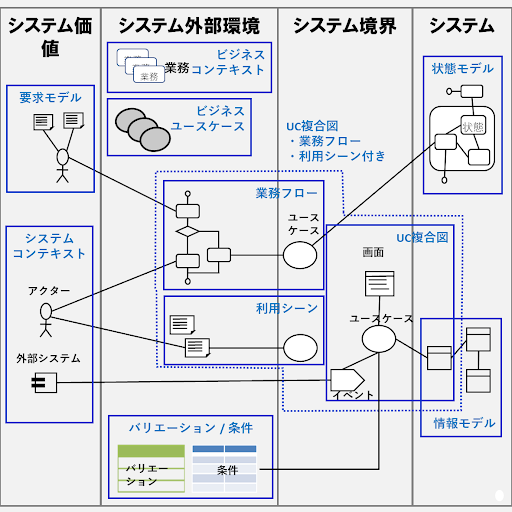

[asin:B07STQZFBX:detail]

-------------------------------------

# RDRAのダイアグラム #

- 要件定義は個々のアイコンのつながりで伝える
  - 右のものが左に依存している
  - 左が右の根拠になっている
- 作成する単位はダイアグラム単位
  - 業務フロー
  - ユースケース複合図
  - etc.

# ダイアグラムで要件を定義する #

- 図のデメリット
  - 読み手にとって習熟が要求される
- 図のメリット
  - ひとたび理解できるようになると、文章で書いたものよりも何倍も広がりを持って理解できる
  - 打ち合わせで使いやすい
- ドキュメントとして保持するものではなく、コミュニケーションツール

## ダイアグラムの階層化でシステムを俯瞰する ##

- トップダウン・階層化
  1. 業務
  2. ビジネスユースケース
  3. 業務フロー/利用シーン
  4. UC複合図

## 情報モデルと状態モデルでユースケースの役割を明確にする ##

- 情報は複数のユースケース間の連携をあらわす
- 状態の遷移はユースケースが実現すべき情報の変化をあらわす

## ダイアグラムを超えたアイコンのつながり ##

- 例: 情報
  - 複数のUC複合図上でユースケースにつながっている
- ダイアグラムを横断したアイコンのつながりが重要

# システム価値レイヤーのダイアグラム #

- システムコンテキスト図
  - システム化の目的を端的に表す
  - 価値を提供するアクターと外部システム
- 要求モデル図
  - 要求を整理し、システム化の方向性を明確にする
  - 枝葉の要求を捨てるのが時間をかけないコツ

# システム外部環境レイヤーのダイアグラム #

- ビジネスコンテキスト図
  - システム化対象の最上位のビジネス単位「業務」を明らかにする
- ビジネスユースケース図
  - 「業務」に1対1で対応、業務をビジネスユースケースに細分化する
    - 垂直分割: 構成要素の分割
    - 水平分割: 同じ業務でも商品や取引先によってフローが異なる場合などの分割
- 業務フロー図
  - ビジネスユースケースをアクティビティ図で表す
  - 基本的な仕事の流れとシステムとの接点を明らかにする
- 利用シーン図
  - 「フロー」がない場合はこれ
  - 使われ方を記述する
- バリエーション/条件図
  - 例
    - 条件: 単価表
    - バリエーション: 取引先、商品種類

# システム境界レイヤーのダイアグラム #

- ユースケース(UC)複合図
  - 下記要素からなる
    - 画面
      - 人と関わる入出力
    - イベント
      - 外部システムとの連携
    - 情報
      - ユースケースの操作の対象
    - 条件
      - ビジネスルール
  - 【所感】ICONIXでいうロバストネス図にあたる？

# システムレイヤーのダイアグラム #

- 情報モデル図
  - システム化したいビジネス上の用語
  - 「生機は製造ロット単位に管理している」 => 「生機」と「製造ロット」を結ぶ
  - 【所感】ICONIXでいうドメインモデルにあたる気がする
- 状態モデル図
  - 「xx済」「xx待ち」「xx中」などを状態遷移図で表す

## ユースケースと情報モデル、状態モデル ##

- 「情報」と「状態」は相補的
- 「ユースケース」と「情報」「状態」は相互に関わりを持つことでRDRAモデル全体の精度を向上させることができる
  - 【所感】ICONIXでいうところの、ドメインモデル・ユースケース・ロバストネス図を行き来して精度を高めるのとたぶん同じことを言っている

# ダイアグラムをまたぐアイコンの関係 #

> - ダイアグラムを横断したアイコンのつながりが重要

- ダイアグラムにアイコンを追加するときは、別のダイアグラムの既存のものと同一かどうかを意識する
- したがって、同時並行的に作成していくことになる

# ダイアグラムの関係 #

- システム境界レイヤの「(システム)ユースケース」がシステムのボリューム感を表す
  - 【所感】ICONIXで「ユースケース=振る舞い要件を洗い出さないと見積もれない」と主張していることに符合する

# 開発ボリュームの把握 #

- 開発ボリュームはユースケースで決まる
- ユースケースは業務から階層的にブレークダウンされる
  - 業務 => ビジネスユースケース => アクティビティ => ユースケース
- 作成するダイアグラムはこう:
  - ビジネスコンテキスト図 => ビジネスユースケース図 => 業務フロー図

# RDRAモデルの読み方 #

- 文章は上から下、左から右に読む
- ダイアグラムは決まった読み方がない
  - トップダウンで読み進める
    - 全体を俯瞰しながらシステムの構成を理解するのに好適
  - 関心のあるアイコンからつながりをたどって読む
    - 開発担当者が自分の担当するユースケースを理解するのに好適
      - どのように使われるか => 遡って「アクティビティ」「ビジネスユースケース」を読む
      - 何を行うか => 「情報」「状態」を読む
  - 中心となるダイアグラムから逆につながりをたどって読む
    - 中心 = ダイアグラム横断的なやつ
      - 情報
      - 状態

# 影響度を把握する #

- 影響が見過ごされ、修正が漏れがちな例
  - ユースケース -> 情報 -> 別のユースケース
  - バリエーション -> 条件 -> ユースケース
- RDRAモデルでは全てのアイコンをつなぐので、変更起点からつながりをたどることで影響範囲を把握できる
- 安心して要件を変更できる
  - テストがあるから安心してリファクタリングできるような感じ
