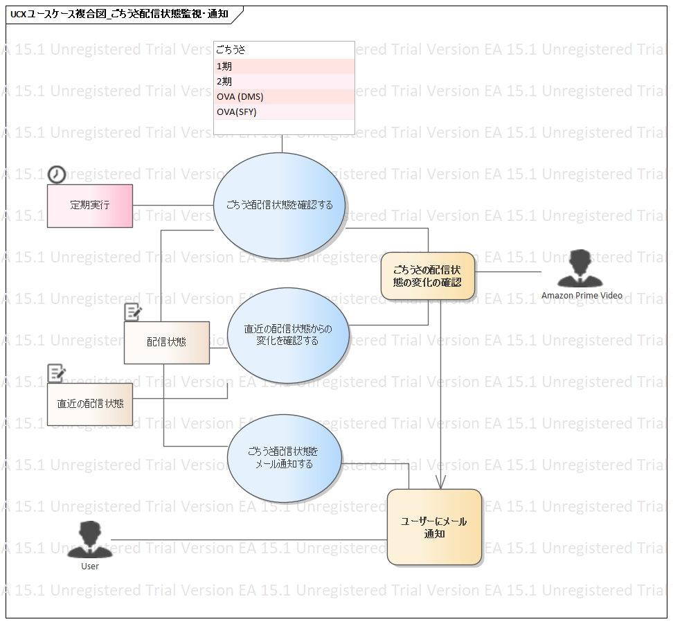

---
title: RDRA2.0ハンズオン -- ごちうさ配信状態監視システムの場合
tags:
- RDRA2.0
- ごちうさ
- 勉強メモ
date: 2020-04-19T17:07:29+09:00
URL: https://wand-ta.hatenablog.com/entry/2020/04/19/170729
EditURL: https://blog.hatena.ne.jp/wand_ta/wand-ta.hatenablog.com/atom/entry/26006613552632548
-------------------------------------

順番が逆だが、以前作ったごちうさ配信状態監視システムを「これから作る体」で要件定義の練習をしてみた

# Enterprise Architect 評価版(英語)の導入 #

- https://www.sparxsystems.jp/ea_download_exe.htm

# RDRA2.0 アドインの導入 #

- 公式からmsiファイルをダウンロード
  - https://www.sparxsystems.jp/products/EA/tech/RDRA.htm
- アドオンのインストール先は`C:\Program Files (x86)\Sparx Systems\EA Trial`
- インストールに成功すると「Specialize」に追加される

# 成果物

## システム価値

### システムコンテキスト図

### 要求モデル図

実装したシステムにはCloudWatchのダッシュボードが付いてきたが、これは必須ではなかったので含めていない

## システム外部環境

### ビジネスコンテキスト図

### ビジネスユースケース図

### 業務フロー図

### バリエーション・条件図

## システム境界

### ユースケース複合図

業務フロー図に下記の情報が追加されている感じ

- 定期実行
- 外部システム(Amazon Prime Video) からデータを取ってくる
- (システム)ユースケースの入出力の情報

## システム

### 情報モデル図

- 汎化の矢印を引けなかった
- ICONIXのドメインモデルよりもさらに表現力を絞っていそう

### 状態モデル図

