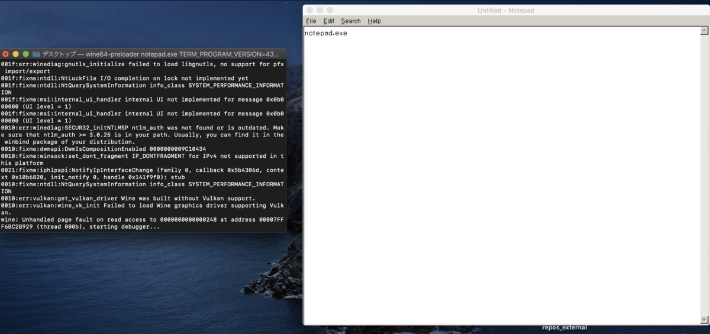

---
title: macOS catalinaでwine64をビルド 備忘録
tags:
- wine
- mac
date: 2020-04-22T00:00:00+09:00
URL: https://wand-ta.hatenablog.com/entry/2020/04/22/000000
EditURL: https://blog.hatena.ne.jp/wand_ta/wand-ta.hatenablog.com/atom/entry/26006613559353903
-------------------------------------


# clangを入れる #

- gccだとwineビルド時に下記のようなエラーが出るのでclangを使う

```
gcc -m64 -c -o loader.o loader.c -I. -I../../include -D__WINESRC__ -D_REENTRANT -fPIC -Wall -pipe \
  -fcf-protection=none -fno-stack-protector -fno-strict-aliasing -Wdeclaration-after-statement \
  -Wempty-body -Wignored-qualifiers -Wno-packed-not-aligned -Wshift-overflow=2 -Wstrict-prototypes \
  -Wtype-limits -Wunused-but-set-parameter -Wvla -Wwrite-strings -Wpointer-arith -Wlogical-op \
  -gdwarf-2 -gstrict-dwarf -g -O2 -U_FORTIFY_SOURCE -D_FORTIFY_SOURCE=0
In file included from /Library/Developer/CommandLineTools/SDKs/MacOSX10.15.sdk/System/Library/Frameworks/Security.framework/Headers/AuthSession.h:32,
                 from /Library/Developer/CommandLineTools/SDKs/MacOSX10.15.sdk/System/Library/Frameworks/Security.framework/Headers/Security.h:42,
                 from /Library/Developer/CommandLineTools/SDKs/MacOSX10.15.sdk/System/Library/Frameworks/CoreServices.framework/Frameworks/OSServices.framework/Headers/CSIdentity.h:43,
                 from /Library/Developer/CommandLineTools/SDKs/MacOSX10.15.sdk/System/Library/Frameworks/CoreServices.framework/Frameworks/OSServices.framework/Headers/OSServices.h:29,
                 from /Library/Developer/CommandLineTools/SDKs/MacOSX10.15.sdk/System/Library/Frameworks/CoreServices.framework/Frameworks/LaunchServices.framework/Headers/IconsCore.h:23,
                 from /Library/Developer/CommandLineTools/SDKs/MacOSX10.15.sdk/System/Library/Frameworks/CoreServices.framework/Frameworks/LaunchServices.framework/Headers/LaunchServices.h:23,
                 from /Library/Developer/CommandLineTools/SDKs/MacOSX10.15.sdk/System/Library/Frameworks/CoreServices.framework/Headers/CoreServices.h:39,
                 from loader.c:48:
/Library/Developer/CommandLineTools/SDKs/MacOSX10.15.sdk/System/Library/Frameworks/Security.framework/Headers/Authorization.h:193:7: error: variably modified 'bytes' at file scope
  193 |  char bytes[kAuthorizationExternalFormLength];
      |       ^~~~~
make[1]: *** [loader.o] Error 1
make: *** [libs/wine] Error 2
```


```sh
brew install llvm
```

- パス通す

.なんとかshrc

``` sh
export PATH="/usr/local/opt/llvm/bin:$PATH"
```


# bisonのバージョンを上げる #

```sh
brew reinstall bison
bison --version
```

```
bison (GNU Bison) 3.5.4
Written by Robert Corbett and Richard Stallman.

Copyright (C) 2020 Free Software Foundation, Inc.
This is free software; see the source for copying conditions.  There is NO
warranty; not even for MERCHANTABILITY or FITNESS FOR A PARTICULAR PURPOSE.
```

3以上が必要


# wineビルド #


[https://github.com/wine-mirror/wine:embed:cite]

- cloneしてくる
- configure

``` sh
./configure CC="clang" CXX="clang++" --enable-win64
```

- ビルド

```sh
make
```

- 1時間くらいかかった
- 6万行くらいnoteとwarningが出た後、installで失敗するはず
- インストール

```sh
sudo make install
```

- インストール確認

``` sh
ls /usr/local/bin | grep wine
```

```
wine64
wine64-preloader
wineboot
winebuild
winecfg
wineconsole
winecpp
winedbg
winedump
winefile
wineg++
winegcc
winemaker
winemine
winepath
wineserver
```

``` sh
wine64 --version
```

```
wine-5.6-299-gf65cfbfe9b
```

# つかってみる #

```sh
wine64 notepad.exe
```


