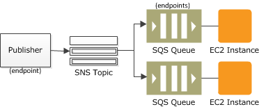

---
title: ' LaravelでFanoutパターン'
tags:
- Laravel
- CloudDesignPattern
date: 2020-04-23T23:54:13+09:00
URL: https://wand-ta.hatenablog.com/entry/2020/04/23/235413
EditURL: https://blog.hatena.ne.jp/wand_ta/wand-ta.hatenablog.com/atom/entry/26006613555190588
-------------------------------------

# ユースケース #

- あるアプリケーションで発火した1つのイベントを複数のアプリケーションでサブスクライブしたい
  - CQRSとかで

# ソリューション #

- AWS SNS + AWS SQS の Fanout Pattern

# Laravel用ライブラリ #

[https://github.com/joblocal/laravel-sqs-sns-subscription-queue:embed:cite]

# サンプルアプリケーション #

[https://github.com/wand2016/laravel-fanout-sample:embed:cite]

- terraformで立ち上がるSNS/SQSインフラ一式
- アプリケーション2つ
  - `app_a`: publisher / subscriber
  - `app_b`: subscriber

## 処理の流れ ##

1. ユーザが`app_a`の`/publish`にアクセスする
1. `app_a`はSNSメッセージをトピックにpublishする
1. SNSは`app_a`,`app_b`用のSQSキューにメッセージを複製してpushする
1. `app_a`, `app_b`のジョブワーカーは自分のSQSキューのメッセージをpullする (subscribe)
1. `app_a`, `app_b`は、メッセージに含まれているSNSのarnから実行すべきジョブを特定し、ジョブを実行する。

ジョブの特定のためにarnや決めのフィールドの値(このライブラリではSubject)を使うのがミソのよう。

[https://hackernoon.com/pub-sub-with-aws-sns-sqs-and-laravel-ed9f7e1bd79:embed:cite]

Laravel Worker

> one interesting option is to tie the SNS Topic ARN to a specific Job class.
